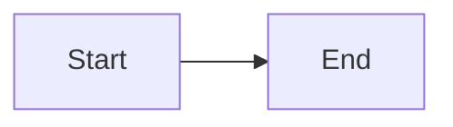

# Documentation Development Guide

This guide explains how to build and maintain the documentation for HHW Brick Application.

## Documentation Stack

- **[MkDocs](https://www.mkdocs.org/)** - Static site generator
- **[Material for MkDocs](https://squidfunk.github.io/mkdocs-material/)** - Professional theme
- **Markdown** - Content format

## Quick Start

### Install Dependencies

```bash
pip install mkdocs mkdocs-material mkdocs-include-markdown-plugin
```

### Serve Locally

```bash
mkdocs serve
```

Then open http://127.0.0.1:8000 in your browser.

### Build Static Site

```bash
mkdocs build
```

Output will be in the `site/` directory.

## Documentation Structure

```
docs/
├── index.md                    # Home page
├── getting-started/            # Installation and basics
│   ├── index.md
│   ├── installation.md         # TODO: Fill content
│   ├── quick-start.md          # TODO: Fill content
│   └── core-concepts.md        # TODO: Fill content
├── user-guide/                 # End-user documentation
│   ├── index.md
│   ├── conversion/             # CSV to Brick
│   ├── validation/             # Model validation
│   ├── applications/           # Analytics apps
│   └── cli/                    # Command-line
├── developer-guide/            # Developer documentation
│   ├── index.md
│   ├── architecture/           # Package design
│   ├── developing-apps/        # App development
│   └── contributing/           # Contribution guide
├── api-reference/              # API documentation
│   ├── index.md
│   ├── conversion/
│   ├── validation/
│   ├── applications/
│   ├── cli/
│   └── utils/
├── examples/                   # Code examples
│   ├── index.md
│   ├── basic/
│   └── advanced/
├── tutorials/                  # Step-by-step guides
│   ├── index.md
│   ├── first-app.md            # TODO: Fill content
│   ├── data-pipeline.md        # TODO: Fill content
│   └── optimization.md         # TODO: Fill content
├── faq.md                      # FAQ
├── changelog.md                # Version history
├── license.md                  # License info
├── stylesheets/
│   └── extra.css               # Custom styles
└── javascripts/
    └── extra.js                # Custom scripts
```

## Content Status

### ✅ Completed

- Home page (index.md)
- Section index pages (*/index.md)
- FAQ
- Changelog
- License
- Custom CSS/JS

### 📝 To Be Written

User should fill these pages with actual content:

#### Getting Started
- [ ] installation.md
- [ ] quick-start.md
- [ ] core-concepts.md

#### User Guide - Conversion
- [ ] conversion/index.md
- [ ] conversion/basic-usage.md
- [ ] conversion/batch-processing.md
- [ ] conversion/configuration.md

#### User Guide - Validation
- [ ] validation/index.md
- [ ] validation/ontology.md
- [ ] validation/subgraph.md
- [ ] validation/point-count.md

#### User Guide - Applications
- [ ] applications/index.md
- [ ] applications/available-apps.md
- [ ] applications/running-apps.md
- [ ] applications/batch-analysis.md

#### User Guide - CLI
- [ ] cli/index.md
- [ ] cli/commands.md
- [ ] cli/examples.md

#### Developer Guide - Architecture
- [ ] architecture/index.md
- [ ] architecture/modules.md
- [ ] architecture/app-framework.md
- [ ] architecture/patterns.md

#### Developer Guide - Developing Apps
- [ ] developing-apps/index.md
- [ ] developing-apps/getting-started.md
- [ ] developing-apps/structure.md
- [ ] developing-apps/qualify.md
- [ ] developing-apps/analyze.md
- [ ] developing-apps/configuration.md
- [ ] developing-apps/testing.md
- [ ] developing-apps/best-practices.md

#### Developer Guide - Contributing
- [ ] contributing/index.md
- [ ] contributing/setup.md
- [ ] contributing/code-style.md
- [ ] contributing/testing.md
- [ ] contributing/documentation.md
- [ ] contributing/pull-requests.md

#### API Reference
- [ ] All API documentation files

#### Examples
- [ ] basic/csv-conversion.md
- [ ] basic/validation.md
- [ ] basic/running-apps.md
- [ ] advanced/batch-processing.md
- [ ] advanced/custom-apps.md
- [ ] advanced/integration.md

#### Tutorials
- [ ] first-app.md
- [ ] data-pipeline.md
- [ ] optimization.md

## Writing Guidelines

### Page Structure

Each page should have:

1. **Title** (# heading)
2. **Introduction** - Brief overview
3. **Main Content** - Organized with headings
4. **Code Examples** - Practical demonstrations
5. **Next Steps** - Links to related pages

### Example Template

````markdown
# Page Title

Brief introduction explaining what this page covers.

## Section 1

Content here with code examples:

```python
# Example code
from hhw_brick import CSVToBrickConverter
```

## Section 2

More content...

---

**Next**: [Related Page](../path/to/page.md)
````

### Markdown Features

The documentation supports:

- **Admonitions**: `!!! note`, `!!! warning`, `!!! tip`
- **Code blocks**: Syntax highlighting for Python, bash, etc.
- **Tabs**: Group related content
- **Mermaid diagrams**: Flowcharts and diagrams
- **Icons**: Material Design icons
- **Cards**: Grid layouts

#### Admonitions

```markdown
!!! note "Optional Title"
    This is a note.

!!! warning
    This is a warning.

!!! tip "Pro Tip"
    This is a helpful tip.
```

#### Code Tabs

```markdown
=== "Python"
    ```python
    print("Hello")
    ```

=== "Bash"
    ```bash
    echo "Hello"
    ```
```

#### Mermaid Diagrams

```markdown

```

## Commands

### Development

```bash
# Serve with live reload
mkdocs serve

# Serve on specific port
mkdocs serve -a localhost:8080

# Verbose output
mkdocs serve -v
```

### Building

```bash
# Build static site
mkdocs build

# Clean build
mkdocs build --clean

# Build to specific directory
mkdocs build -d /path/to/output
```

### Deployment

```bash
# Deploy to GitHub Pages
mkdocs gh-deploy

# Force deploy (overwrites)
mkdocs gh-deploy --force
```

## Configuration

Main configuration is in `mkdocs.yml`:

- **Site metadata**: name, description, author
- **Theme**: Material theme configuration
- **Navigation**: Site structure
- **Plugins**: Search, includes, etc.
- **Extensions**: Markdown features

## Styling

Custom styles in `docs/stylesheets/extra.css`:

- Colors and branding
- Component styles
- Responsive design
- Dark mode support

## Next Steps for User

1. **Review Structure**: Check the documentation outline above
2. **Start Writing**: Begin with high-priority pages
3. **Test Locally**: Run `mkdocs serve` to preview
4. **Iterate**: Write, preview, refine
5. **Deploy**: Publish when ready

## Tips

- **Start Simple**: Write content first, format later
- **Use Examples**: Code examples are crucial
- **Link Liberally**: Connect related pages
- **Preview Often**: Check how it looks
- **Keep Consistent**: Follow the established style

---

Ready to start filling in content? Pick a page from the "To Be Written" list above!

