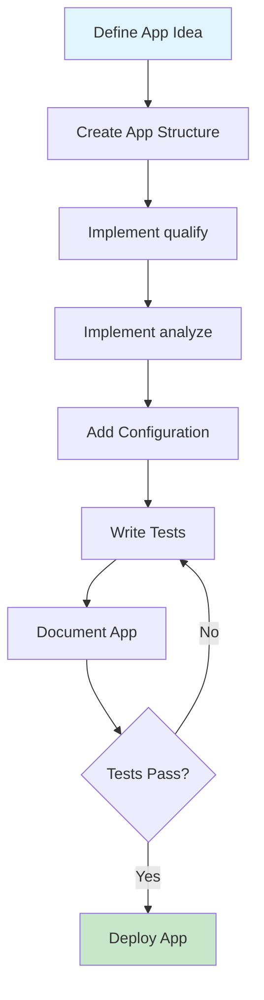

# Developer Guide

Welcome to the HHW Brick Application Developer Guide! This guide is for developers who want to extend the package or contribute to its development.

## Overview

This guide covers:

### :material-package-variant: [Package Architecture](architecture/index.md)

Understand the internal structure and design of the package.

- [Core Modules](architecture/modules.md) - Overview of all modules
- [Application Framework](architecture/app-framework.md) - How the app system works
- [Design Patterns](architecture/patterns.md) - Architectural decisions

---

### :material-code-braces: [Developing Applications](developing-apps/index.md)

Learn how to create your own analytics applications.

- [Getting Started](developing-apps/getting-started.md) - Your first application
- [Application Structure](developing-apps/structure.md) - Required components
- [Qualify Function](developing-apps/qualify.md) - Check building eligibility
- [Analyze Function](developing-apps/analyze.md) - Implement analysis logic
- [Configuration](developing-apps/configuration.md) - Handle app settings
- [Testing](developing-apps/testing.md) - Test your application
- [Best Practices](developing-apps/best-practices.md) - Tips and guidelines

---

### :material-source-pull: [Contributing](contributing/index.md)

Contribute to the HHW Brick Application project.

- [Development Setup](contributing/setup.md) - Set up your environment
- [Code Style](contributing/code-style.md) - Coding standards
- [Testing Guide](contributing/testing.md) - Write and run tests
- [Documentation](contributing/documentation.md) - Update docs
- [Pull Requests](contributing/pull-requests.md) - Submit changes

---

## Quick Start for Developers

### Create Your First Application

```python
# my_app/__init__.py
"""
Custom Analytics Application
"""
from typing import Dict, Tuple
import pandas as pd
from rdflib import Graph

__all__ = ['qualify', 'analyze', 'load_config']

def qualify(brick_model: Graph) -> Tuple[bool, Dict]:
    """Check if building has required sensors"""
    # Implementation here
    return True, {"status": "qualified"}

def analyze(brick_model: Graph, 
           timeseries_data: pd.DataFrame,
           config: Dict) -> Dict:
    """Run analysis on the building"""
    # Implementation here
    return {"results": "analysis complete"}

def load_config(config_path: str = None) -> Dict:
    """Load application configuration"""
    return {"default": "config"}
```

[Learn more about developing apps →](developing-apps/getting-started.md)

---

## Application Development Workflow



---

## Package Structure

```
hhw_brick/
├── conversion/              # CSV to Brick conversion
│   ├── csv_to_brick.py
│   └── batch_converter.py
├── validation/              # Model validation
│   ├── validator.py
│   └── subgraph_matcher.py
├── applications/            # Analytics applications
│   ├── apps_manager.py     # Application framework
│   ├── secondary_loop_temp_diff/
│   └── primary_loop_temp_diff/
├── cli/                     # Command-line interface
│   └── main.py
└── utils/                   # Utility functions
    ├── brick_query.py
    └── config_loader.py
```

[Explore architecture →](architecture/modules.md)

---

## Development Tools

### Required Tools

- **Python 3.8+**
- **Git** - Version control
- **pytest** - Testing framework
- **black** - Code formatting
- **mypy** - Type checking

### Recommended Tools

- **VS Code** or **PyCharm** - IDE
- **pytest-cov** - Coverage reporting
- **pre-commit** - Git hooks

[Setup guide →](contributing/setup.md)

---

## API Design Principles

### Consistency

All applications follow the same interface:

```python
__all__ = ['qualify', 'analyze', 'load_config']

def qualify(brick_model: Graph) -> Tuple[bool, Dict]:
    """Standard signature for all apps"""
    pass

def analyze(brick_model: Graph, 
           timeseries_data: pd.DataFrame,
           config: Dict) -> Dict:
    """Standard signature for all apps"""
    pass
```

### Modularity

Each component is self-contained and can be used independently:

```python
# Use conversion alone
from hhw_brick import CSVToBrickConverter

# Use validation alone
from hhw_brick import BrickModelValidator

# Use apps alone
from hhw_brick import apps
```

### Extensibility

The application framework allows easy addition of new analytics:

```python
# Your custom app is automatically discovered
from hhw_brick import apps

# Just place it in applications/ directory
apps.list_apps()  # Will include your app
```

---

## Quick Navigation

<div class="grid cards" markdown>

- :material-architecture: **[Architecture](architecture/index.md)**

    Understand the package design

- :material-hammer-wrench: **[Build Apps](developing-apps/index.md)**

    Create analytics applications

- :material-account-group: **[Contribute](contributing/index.md)**

    Join the development

- :material-api: **[API Reference](../api-reference/index.md)**

    Detailed API docs

</div>

---

## Resources

- **Source Code**: [GitHub Repository](https://github.com/CenterForTheBuiltEnvironment/HHW_brick)
- **Issue Tracker**: [GitHub Issues](https://github.com/CenterForTheBuiltEnvironment/HHW_brick/issues)
- **PyPI Package**: [hhw-brick](https://pypi.org/project/hhw-brick/)

---

**Ready to build?** Start with [Package Architecture](architecture/index.md) or jump to [Developing Applications](developing-apps/index.md) →
# Getting Started

Welcome to HHW Brick Application! This guide will help you get up and running quickly.

## What You'll Learn

In this section, you'll learn:

- How to [install](installation.md) the package
- How to perform your [first conversion](quick-start.md)
- Understanding [core concepts](core-concepts.md) of the package

## Prerequisites

Before you begin, make sure you have:

- Python 3.8 or higher installed
- Basic knowledge of Python programming
- Familiarity with CSV files (optional but helpful)
- Understanding of building systems (optional but helpful)

## Installation Overview

The easiest way to install HHW Brick Application is using pip:

```bash
pip install hhw-brick
```

For detailed installation instructions, including development setup, see the [Installation Guide](installation.md).

## Quick Example

Here's a simple example to get you started:

```python
from hhw_brick import CSVToBrickConverter

# Create a converter
converter = CSVToBrickConverter()

# Convert CSV to Brick
converter.convert_csv_to_brick(
    input_file="your_building.csv",
    output_file="your_building.ttl"
)
```

## Next Steps

Ready to dive in? Choose your path:

<div class="grid cards" markdown>

- :material-download: **[Install the Package](installation.md)**

    Get HHW Brick Application installed on your system

- :material-flash: **[Quick Start Guide](quick-start.md)**

    Follow a step-by-step tutorial

- :material-school: **[Learn Core Concepts](core-concepts.md)**

    Understand the fundamentals

- :material-book-open: **[Explore User Guide](../user-guide/index.md)**

    Dive deeper into features

</div>

## Need Help?

- Check the [FAQ](../faq.md) for common questions
- Browse [Examples](../examples/index.md) for code samples
- Visit our [GitHub repository](https://github.com/CenterForTheBuiltEnvironment/HHW_brick) for issues and discussions

---

**Let's get started!** Head over to the [Installation Guide](installation.md) →

