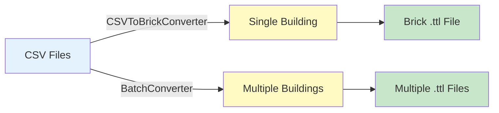

# Example 01: Convert CSV to Brick

Convert building data from CSV format to Brick Schema models.

---

## What You'll Learn

- ✅ Convert a single building to Brick
- ✅ Batch convert multiple buildings
- ✅ Specify input CSV files
- ✅ Auto-detect system types

---

## Overview

This example demonstrates the **core conversion workflow**:



---

## Prerequisites

Test data is included in `tests/fixtures/`:

- `metadata.csv` - Building characteristics
- `vars_available_by_building.csv` - Sensor availability

---

## Part 1: Single Building Conversion

Convert one building to a Brick model:

```python
from pathlib import Path
from hhw_brick import CSVToBrickConverter

# Prepare paths
fixtures = Path("tests/fixtures")
metadata_csv = fixtures / "metadata.csv"
vars_csv = fixtures / "vars_available_by_building.csv"
output_dir = fixtures / "Brick_Model_File"
output_dir.mkdir(exist_ok=True)

# Convert building #29
building_id = "29"
converter = CSVToBrickConverter()

result = converter.convert_to_brick(
    metadata_csv=str(metadata_csv),
    vars_csv=str(vars_csv),
    building_tag=building_id,
    output_path=str(output_dir / f"building_{building_id}.ttl")
)

print(f"✓ Created {len(result)} RDF triples")
```

**Output**:
```
✓ Created 60 RDF triples
✓ Output: building_29.ttl
```

---

## Part 2: Batch Conversion

Convert all buildings at once:

```python
from hhw_brick import BatchConverter

# Batch convert all buildings
batch_converter = BatchConverter()

results = batch_converter.convert_all_buildings(
    metadata_csv=str(metadata_csv),
    vars_csv=str(vars_csv),
    output_dir=str(output_dir),
    show_progress=True  # Show progress bar
)

print(f"Converted: {results['successful']} / {results['total']}")
print(f"Total triples: {results['total_triples']}")
```

**Output**:
```
Converting buildings: 100%|██████████| 10/10
✓ Converted: 10 / 10
✓ Total triples: 842
```

---

## Key Features

### Auto-Detection

System type is **automatically detected** from `metadata.csv`:

| Building | System Column | Detected Type |
|----------|--------------|---------------|
| 29 | District HW | District Hot Water |
| 53 | Condensing | Condensing Boiler |
| 105 | Non-condensing | Non-Condensing Boiler |

### Output Files

Generated Brick models follow naming convention:

```
building_{tag}_{system_type}_{org}.ttl
```

Examples:
- `building_29_district_hw_z.ttl`
- `building_53_condensing_x.ttl`
- `building_105_non_condensing_h.ttl`

---

## Complete Example

Run the full example:

```bash
python examples/01_convert_csv_to_brick.py
```

**Expected Output**:

```
Example 1: CSV to Brick Conversion
============================================================

============================================================
Part 1: Convert Single Building
============================================================

✓ Converting building 29...
✓ Success!
  - Building ID: 29
  - RDF Triples: 60 statements
  - Output: building_29_district_hw_z.ttl

============================================================
Part 2: Batch Convert Multiple Buildings
============================================================

✓ Converting all District HW buildings...
Converting buildings: 100%|██████████| 10/10

✓ Success!
  - Buildings converted: 10 / 10
  - Total RDF triples: 842 statements

  Generated files:
    - building_29_district_hw_z.ttl
    - building_34_district_hw_z.ttl
    - building_53_condensing_x.ttl
    - building_55_condensing_bf.ttl
    - building_56_district_steam_x.ttl
    - building_58_district_steam_x.ttl
    - building_105_non_condensing_h.ttl
    - building_110_non_condensing_ad.ttl
    - building_124_boiler_ar.ttl
    - building_127_condensing_m.ttl

============================================================
Summary
============================================================
  - All Brick models are saved to: tests/fixtures/Brick_Model_File

✓ Done! You can now use these Brick models for analysis.
```

---

## What's Generated?

Each `.ttl` file contains:

- 🏢 **Building entity** (RealEstateCore)
- ⚙️ **Equipment** (Boilers, pumps, heat exchangers)
- 🌡️ **Sensors** (Temperature, flow, pressure)
- 🔗 **Relationships** (hasPoint, feeds, isPartOf)

Example RDF triples:

```turtle
:Building_29 a rec:Building .
:Boiler_Primary a brick:Boiler ;
    brick:hasPoint :HW_Supply_Temp, :HW_Return_Temp .
:HW_Supply_Temp a brick:Hot_Water_Supply_Temperature_Sensor .
```

---

## Next Steps

- **Validate models** → [Example 02: Ontology Validation](02-ontology-validation.md)
- **Verify sensors** → [Example 03: Point Count Validation](03-point-count-validation.md)
- **Run analytics** → [Example 07: Run Application](07-run-application.md)

---

📂 **Source Code**: [`examples/01_convert_csv_to_brick.py`](https://github.com/CenterForTheBuiltEnvironment/HHW_brick/blob/main/examples/01_convert_csv_to_brick.py)
