# Example 02: Ontology Validation

Validate Brick models against the Brick Schema ontology.

---

## What You'll Learn

- ✅ Validate a single Brick model
- ✅ Batch validate multiple models
- ✅ Interpret validation results
- ✅ Use parallel processing for speed

---

## Overview

Validation ensures your Brick models conform to the official Brick Schema:

```mermaid
graph LR
    A[Brick Model .ttl] -->|Validator| B{SHACL Check}
    B -->|Pass| C[✓ Valid Model]
    B -->|Fail| D[✗ Violations Found]

    style A fill:#e3f2fd
    style B fill:#fff9c4
    style C fill:#c8e6c9
    style D fill:#ffcdd2
```



---

## Part 1: Single Model Validation

Validate one Brick model:

```python
from pathlib import Path
from hhw_brick import BrickModelValidator

# Path to Brick model from Example 01
model_file = Path("tests/fixtures/Brick_Model_File/building_29.ttl")

# Create validator
validator = BrickModelValidator(use_local_brick=True)

# Validate
result = validator.validate_ontology(str(model_file))

if result['valid']:
    print(f"✓ Valid! Accuracy: {result['accuracy_percentage']}%")
else:
    print(f"✗ Invalid! Error: {result.get('error', 'Unknown')}")
```

**Output**:
```
✓ Valid! Accuracy: 100.0%
```

---

## Part 2: Batch Validation (Parallel)

Validate multiple models with parallel processing:

```python
# Batch validate all models in directory
batch_result = validator.batch_validate_ontology(
    test_data_dir="tests/fixtures/Brick_Model_File",
    max_workers=15  # Parallel workers (optional)
)

print(f"Valid: {batch_result['passed_files']} / {batch_result['total_files']}")
print(f"Overall accuracy: {batch_result['overall_accuracy']:.1f}%")
```

**Output**:
```
Validating 10 models (parallel processing)...
✓ Valid: 10 / 10
✓ Overall accuracy: 100.0%
```

---

## Validation Report Structure

```python
{
    'ttl_file_path': 'building_29.ttl',
    'valid': True,
    'accuracy_percentage': 100.0,
    'success': True,
    'validation_report': 'All checks passed',
    'error': None  # or error message if failed
}
```

---

## Run Complete Example

```bash
python examples/02_ontology_validation.py
```

**Expected Output**:

```
Example 2: Brick Model Validation
============================================================

============================================================
Part 1: Validate Single Brick Model
============================================================

✓ Validating building_29_district_hw_z.ttl...
✓ Valid! Model follows Brick schema rules.

============================================================
Part 2: Batch Validate Multiple Models
============================================================

✓ Validating 10 Brick models...
  (Using parallel processing for faster validation)

✓ Validation complete!

Results:
  - Total models: 10
  - Valid: 10
  - Invalid: 0
  - Overall accuracy: 100.0%

============================================================
Summary
============================================================

  ✓ Validated 10 Brick models using parallel processing
  ✓ All models checked against Brick schema
  ✓ Overall accuracy: 100.0%
```

---

## Performance Tips

- ⚡ **Parallel Processing**: Automatically uses CPU count - 1 workers
- ⚡ **Adjust Workers**: Set `max_workers` parameter (default: 15)
- ⚡ **Local Schema**: Use `use_local_brick=True` for faster validation

---

## Next Steps

- **Verify sensors** → [Example 03: Point Count Validation](03-point-count-validation.md)
- **Check equipment** → [Example 04: Equipment Count Validation](04-equipment-count-validation.md)
- **Structural validation** → [Example 05: Subgraph Pattern Matching](05-subgraph-pattern-matching.md)

---

📂 **Source Code**: [`examples/02_ontology_validation.py`](https://github.com/CenterForTheBuiltEnvironment/HHW_brick/blob/main/examples/02_ontology_validation.py)
