# Example 03: Point Count Validation

Verify that all sensors from CSV were converted correctly to Brick models.

---

## What You'll Learn

- ✅ Generate ground truth from CSV data
- ✅ Validate point counts in Brick models
- ✅ Batch validate multiple models
- ✅ Ensure data completeness

---

## Overview

Point count validation ensures no sensors were lost during conversion:

```mermaid
graph LR
    A[CSV Data] -->|Calculate| B[Ground Truth]
    C[Brick Model] -->|Count Points| D[Actual Count]
    B -->|Compare| E{Match?}
    D -->|Compare| E
    E -->|Yes| F[✓ Complete]
    E -->|No| G[✗ Missing Data]

    style A fill:#e3f2fd
    style C fill:#e3f2fd
    style B fill:#fff9c4
    style D fill:#fff9c4
    style F fill:#c8e6c9
    style G fill:#ffcdd2
```



---

## Part 1: Generate Ground Truth

Calculate expected counts from source CSV:

```python
from pathlib import Path
from hhw_brick.validation import GroundTruthCalculator

fixtures = Path("tests/fixtures")

# Generate ground truth
calculator = GroundTruthCalculator()
ground_truth = calculator.calculate(
    metadata_csv=str(fixtures / "metadata.csv"),
    vars_csv=str(fixtures / "vars_available_by_building.csv"),
    output_csv=str(fixtures / "ground_truth.csv")
)

print(f"Buildings: {len(ground_truth)}")
```

**Output**:
```
✓ Ground truth generated!
  - Total buildings: 10
  Sample (first 3):
    Building 29: 4 points, 0 boilers, 1 pumps
    Building 34: 4 points, 0 boilers, 1 pumps
    Building 53: 8 points, 2 boilers, 1 pumps
```

---

## Part 2: Validate Single Building

Check one model against ground truth:

```python
from hhw_brick import BrickModelValidator

validator = BrickModelValidator(
    ground_truth_csv_path="tests/fixtures/ground_truth.csv"
)

result = validator.validate_point_count(
    "tests/fixtures/Brick_Model_File/building_29_district_hw_z.ttl"
)

if result['success']:
    print(f"✓ Match! Expected: {result['expected_point_count']}, "
          f"Actual: {result['actual_point_count']}")
```

**Output**:
```
✓ Point counts match! Model is correct.
  Expected: 4 points
  Actual: 4 points
  Accuracy: 100.0%
```

---

## Part 3: Batch Validation (Parallel)

Validate all models with parallel processing:

```python
batch_results = validator.batch_validate_point_count(
    test_data_dir="tests/fixtures/Brick_Model_File",
    max_workers=4
)

print(f"Matched: {batch_results['matched_files']} / {batch_results['total_files']}")
print(f"Accuracy: {batch_results['overall_accuracy']:.1f}%")
```

**Output**:
```
✓ Batch validation complete!
  Matched: 10 / 10
  Overall accuracy: 100.0%
```

---

## Run Complete Example

```bash
python examples/03_point_count_validation.py
```

**Expected Output**:

```
Example 3: Count and Validate Points
============================================================

============================================================
Part 1: Generate Ground Truth
============================================================

✓ Calculating expected counts from CSV data...
✓ Ground truth generated!
  - Saved to: ground_truth.csv
  - Total buildings: 10

  Sample (first 3 buildings):
    Building 29: 4 points, 0 boilers, 1 pumps
    Building 34: 4 points, 0 boilers, 1 pumps
    Building 53: 8 points, 2 boilers, 1 pumps

============================================================
Part 2: Validate Single Building
============================================================

✓ Validating building 29...
✓ Validation complete!
  ✓ Point counts match! Model is correct.

  Details:
    Expected points: 4
    Actual points: 4
    Match: ✓ Yes
    Accuracy: 100.0%

============================================================
Part 3: Batch Validate Multiple Buildings
============================================================

✓ Running batch validation on all models...
  (Using parallel processing for faster validation)

✓ Batch validation complete!

Summary:
  - Total models: 10
  - Matched (correct): 10
  - Mismatched: 0
  - Overall accuracy: 100.0%

============================================================
Summary
============================================================

  ✓ Generated ground truth from CSV data
  ✓ Validated 10 Brick models using parallel processing
  ✓ Overall accuracy: 100.0%
  ✓ Ground truth saved: ground_truth.csv
```

---

## Ground Truth CSV Format

Generated file contains expected counts:

| tag | point_count | boiler_count | pump_count | weather_station_count |
|-----|-------------|--------------|------------|----------------------|
| 29 | 4 | 0 | 1 | 1 |
| 53 | 8 | 2 | 1 | 1 |
| 105 | 5 | 3 | 1 | 1 |

---

## Next Steps

- **Check equipment** → [Example 04: Equipment Count Validation](04-equipment-count-validation.md)
- **Structural validation** → [Example 05: Subgraph Pattern Matching](05-subgraph-pattern-matching.md)

---

📂 **Source Code**: [`examples/03_point_count_validation.py`](https://github.com/CenterForTheBuiltEnvironment/HHW_brick/blob/main/examples/03_point_count_validation.py)
