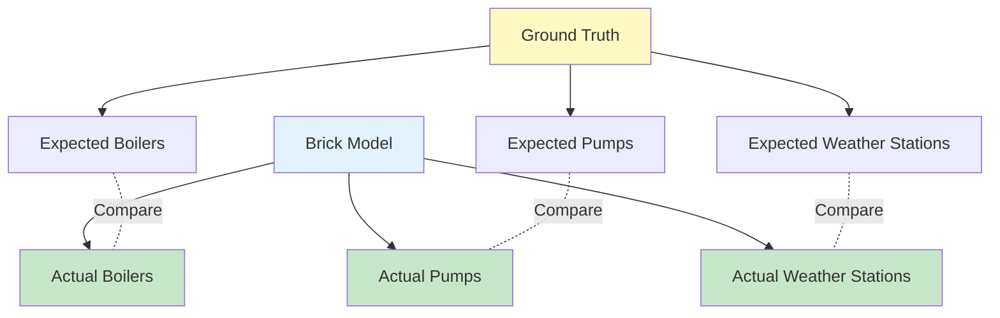

# Example 04: Equipment Count Validation

Validate equipment (boilers, pumps, weather stations) in Brick models.

---

## What You'll Learn

- ✅ Validate equipment counts
- ✅ Check boilers, pumps, weather stations
- ✅ Batch equipment validation
- ✅ Verify system completeness

---

## Overview

Equipment validation ensures all physical devices are modeled correctly:



---

## Part 1: Generate Ground Truth

```python
from hhw_brick.validation import GroundTruthCalculator

calculator = GroundTruthCalculator()
ground_truth = calculator.calculate(
    metadata_csv="tests/fixtures/metadata.csv",
    vars_csv="tests/fixtures/vars_available_by_building.csv",
    output_csv="tests/fixtures/ground_truth.csv"
)
```

**Output**:
```
Sample (first 3 buildings):
  Building 29: 0 boilers, 1 pumps, 1 weather stations
  Building 53: 2 boilers, 1 pumps, 1 weather stations
  Building 105: 3 boilers, 1 pumps, 1 weather stations
```

---

## Part 2: Validate Single Building

```python
from hhw_brick import BrickModelValidator

validator = BrickModelValidator(
    ground_truth_csv_path="tests/fixtures/ground_truth.csv"
)

result = validator.validate_equipment_count(
    "tests/fixtures/Brick_Model_File/building_29_district_hw_z.ttl"
)

if result['overall_success']:
    print("✓ All equipment counts match!")
```

**Output**:
```
✓ All equipment counts match!

Equipment Details:
  ✓ Boilers: 0 / 0 (actual/expected)
  ✓ Pumps: 1 / 1 (actual/expected)
  ✓ Weather Stations: 1 / 1 (actual/expected)
```

---

## Part 3: Batch Validation

```python
batch_results = validator.batch_validate_equipment_count(
    test_data_dir="tests/fixtures/Brick_Model_File",
    max_workers=4
)

print(f"Accuracy: {batch_results['overall_accuracy']:.1f}%")
```

---

## Run Complete Example

```bash
python examples/04_equipment_count_validation.py
```

---

## Next Steps

- **Structural validation** → [Example 05: Subgraph Pattern Matching](05-subgraph-pattern-matching.md)
- **Discover apps** → [Example 06: Application Management](06-application-management.md)

---

📂 **Source Code**: [`examples/04_equipment_count_validation.py`](https://github.com/CenterForTheBuiltEnvironment/HHW_brick/blob/main/examples/04_equipment_count_validation.py)
