# Example 05: Subgraph Pattern Matching

Use SPARQL patterns to validate system topology and structure.

---

## What You'll Learn

- ✅ Define SPARQL validation patterns
- ✅ Check system structure
- ✅ Validate relationships
- ✅ Advanced structural validation

---

## Overview

Pattern matching validates system topology using SPARQL:

```mermaid
graph LR
    A[Define Pattern] --> B[SPARQL Query]
    C[Brick Model] --> B
    B --> D{Pattern Match?}
    D -->|Yes| E[✓ Valid Structure]
    D -->|No| F[✗ Structural Issue]

    style A fill:#fff9c4
    style C fill:#e3f2fd
    style E fill:#c8e6c9
    style F fill:#ffcdd2
```



---

## Example Pattern

Validate boiler has supply and return sensors:

```python
from hhw_brick.validation import SubgraphPatternValidator

validator = SubgraphPatternValidator()

# Define pattern
pattern = """
SELECT ?boiler ?supply ?return WHERE {
    ?boiler a brick:Boiler .
    ?boiler brick:hasPoint ?supply .
    ?boiler brick:hasPoint ?return .
    ?supply a brick:Hot_Water_Supply_Temperature_Sensor .
    ?return a brick:Hot_Water_Return_Temperature_Sensor .
}
"""

# Validate
result = validator.validate_pattern(
    ttl_file_path="building_105.ttl",
    pattern_query=pattern,
    min_matches=1
)

if result['valid']:
    print(f"✓ Pattern matched! Found {result['match_count']} instances")
```

---

## Run Example

```bash
python examples/05_subgraph_pattern_matching.py
```

---

## Next Steps

- **Discover apps** → [Example 06: Application Management](06-application-management.md)

---

📂 **Source Code**: [`examples/05_subgraph_pattern_matching.py`](https://github.com/CenterForTheBuiltEnvironment/HHW_brick/blob/main/examples/05_subgraph_pattern_matching.py)
