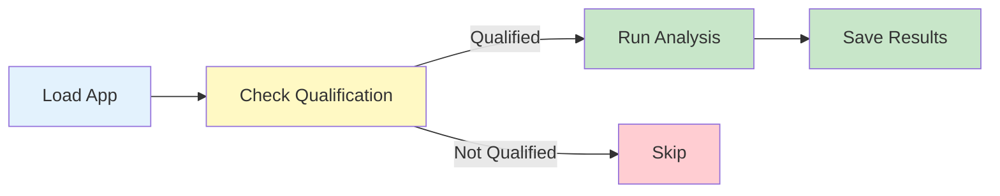

# Example 07: Run Application

Execute portable analytics on a single building.

---

## What You'll Learn

- ✅ Check building qualification
- ✅ Run analytics application
- ✅ Interpret results
- ✅ Save analysis output

---

## Workflow



---

## Complete Example

```python
from hhw_brick import apps

# Load application
app = apps.load_app("secondary_loop_temp_diff")

# Check if building qualifies
qualified, details = app.qualify("building_105.ttl")

if qualified:
    print("✓ Building qualifies!")

    # Run analysis
    results = app.analyze(
        brick_model_path="building_105.ttl",
        timeseries_path="timeseries.csv",
        output_dir="results/"
    )

    print(f"✓ Analysis complete!")
    print(f"  Results saved to: {results['output_path']}")
else:
    print(f"✗ Building not qualified")
    print(f"  Missing: {details.get('missing', [])}")
```

**Output**:
```
✓ Building qualifies!

Running analysis...
  - Processing 1000 hours of data
  - Calculating temperature differences
  - Generating visualizations

✓ Analysis complete!
  Results saved to: results/secondary_loop_temp_diff_105.csv
```

---

## Run Example

```bash
python examples/07_run_application.py
```

---

## Next Steps

- **Batch processing** → [Example 08: Batch Run Application](08-batch-run-application.md)

---

📂 **Source Code**: [`examples/07_run_application.py`](https://github.com/CenterForTheBuiltEnvironment/HHW_brick/blob/main/examples/07_run_application.py)
