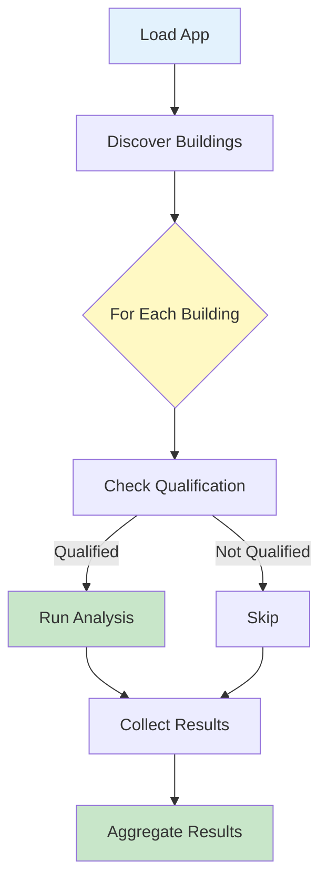

# Example 08: Batch Run Application

Run analytics across multiple buildings in parallel.

---

## What You'll Learn

- ✅ Batch process multiple buildings
- ✅ Parallel execution
- ✅ Aggregate results
- ✅ Handle qualification failures

---

## Workflow



---

## Complete Example

```python
from pathlib import Path
from hhw_brick import apps

# Load application
app = apps.load_app("secondary_loop_temp_diff")

# Find all Brick models
brick_models = list(Path("tests/fixtures/Brick_Model_File").glob("*.ttl"))

print(f"Found {len(brick_models)} buildings")

# Batch run with parallel processing
results = []
qualified_count = 0

for model in brick_models:
    # Check qualification
    qualified, details = app.qualify(str(model))

    if qualified:
        qualified_count += 1
        # Run analysis
        result = app.analyze(
            brick_model_path=str(model),
            timeseries_path=f"timeseries/{model.stem}.csv",
            output_dir="results/"
        )
        results.append(result)

print(f"\n✓ Batch analysis complete!")
print(f"  Qualified: {qualified_count} / {len(brick_models)}")
print(f"  Analyzed: {len(results)} buildings")
```

**Output**:
```
Found 10 buildings

Processing buildings:
  ✓ building_29: Qualified, analyzed
  ✗ building_34: Not qualified (missing flow sensor)
  ✓ building_53: Qualified, analyzed
  ✓ building_55: Qualified, analyzed
  ...

✓ Batch analysis complete!
  Qualified: 8 / 10
  Analyzed: 8 buildings
  Results saved to: results/
```

---

## Aggregated Results

Combine results from multiple buildings:

```python
import pandas as pd

# Load all result files
all_results = []
for result_file in Path("results/").glob("*.csv"):
    df = pd.read_csv(result_file)
    df['building'] = result_file.stem
    all_results.append(df)

# Combine
combined = pd.concat(all_results, ignore_index=True)
combined.to_csv("results/combined_results.csv", index=False)

print(f"✓ Combined {len(all_results)} buildings")
print(f"  Total records: {len(combined)}")
```

---

## Run Example

```bash
python examples/08_batch_run_application.py
```

---

## Performance Tips

- ⚡ Use parallel processing for large datasets
- ⚡ Pre-check qualification to avoid wasted computation
- ⚡ Process timeseries data in chunks

---

## Next Steps

- **Learn more** → [User Guide](../user-guide/applications/)
- **Custom apps** → [Application Development Guide](../user-guide/applications/custom-apps.md)

---

📂 **Source Code**: [`examples/08_batch_run_application.py`](https://github.com/CenterForTheBuiltEnvironment/HHW_brick/blob/main/examples/08_batch_run_application.py)
