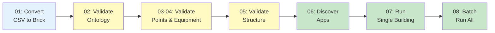

# Examples

Ready-to-run code examples demonstrating HHW Brick's core features.

---

## Philosophy

These examples are designed to be:

- ✅ **Complete** - Run as-is with included test data
- ✅ **Progressive** - Build from simple to advanced
- ✅ **Practical** - Real-world use cases
- ✅ **Educational** - Learn by doing

---

## Examples Overview

### 🔄 Conversion (Examples 1)

**[01 - Convert CSV to Brick](01-convert-csv-to-brick.md)**  
Convert building data from CSV to Brick Schema models. Includes single building and batch conversion.

**What you'll learn**: Basic conversion workflow, batch processing

---

### ✅ Validation (Examples 2-4)

**[02 - Ontology Validation](02-ontology-validation.md)**  
Validate Brick models against the Brick Schema ontology.

**What you'll learn**: Model validation, SHACL compliance checking

**[03 - Point Count Validation](03-point-count-validation.md)**  
Verify that all sensors from CSV were converted correctly.

**What you'll learn**: Data integrity checks, sensor counting

**[04 - Equipment Count Validation](04-equipment-count-validation.md)**  
Validate equipment (boilers, pumps, weather stations) in models.

**What you'll learn**: Equipment verification, system completeness

---

### 🔍 Advanced Validation (Example 5)

**[05 - Subgraph Pattern Matching](05-subgraph-pattern-matching.md)**  
Use SPARQL patterns to validate system topology and structure.

**What you'll learn**: SPARQL queries, structural validation, pattern matching

---

### 📊 Portable Analytics (Examples 6-8)

**[06 - Application Management](06-application-management.md)**  
Discover, load, and inspect available analytics applications.

**What you'll learn**: App discovery, configuration, requirements

**[07 - Run Application](07-run-application.md)**  
Execute portable analytics on a single building.

**What you'll learn**: Building qualification, running analysis, interpreting results

**[08 - Batch Run Application](08-batch-run-application.md)**  
Run analytics across multiple buildings in parallel.

**What you'll learn**: Batch processing, parallel execution, aggregated results

---

## Quick Start

### Prerequisites

Install HHW Brick in editable mode:

```bash
git clone https://github.com/CenterForTheBuiltEnvironment/HHW_brick.git
cd HHW_brick
pip install -e .
```

### Run Examples

All examples use test data from `tests/fixtures/`:

```bash
# Run any example
python examples/01_convert_csv_to_brick.py
python examples/02_ontology_validation.py
# ... etc
```

### Test Data Included

- ✅ `metadata.csv` - 10 buildings, 5 system types
- ✅ `vars_available_by_building.csv` - Sensor availability
- ✅ `TimeSeriesData/` - Sample timeseries for analytics
- ✅ Pre-generated Brick models in `Brick_Model_File/`

---

## Example Workflow



---

## Learning Path

### Beginner (Start Here)

1. **[Example 01](01-convert-csv-to-brick.md)** - Learn basic conversion
2. **[Example 02](02-ontology-validation.md)** - Validate your models
3. **[Example 07](07-run-application.md)** - Run your first analysis

### Intermediate

4. **[Example 03](03-point-count-validation.md)** - Verify data completeness
5. **[Example 06](06-application-management.md)** - Explore available apps
6. **[Example 08](08-batch-run-application.md)** - Scale to multiple buildings

### Advanced

7. **[Example 05](05-subgraph-pattern-matching.md)** - Advanced SPARQL validation
8. **[Example 04](04-equipment-count-validation.md)** - Deep equipment checks

---

## Common Patterns

### Convert → Validate → Analyze

Most workflows follow this pattern:

```python
from hhw_brick import CSVToBrickConverter, BrickModelValidator, apps

# 1. Convert
converter = CSVToBrickConverter()
model = converter.convert_to_brick(
    metadata_csv="metadata.csv",
    vars_csv="vars.csv",
    building_tag="105",
    output_path="building_105.ttl"
)

# 2. Validate
validator = BrickModelValidator()
report = validator.validate_ontology("building_105.ttl")
print(f"Valid: {report['valid']}")

# 3. Analyze
app = apps.load_app("secondary_loop_temp_diff")
qualified, details = app.qualify("building_105.ttl")
if qualified:
    results = app.analyze(
        brick_model_path="building_105.ttl",
        timeseries_path="timeseries.csv"
    )
```

---

## Tips for Using Examples

1. **Run in order** - Examples build on each other
2. **Read the code** - Each example has detailed comments
3. **Modify and experiment** - Try different buildings or parameters
4. **Check output** - Look at generated files to understand results

---

## Next Steps

- 📖 [User Guide](../user-guide/conversion/) - Detailed documentation
- 🚀 [Quick Start](../getting-started/quick-start.md) - Step-by-step tutorial
- 📊 [CSV Format](../getting-started/csv-format.md) - Data preparation guide

---

**Ready?** → Start with [Example 01: Convert CSV to Brick](01-convert-csv-to-brick.md)
