# Getting Started

Welcome to **HHW Brick**! This comprehensive guide will take you from installation to running your first portable analytics application on heating hot water system data.

## What You'll Learn

In this Getting Started section, you'll master:

1. **[Installation](installation.md)** - Set up the hhw_brick package on your system
2. **[Understanding Brick Schema](understanding-brick.md)** - Learn the semantic ontology powering interoperability
3. **[CSV Data Format](csv-format.md)** - Prepare your data files with proper structure
4. **[Quick Start](quick-start.md)** - Complete workflow: Convert → Validate → Analyze in 10 minutes

By the end of this guide, you'll be able to:

- ✅ Convert CSV building data to standardized Brick Schema models
- ✅ Validate models for correctness and completeness
- ✅ Run analytics applications without writing building-specific code
- ✅ Process multiple buildings in parallel with batch operations

## What is HHW Brick?

**HHW Brick** (`hhw_brick`) is a Python toolkit for **converting**, **validating**, and **analyzing** heating hot water system data using the Brick Schema semantic standard.

### The Problem: Data Chaos

**Different names for the same sensors** → Impossible to write reusable analytics!

### Our Solution: Semantic Standardization

**Same semantic meaning** → Write analytics once, run everywhere!

## Core Capabilities

**HHW Brick** (`hhw_brick`) is a Python package that provides three integrated capabilities:

### 🔄 Conversion
Transform heating hot water system equipment data from CSV format into standardized Brick Schema 1.4 RDF models.

- **5 System Types Supported**: Condensing boilers, non-condensing boilers, generic boilers, district hot water, district steam
- **Automatic Detection**: System type identification and sensor mapping
- **Batch Processing**: Convert hundreds of buildings in parallel
- **Flexible Input**: Works with varying CSV structures and sensor availability
- **Test Data**: We provide test data in [`tests/fixtures/`](https://github.com/CenterForTheBuiltEnvironment/HHW_brick/tree/main/tests/fixtures/) to get you started

### ✅ Validation  
Ensure your Brick models are correct through comprehensive multi-level validation.

- **Ontology Validation**: SHACL-based compliance with Brick Schema 1.4
- **Point Count Validation**: Verify all sensors were converted correctly
- **Equipment Count Validation**: Validate boilers, pumps, and weather stations
- **Structural Validation**: Pattern matching for system topology
- **Ground Truth Comparison**: Independent validation against source CSV data

### 📊 Portable Analytics
Run analytics applications that work across any qualified building without recoding.

- **Auto-Discovery**: SPARQL queries find required sensors automatically
- **Building-Agnostic**: No hardcoded point names or building IDs
- **Qualification Checks**: Automatically verify buildings have required equipment
- **Pre-Built Apps**: Temperature difference analysis for primary/secondary loops
- **Extensible Framework**: Build your own portable applications

## Prerequisites

Before you begin, ensure you have:

- **Python 3.8 or higher** installed on your system
- **Basic Python knowledge** - understanding of variables, functions, and imports
- **Git** installed for cloning the repository
- **CSV data files** with building equipment metadata and sensor availability
  - We provide test data in [`tests/fixtures/`](https://github.com/CenterForTheBuiltEnvironment/HHW_brick/tree/main/tests/fixtures/) to get you started
  - Or download sample data from [https://doi.org/10.5061/dryad.t4b8gtj8n](https://doi.org/10.5061/dryad.t4b8gtj8n)

**Optional but Recommended**:
- Virtual environment tool (venv or conda)
- Text editor or IDE (VS Code, PyCharm, etc.)
- Basic understanding of RDF/semantic web (helpful but not required)

## Three-Step Workflow

HHW Brick follows a simple three-step workflow:

1. **Convert** - Transform CSV to Brick Schema
2. **Validate** - Ensure model correctness
3. **Analyze** - Deploy portable analytics

## Package Architecture

```mermaid
graph LR
    subgraph Input
        CSV[CSV Files]
        TS[Timeseries Data]
    end

    subgraph "HHW Brick Package"
        direction TB
        CONV[🔄 Conversion Module]
        VAL[✅ Validation Module]
        APP[📊 Analytics Module]

        CONV -->|TTL Models| VAL
        VAL -->|Validated Models| APP
    end

    subgraph Output
        TTL[Brick Models<br/>.ttl files]
        REP[Validation Reports]
        RES[Analysis Results]
    end

    CSV --> CONV
    CONV --> TTL
    VAL --> REP
    TS --> APP
    APP --> RES

    style CONV fill:#fff9c4
    style VAL fill:#c8e6c9
    style APP fill:#bbdefb
    style TTL fill:#e1f5fe
    style REP fill:#f0f4c3
    style RES fill:#ffe0b2
```

## Package Components

The package consists of three main modules:

### 1. 🔄 Conversion Module

Transform CSV data to Brick Schema models.

**Key Classes**: `CSVToBrickConverter`, `BatchConverter`

**Supported System Types**:

```mermaid
graph LR
    subgraph "5 Supported System Types"
        C[🔥 Condensing<br/>Boiler]
        NC[🔥 Non-Condensing<br/>Boiler]
        G[🔥 Generic<br/>Boiler]
        DH[🏢 District<br/>Hot Water]
        DS[💨 District<br/>Steam]
    end

    style C fill:#ffccbc
    style NC fill:#ffccbc
    style G fill:#ffccbc
    style DH fill:#b3e5fc
    style DS fill:#b2dfdb
```

**Capabilities**:
- ⚡ Single building conversion
- 🚀 Batch conversion with parallel processing
- 🤖 Automatic system type detection
- 📋 Flexible CSV input handling

👉 **[Learn more in Quick Start](quick-start.md)**

### 2. ✅ Validation Module

Ensure your Brick models are correct and complete.

**Key Classes**: `BrickModelValidator`, `GroundTruthCalculator`

**Multi-Level Validation Process**:

```mermaid
graph TD
    M[Brick Model] --> V1[📋 Ontology Validation]
    M --> V2[🔢 Point Count Validation]
    M --> V3[⚙️ Equipment Count Validation]
    M --> V4[🔍 Structural Validation]

    V1 --> R1{SHACL<br/>Conformance?}
    V2 --> R2{Counts<br/>Match?}
    V3 --> R3{Equipment<br/>Present?}
    V4 --> R4{Pattern<br/>Match?}

    R1 -->|✓| PASS[✅ Valid Model]
    R2 -->|✓| PASS
    R3 -->|✓| PASS
    R4 -->|✓| PASS

    R1 -->|✗| FAIL[⚠️ Issues Found]
    R2 -->|✗| FAIL
    R3 -->|✗| FAIL
    R4 -->|✗| FAIL

    style M fill:#e3f2fd
    style V1 fill:#fff9c4
    style V2 fill:#fff9c4
    style V3 fill:#fff9c4
    style V4 fill:#fff9c4
    style PASS fill:#c8e6c9
    style FAIL fill:#ffcdd2
```

**Validation Layers**:
- 📋 **Ontology**: SHACL-based Brick Schema 1.4 compliance
- 🔢 **Point Count**: All sensors converted correctly
- ⚙️ **Equipment Count**: Boilers, pumps, weather stations validated
- 🔍 **Structural**: System topology pattern matching

👉 **[Learn more in Validation Guide](../user-guide/validation/)**

### 3. 📊 Portable Analytics Module

Run analytics applications that work across any qualified building.

**Key Interface**: `apps` manager

**Traditional vs. Portable Analytics**:

**How It Works**:

```mermaid
graph LR
    APP[Analytics App] -->|1. SPARQL Query| BM[Brick Model]
    BM -->|2. Auto-Discover| SENS[Required<br/>Sensors]
    SENS -->|3. Qualify| CHECK{Has All<br/>Sensors?}
    CHECK -->|✓ Yes| RUN[4. Run Analysis]
    CHECK -->|✗ No| SKIP[Skip Building]

    style APP fill:#90caf9
    style BM fill:#fff9c4
    style SENS fill:#ffe0b2
    style RUN fill:#c8e6c9
    style SKIP fill:#ffcdd2
```

**Why Portable?**
- ✅ **No hardcoded point names** - SPARQL auto-discovers sensors
- ✅ **Building-agnostic** - Same code on any qualified building
- ✅ **Auto-qualification** - Checks requirements automatically
- ✅ **One-click deployment** - No recoding needed

**Available Applications**:
- 🌡️ `secondary_loop_temp_diff` - Secondary loop ΔT analysis
- 🔥 `primary_loop_temp_diff` - Primary loop ΔT analysis

👉 **[Learn more in Applications Guide](../user-guide/applications/)**

## Next Steps

Ready to get started? Follow this path:

1. 📥 **[Install the Package](installation.md)** - Set up hhw_brick on your system
2. 📚 **[Understanding Brick](understanding-brick.md)** - Learn what Brick Schema is and why it matters
3. 📋 **[CSV Format Guide](csv-format.md)** - Understand the required data structure
4. ⚡ **[Quick Start Guide](quick-start.md)** - Complete workflow: Convert → Validate → Analyze

## Need Help?

- Check the [FAQ](../faq.md) for common questions
- See [User Guide](../user-guide/conversion/index.md) for detailed documentation

---

**Let's begin!** Head over to [Installation](installation.md) →
