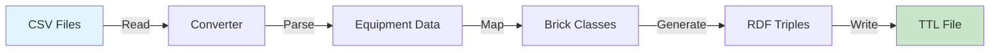

# Quick Start

Convert your first building to Brick format in just 5 minutes!

## What You'll Build

By the end of this guide, you'll have:

- ✅ Converted a building from CSV to Brick format
- ✅ Validated the resulting model
- ✅ Understood the basic workflow

## Step 1: Install the Package

If you haven't already:

```bash
pip install hhw-brick
```

## Step 2: Prepare Your Data

You need two CSV files:

1. **metadata.csv** - Building information (system type, organization, etc.)
2. **vars_available_by_building.csv** - Sensor/point data for each building

For this tutorial, we'll use the included test data.

### Download Test Data

The package includes test data. You can find it at:

```
tests/fixtures/metadata.csv
tests/fixtures/vars_available_by_building.csv
```

Or create a simple example:

```python
import pandas as pd

# Create metadata.csv
metadata = pd.DataFrame({
    'tag': [105],
    'system': ['Non-condensing'],
    'org': ['Organization A']
})
metadata.to_csv('metadata.csv', index=False)

# Create vars_available_by_building.csv  
vars_data = pd.DataFrame({
    'tag': [105],
    'hw_supply_temp': [1],
    'hw_return_temp': [1],
    'hw_flow': [1]
})
vars_data.to_csv('vars_available_by_building.csv', index=False)
```

## Step 3: Convert Your First Building

Create a Python script (`my_first_conversion.py`):

```python
from hhw_brick import CSVToBrickConverter

# Create the converter
converter = CSVToBrickConverter()

# Convert building #105
result = converter.convert_to_brick(
    metadata_csv="metadata.csv",
    vars_csv="vars_available_by_building.csv",
    building_tag="105",  # Building ID to convert
    output_path="building_105.ttl"
)

print(f"✓ Conversion complete!")
print(f"✓ Created {len(result)} RDF triples")
print(f"✓ Output: building_105.ttl")
```

Run it:

```bash
python my_first_conversion.py
```

Expected output:

```
✓ Conversion complete!
✓ Created 156 RDF triples
✓ Output: building_105.ttl
```

## Step 4: Inspect the Output

Your `building_105.ttl` file now contains a Brick model. Let's peek inside:

```python
from rdflib import Graph

# Load the Brick model
g = Graph()
g.parse("building_105.ttl", format="turtle")

# Count elements
print(f"Total statements: {len(g)}")

# Query for equipment
query = """
SELECT ?equip ?type WHERE {
    ?equip a ?type .
    FILTER(STRSTARTS(STR(?type), "https://brickschema.org/schema/Brick#"))
}
"""
for row in g.query(query):
    print(f"  - {row.equip.split('#')[-1]}: {row.type.split('#')[-1]}")
```

## Step 5: Validate the Model (Optional)

Ensure your model is correct:

```python
from hhw_brick import BrickModelValidator

validator = BrickModelValidator()
is_valid, report = validator.validate_model("building_105.ttl")

if is_valid:
    print("✓ Model is valid!")
else:
    print("⚠ Validation warnings:")
    for warning in report.get('warnings', []):
        print(f"  - {warning}")
```

## What Just Happened?

Let's break down what the converter did:



1. **Read CSV files** - Loaded metadata and sensor data
2. **Identified system type** - "Non-condensing" system
3. **Created Brick entities** - Equipment, points, relationships
4. **Generated RDF** - Standard semantic format
5. **Saved TTL file** - Turtle format output

## Next Steps

Now that you've converted your first building:

### Learn More About Conversion

- **[Single Building Conversion](../user-guide/conversion/single-building.md)** - Detailed guide
- **[Batch Conversion](../user-guide/conversion/batch-conversion.md)** - Convert multiple buildings
- **[System Types](../user-guide/conversion/system-types.md)** - Supported HVAC systems

### Explore Other Features

- **[Model Validation](../user-guide/validation/index.md)** - Ensure quality
- **[Analytics Applications](../user-guide/applications/index.md)** - Run analysis
- **[Examples](../examples/index.md)** - More code samples

### Understand the Data

- **[Understanding Brick](understanding-brick.md)** - What is Brick ontology?
- **[CSV Format](csv-format.md)** - Data file requirements

## Common Next Tasks

### Convert Multiple Buildings

```python
from hhw_brick import BatchConverter

batch = BatchConverter()
results = batch.convert_all_buildings(
    metadata_csv="metadata.csv",
    vars_csv="vars_available_by_building.csv",
    output_dir="brick_models/",
    show_progress=True
)

print(f"Converted {results['successful']} buildings")
```

### Filter by System Type

```python
# Convert only condensing systems
result = converter.convert_to_brick(
    metadata_csv="metadata.csv",
    vars_csv="vars_available_by_building.csv",
    system_type="Condensing",  # Filter
    output_path="condensing_buildings.ttl"
)
```

### Run an Analytics Application

```python
from hhw_brick import apps

# Load temperature difference analysis app
app = apps.load_app("secondary_loop_temp_diff")

# Check if building qualifies
qualified, details = app.qualify("building_105.ttl")

if qualified:
    # Run analysis (need timeseries data)
    results = app.analyze(model, timeseries_data, config)
```

## Troubleshooting

### Error: "FileNotFoundError"

Make sure your CSV files exist:

```python
import os
print(os.path.exists("metadata.csv"))  # Should be True
```

### Error: "No data found for building tag"

Check that the building ID exists in your CSV:

```python
import pandas as pd
df = pd.read_csv("metadata.csv")
print(df['tag'].unique())  # List all building IDs
```

### Warning: "Could not convert value to float"

Some sensor values might be missing (NA). This is normal and the converter handles it automatically.

## Complete Example Script

Here's a complete script you can copy and run:

```python
"""
Complete Quick Start Example
This script demonstrates the basic workflow.
"""

from hhw_brick import CSVToBrickConverter, BrickModelValidator
from pathlib import Path

def main():
    print("HHW Brick Application - Quick Start")
    print("=" * 50)

    # Step 1: Set up paths
    metadata_csv = "metadata.csv"
    vars_csv = "vars_available_by_building.csv"
    output_file = "building_105.ttl"

    # Step 2: Convert
    print("\n1. Converting building #105...")
    converter = CSVToBrickConverter()
    result = converter.convert_to_brick(
        metadata_csv=metadata_csv,
        vars_csv=vars_csv,
        building_tag="105",
        output_path=output_file
    )
    print(f"   ✓ Created {len(result)} RDF triples")

    # Step 3: Validate
    print("\n2. Validating model...")
    validator = BrickModelValidator()
    is_valid, report = validator.validate_model(output_file)

    if is_valid:
        print("   ✓ Model is valid!")
    else:
        print("   ⚠ Validation warnings (this is normal):")
        for w in report.get('warnings', [])[:3]:  # Show first 3
            print(f"     - {w}")

    # Step 4: Summary
    print("\n3. Summary:")
    print(f"   - Input: {metadata_csv}, {vars_csv}")
    print(f"   - Output: {output_file}")
    print(f"   - Size: {Path(output_file).stat().st_size / 1024:.1f} KB")

    print("\n✓ Quick start complete!")
    print("\nNext steps:")
    print("  - View the TTL file in a text editor")
    print("  - Try batch conversion")
    print("  - Explore the User Guide")

if __name__ == "__main__":
    main()
```

---

**Congratulations!** 🎉 You've completed the quick start.

Continue to [Understanding Brick](understanding-brick.md) or jump to [User Guide](../user-guide/conversion/index.md) →
