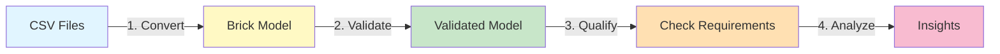

# Quick Start: Complete Workflow

This guide walks you through the **complete HHW Brick workflow** in 10 minutes:

**Convert** CSV data → **Validate** Brick model → **Analyze** with portable analytics

## What You'll Build

By the end of this guide, you'll have:

- ✅ Converted a building from CSV to Brick Schema format
- ✅ Validated the model for correctness and completeness
- ✅ Run a portable analytics application on the building
- ✅ Understood the complete workflow

## Step 1: Install the Package

If you haven't already, clone the repository and install in editable mode:

```bash
# Clone the repository
git clone https://github.com/CenterForTheBuiltEnvironment/HHW_brick.git
cd HHW_brick

# Install in editable mode
pip install -e .
```

**Note**: Once published to PyPI, you'll be able to install with `pip install hhw-brick`.

## Step 2: Prepare Your Data

You need **two types of CSV files** for the complete workflow:

### A. Building Metadata (for conversion)

1. **metadata.csv** - Building information (system type, organization, etc.)
2. **vars_available_by_building.csv** - Sensor/point availability for each building

### B. Timeseries Data (for analytics)

3. **[building]_timeseries.csv** - Time-indexed sensor readings (used in Step 6)

For this tutorial, we'll use the included test data for metadata (Steps 3-5).

### Download Test Data

The package includes test data in the repository:

**[Download from GitHub →](https://github.com/CenterForTheBuiltEnvironment/HHW_brick/tree/main/tests/fixtures)**

You can find:
- `metadata.csv` - Building metadata
- `vars_available_by_building.csv` - Sensor availability data
- `TimeSeriesData/*.csv` - Example timeseries data (for Step 6 analytics)

Or if you've cloned the repository, they're located at:

```
tests/fixtures/metadata.csv
tests/fixtures/vars_available_by_building.csv
tests/fixtures/TimeSeriesData/building_105_timeseries.csv  (example)
```

Or create a simple example:

```python
import pandas as pd

# Create metadata.csv
metadata = pd.DataFrame({
    'tag': [105],
    'system': ['Non-condensing'],
    'org': ['Organization A']
})
metadata.to_csv('metadata.csv', index=False)

# Create vars_available_by_building.csv  
vars_data = pd.DataFrame({
    'tag': [105],
    'hw_supply_temp': [1],
    'hw_return_temp': [1],
    'hw_flow': [1]
})
vars_data.to_csv('vars_available_by_building.csv', index=False)
```

## Step 3: Convert Your First Building

Create a Python script (`my_first_conversion.py`):

```python
from hhw_brick import CSVToBrickConverter

# Create the converter
converter = CSVToBrickConverter()

# Convert building #105
result = converter.convert_to_brick(
    metadata_csv="metadata.csv",
    vars_csv="vars_available_by_building.csv",
    building_tag="105",  # Building ID to convert
    output_path="building_105.ttl"
)

print(f"✓ Conversion complete!")
print(f"✓ Created {len(result)} RDF triples")
print(f"✓ Output: building_105.ttl")
```

Run it:

```bash
python my_first_conversion.py
```

Expected output:

```
✓ Conversion complete!
✓ Created 156 RDF triples
✓ Output: building_105.ttl
```

## Step 4: Inspect the Output

Your `building_105.ttl` file now contains a Brick model. Let's peek inside:

```python
from rdflib import Graph

# Load the Brick model
g = Graph()
g.parse("building_105.ttl", format="turtle")

# Count elements
print(f"Total statements: {len(g)}")

# Query for equipment
query = """
SELECT ?equip ?type WHERE {
    ?equip a ?type .
    FILTER(STRSTARTS(STR(?type), "https://brickschema.org/schema/Brick#"))
}
"""
for row in g.query(query):
    print(f"  - {row.equip.split('#')[-1]}: {row.type.split('#')[-1]}")
```

## Step 5: Validate the Model

Ensure your model is correct and complete:

```python
from hhw_brick import BrickModelValidator

# Create validator
validator = BrickModelValidator()

# Validate the model
is_valid, report = validator.validate_ontology("building_105.ttl")

if is_valid:
    print("✓ Model passed ontology validation!")
    print(f"  - {report['conformance']} conformance")
    print(f"  - {report['violations']} violations")
else:
    print("⚠ Validation found issues:")
    for issue in report.get('violations', []):
        print(f"  - {issue}")
```

Expected output:

```
✓ Model passed ontology validation!
  - True conformance
  - 0 violations
```

## Step 6: Run Portable Analytics

Now for the **key advantage** of Brick Schema - run analytics that work across any building!

### Discover Available Applications

```python
from hhw_brick import apps

# List all available applications
available = apps.list_apps()
print("Available applications:")
for app_info in available:
    print(f"  - {app_info['name']}: {app_info['description']}")
```

Expected output:

```
Available applications:
  - secondary_loop_temp_diff: Analyzes temperature difference in secondary loop
  - primary_loop_temp_diff: Analyzes temperature difference in primary loop
```

### Check if Building Qualifies

```python
# Load an application
app = apps.load_app("secondary_loop_temp_diff")

# Check if building has required equipment
qualified, details = app.qualify("building_105.ttl")

if qualified:
    print("✓ Building qualifies for this analysis!")
    print(f"  Required sensors: {details['required_sensors']}")
    print(f"  Found sensors: {details['found_sensors']}")
else:
    print("✗ Building does not qualify")
    print(f"  Missing: {details['missing']}")
```

### Prepare Timeseries Data

To run analytics, you need **timeseries data** in CSV format with timestamps and sensor readings:

**Example timeseries CSV format:**

```csv
timestamp,hw_supply_temp,hw_return_temp,hw_flow
2023-01-01 00:00:00,180.5,160.2,350.0
2023-01-01 00:15:00,181.0,160.8,352.5
2023-01-01 00:30:00,180.8,160.5,351.2
...
```

**Requirements:**

- First column: `timestamp` (datetime format)
- Remaining columns: Sensor names matching your CSV variable names
- Values: Numeric readings (°F, GPM, etc.)

**Download example timeseries data:**

**[Example Timeseries Data →](https://github.com/CenterForTheBuiltEnvironment/HHW_brick/tree/main/tests/fixtures/TimeSeriesData)**

Or create a simple example:

```python
import pandas as pd
import numpy as np

# Create sample timeseries data
dates = pd.date_range('2023-01-01', periods=1000, freq='15min')
df = pd.DataFrame({
    'timestamp': dates,
    'hw_supply_temp': np.random.normal(180, 5, 1000),
    'hw_return_temp': np.random.normal(160, 5, 1000),
    'hw_flow': np.random.normal(350, 20, 1000)
})
df.to_csv('building_105_timeseries.csv', index=False)
```

### Run Analysis

With timeseries data ready, run the complete analysis:

```python
# Get default configuration
config = apps.get_default_config("secondary_loop_temp_diff")

# Customize configuration if needed
config["analysis_period"] = "2023-01-01 to 2023-12-31"
config["output_directory"] = "results/"

# Run the analysis
results = app.analyze(
    brick_model="building_105.ttl",
    timeseries_csv="building_105_timeseries.csv",
    config=config
)

print("✓ Analysis complete!")
print(f"  - Temperature difference mean: {results['mean_temp_diff']:.2f}°F")
print(f"  - Anomalies detected: {results['anomaly_count']}")
print(f"  - Report saved to: {results['output_path']}")
```

Expected output:

```
✓ Analysis complete!
  - Temperature difference mean: 20.35°F
  - Anomalies detected: 12
  - Report saved to: results/building_105_analysis.html
```

**Note**: For detailed timeseries format requirements and advanced analysis options, see [Applications Guide](../user-guide/applications/).

## What Just Happened?

You completed the **complete HHW Brick workflow**:



### Step-by-Step Breakdown

**1. Conversion (CSV → Brick)**
- Read CSV files containing equipment metadata and sensor availability
- Identified system type (e.g., "Non-condensing boiler")
- Mapped CSV columns to Brick Schema classes and relationships
- Generated RDF triples in Turtle format

**2. Validation (Quality Check)**
- Verified model conforms to Brick Schema 1.4 ontology
- Checked point counts match source CSV data
- Validated equipment relationships and structure

**3. Analytics (Portable Application)**
- Used SPARQL to auto-discover required sensors in the model
- Checked if building has necessary equipment for analysis
- Ready to run analytics without hardcoded point names

**Key Insight**: You created a **standardized, validated, analysis-ready** building model!

## Why This Matters

Traditional building analytics require **manual recoding** for each building:

```python
# ❌ Traditional approach - hardcoded point names
supply_temp = data["HW_Supply_Temp"]  # Only works for this building!
return_temp = data["HWReturnTemp"]    # Different name in next building
```

With HHW Brick, analytics are **portable**:

```python
# ✅ Brick approach - semantic queries
query = """
SELECT ?sensor WHERE {
    ?sensor a brick:Hot_Water_Supply_Temperature_Sensor .
}
"""
# Works on ANY building with Brick model!
```

**Result**: Write analytics once, deploy across hundreds of buildings.

## Next Steps

Congratulations! You've completed the full workflow. Now dive deeper:

### 📚 Deepen Your Understanding

- **[Understanding Brick Schema](understanding-brick.md)** - Learn the ontology concepts
- **[CSV Data Format](csv-format.md)** - Master the input data structure

### 🔧 Master the Tools

- **[Conversion Guide](../user-guide/conversion/)** - Advanced conversion techniques
  - Single building conversion with custom options
  - Batch conversion for multiple buildings
  - Supported system types and configurations

- **[Validation Guide](../user-guide/validation/)** - Ensure model quality
  - Ontology conformance validation
  - Point count validation
  - Equipment structure validation

- **[Applications Guide](../user-guide/applications/)** - Build portable analytics
  - Creating custom analytics apps
  - Timeseries data format requirements
  - Configuration and deployment

### 💡 See More Examples

- **[Example Scripts](../../examples/)** - Copy-paste ready code
  - `01_convert_csv_to_brick.py` - Basic conversion
  - `02_ontology_validation.py` - Validation examples
  - `06_application_management.py` - App discovery and loading
  - `07_run_application.py` - Running analytics

## Common Next Tasks

### Convert Multiple Buildings

```python
from hhw_brick import BatchConverter

batch = BatchConverter()
results = batch.convert_all_buildings(
    metadata_csv="metadata.csv",
    vars_csv="vars_available_by_building.csv",
    output_dir="brick_models/",
    show_progress=True
)

print(f"Converted {results['successful']} buildings")
```

### Filter by System Type

```python
# Convert only condensing systems
result = converter.convert_to_brick(
    metadata_csv="metadata.csv",
    vars_csv="vars_available_by_building.csv",
    system_type="Condensing",  # Filter
    output_path="condensing_buildings.ttl"
)
```

### Run an Analytics Application

```python
from hhw_brick import apps

# Load temperature difference analysis app
app = apps.load_app("secondary_loop_temp_diff")

# Check if building qualifies
qualified, details = app.qualify("building_105.ttl")

if qualified:
    # Run analysis (need timeseries data)
    results = app.analyze(model, timeseries_data, config)
```

## Troubleshooting

### Error: "FileNotFoundError"

Make sure your CSV files exist:

```python
import os
print(os.path.exists("metadata.csv"))  # Should be True
```

### Error: "No data found for building tag"

Check that the building ID exists in your CSV:

```python
import pandas as pd
df = pd.read_csv("metadata.csv")
print(df['tag'].unique())  # List all building IDs
```

### Warning: "Could not convert value to float"

Some sensor values might be missing (NA). This is normal and the converter handles it automatically.

## Complete Example Script

Here's a **complete end-to-end script** you can copy and run:

```python
"""
HHW Brick - Complete Workflow Example

This script demonstrates the complete workflow:
1. Convert CSV to Brick model
2. Validate the model
3. Check analytics qualification
"""

from hhw_brick import CSVToBrickConverter, BrickModelValidator, apps
from pathlib import Path

def main():
    print("=" * 60)
    print("HHW Brick - Complete Workflow")
    print("=" * 60)

    # Configuration
    metadata_csv = "metadata.csv"
    vars_csv = "vars_available_by_building.csv"
    building_tag = "105"
    output_file = f"building_{building_tag}.ttl"

    # Step 1: Convert CSV to Brick
    print("\n[Step 1/3] Converting CSV to Brick Schema...")
    converter = CSVToBrickConverter()
    graph = converter.convert_to_brick(
        metadata_csv=metadata_csv,
        vars_csv=vars_csv,
        building_tag=building_tag,
        output_path=output_file
    )
    print(f"✓ Created {len(graph)} RDF triples")
    print(f"✓ Saved to: {output_file}")

    # Step 2: Validate the model
    print("\n[Step 2/3] Validating Brick model...")
    validator = BrickModelValidator()
    is_valid, report = validator.validate_ontology(output_file)

    if is_valid:
        print("✓ Model passed ontology validation!")
    else:
        print("⚠ Validation issues found:")
        for issue in report.get('violations', [])[:3]:
            print(f"  - {issue}")

    # Step 3: Check analytics qualification
    print("\n[Step 3/3] Checking analytics qualification...")

    # Discover available apps
    available_apps = apps.list_apps()
    print(f"Found {len(available_apps)} analytics applications")

    # Test qualification for each app
    for app_info in available_apps:
        app_name = app_info['name']
        try:
            app = apps.load_app(app_name)
            qualified, details = app.qualify(output_file)

            if qualified:
                print(f"  ✓ {app_name}: QUALIFIED")
            else:
                print(f"  ✗ {app_name}: Not qualified")
                if 'missing' in details:
                    print(f"    Missing: {', '.join(details['missing'][:3])}")
        except Exception as e:
            print(f"  ! {app_name}: Error - {e}")

    # Summary
    print("\n" + "=" * 60)
    print("Summary")
    print("=" * 60)
    print(f"Input:  {metadata_csv}, {vars_csv}")
    print(f"Output: {output_file} ({Path(output_file).stat().st_size / 1024:.1f} KB)")
    print(f"Status: {'Valid' if is_valid else 'Has warnings'}")
    print("\n✓ Complete workflow finished!")
    print("\nNext: View the TTL file or run analytics with timeseries data")

if __name__ == "__main__":
    main()
```

**Run it:**

```bash
python complete_workflow.py
```

**Expected output:**

```
============================================================
HHW Brick - Complete Workflow
============================================================

[Step 1/3] Converting CSV to Brick Schema...
✓ Created 156 RDF triples
✓ Saved to: building_105.ttl

[Step 2/3] Validating Brick model...
✓ Model passed ontology validation!

[Step 3/3] Checking analytics qualification...
Found 2 analytics applications
  ✓ secondary_loop_temp_diff: QUALIFIED
  ✓ primary_loop_temp_diff: QUALIFIED

============================================================
Summary
============================================================
Input:  metadata.csv, vars_available_by_building.csv
Output: building_105.ttl (12.3 KB)
Status: Valid

✓ Complete workflow finished!

Next: View the TTL file or run analytics with timeseries data
```

---

**🎉 Congratulations!** You've completed the HHW Brick quick start and experienced the full workflow.

**What's Next?**

- 📖 [Understanding Brick Schema](understanding-brick.md) - Learn the concepts
- 📋 [CSV Data Format](csv-format.md) - Master the input format  
- 🔧 [User Guide](../user-guide/conversion/) - Advanced features
- 💻 [Example Scripts](../../examples/) - More code samples

---
