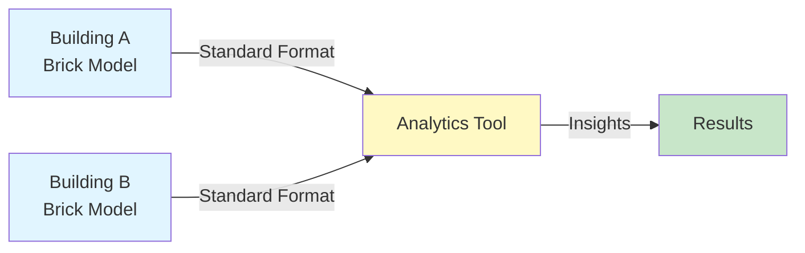
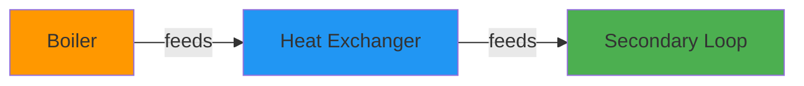
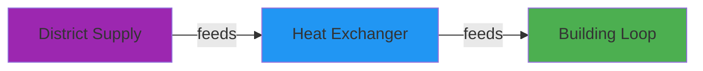

# Understanding Brick

Learn about Brick ontology and why it matters for building data.

## What is Brick?

[Brick](https://brickschema.org/) is a **standardized semantic vocabulary** for describing buildings and their systems. Think of it as a common language that allows different building management systems, analytics tools, and applications to understand each other.

### The Problem Brick Solves

Building systems use different naming conventions:

```
Building A: "AHU_01_Supply_Temp"
Building B: "SupplyAirTemp_AHU1"
Building C: "SAT-AHU-001"
```

All three mean the same thing, but software can't automatically understand that!

### Brick's Solution

Brick provides standardized classes:

```turtle
# In Brick, they're all:
:AHU_01 a brick:AHU ;
    brick:hasPoint :Supply_Temp .

:Supply_Temp a brick:Supply_Air_Temperature_Sensor .
```

Now software can automatically understand the data!

## Why Use Brick?

### 1. **Interoperability**

Share data between different systems:



### 2. **Portability**

Move analytics between buildings:

```python
# Same code works on any Brick model!
def analyze_hvac_efficiency(brick_model):
    # Query for AHUs and their points
    query = """
    SELECT ?ahu ?temp WHERE {
        ?ahu a brick:AHU .
        ?ahu brick:hasPoint ?temp .
        ?temp a brick:Supply_Air_Temperature_Sensor .
    }
    """
    # Analysis logic...
```

### 3. **Automatic Discovery**

Find equipment and points programmatically:

```python
# Find all temperature sensors
sensors = model.query("""
    SELECT ?sensor WHERE {
        ?sensor a brick:Temperature_Sensor .
    }
""")
```

## Brick Schema Components

Brick has three main types of entities:

### Equipment

Physical devices in buildings:

```turtle
:Boiler_01 a brick:Boiler .
:HX_01 a brick:Heat_Exchanger .
:Pump_Primary_01 a brick:Water_Pump .
```

Common equipment classes:
- `brick:Boiler`
- `brick:Heat_Exchanger`
- `brick:Pump`
- `brick:Valve`

### Points

Sensors, actuators, setpoints:

```turtle
:HW_Supply_Temp a brick:Hot_Water_Supply_Temperature_Sensor .
:HW_Return_Temp a brick:Hot_Water_Return_Temperature_Sensor .
:HW_Flow a brick:Water_Flow_Sensor .
```

Common point classes:
- `brick:Temperature_Sensor`
- `brick:Flow_Sensor`
- `brick:Valve_Command`
- `brick:Temperature_Setpoint`

### Relationships

How things connect:

```turtle
:Boiler_01 brick:hasPoint :HW_Supply_Temp .
:Boiler_01 brick:feeds :HX_01 .
:HX_01 brick:hasPoint :Secondary_Supply_Temp .
```

Common relationships:
- `brick:hasPoint` - Equipment has a point
- `brick:feeds` - Flow direction
- `brick:isPartOf` - Component hierarchy

## Brick in HHWS Application

### What We Convert

The HHW Brick Application converts:

```
CSV Data              →    Brick Model
─────────────────────     ─────────────────────
Building metadata     →    Building entity
System type           →    Equipment types
Sensor availability   →    Point entities  
                           Relationships
```

### Example Conversion

**Input CSV:**

| tag | system | org | hw_supply_temp | hw_return_temp |
|-----|--------|-----|----------------|----------------|
| 105 | Non-condensing | Org A | 1 | 1 |

**Output Brick:**

```turtle
:Building_105 a rec:Building ;
    brick:hasLocation :Building_105_location .

:Boiler_Primary a brick:Boiler ;
    brick:hasPoint :HW_Supply_Temp_Sensor,
                   :HW_Return_Temp_Sensor .

:HW_Supply_Temp_Sensor a brick:Hot_Water_Supply_Temperature_Sensor .
:HW_Return_Temp_Sensor a brick:Hot_Water_Return_Temperature_Sensor .
```

## System Type Mapping

HHWS Application supports these system types:

### Non-condensing Systems



Equipment created:
- Primary boiler
- Heat exchanger
- Primary/secondary pumps

### Condensing Systems

Similar to non-condensing but with:
- Condensing boiler type
- Different control strategies

### District HW/Steam



Equipment created:
- District connection
- Heat exchanger
- Building-side equipment

## Querying Brick Models

Once you have a Brick model, you can query it:

### Find All Equipment

```python
from rdflib import Graph

g = Graph()
g.parse("building_105.ttl")

query = """
PREFIX brick: <https://brickschema.org/schema/Brick#>

SELECT ?equipment ?type WHERE {
    ?equipment a ?type .
    FILTER(STRSTARTS(STR(?type), STR(brick:)))
}
"""

for row in g.query(query):
    print(f"{row.equipment}: {row.type}")
```

### Find Temperature Sensors

```python
query = """
PREFIX brick: <https://brickschema.org/schema/Brick#>

SELECT ?sensor WHERE {
    ?sensor a brick:Temperature_Sensor .
}
"""
```

### Find Equipment Relationships

```python
query = """
PREFIX brick: <https://brickschema.org/schema/Brick#>

SELECT ?equip1 ?rel ?equip2 WHERE {
    ?equip1 ?rel ?equip2 .
    FILTER(?rel = brick:feeds || ?rel = brick:hasPoint)
}
"""
```

## Brick Versions

### Brick 1.3 (Current)

HHWS Application uses **Brick 1.3**, which includes:

- Comprehensive HVAC classes
- Better relationship definitions
- Hot water system support

Import statement in generated models:

```turtle
@prefix brick: <https://brickschema.org/schema/Brick#> .

<ontology_uri> a owl:Ontology ;
    owl:imports <https://brickschema.org/schema/1.3/Brick> .
```

## Advantages for HVAC Analysis

### 1. Standard Queries

Write once, run anywhere:

```python
# Works on ANY Brick model
def get_loop_temperature_diff(model):
    query = """
    SELECT ?supply ?return WHERE {
        ?supply a brick:Hot_Water_Supply_Temperature_Sensor .
        ?return a brick:Hot_Water_Return_Temperature_Sensor .
    }
    """
    return model.query(query)
```

### 2. Automatic Validation

Check if building has required sensors:

```python
def check_for_analysis(model):
    required = [
        "brick:Hot_Water_Supply_Temperature_Sensor",
        "brick:Hot_Water_Return_Temperature_Sensor",
        "brick:Water_Flow_Sensor"
    ]

    for sensor_type in required:
        if not has_sensor(model, sensor_type):
            return False, f"Missing {sensor_type}"
    return True, "Qualified"
```

### 3. Relationship Traversal

Follow system connections:

```python
# Find all equipment fed by the boiler
query = """
SELECT ?equipment WHERE {
    :Boiler_01 brick:feeds+ ?equipment .
}
"""
```

The `+` means "one or more steps" - it follows the chain!

## Learn More

### Official Resources

- **[Brick Schema Website](https://brickschema.org/)** - Official site
- **[Brick Schema Viewer](https://explore.brickschema.org/)** - Browse classes
- **[Brick GitHub](https://github.com/BrickSchema/Brick)** - Source code

### In This Documentation

- **[CSV Format](csv-format.md)** - Data requirements
- **[System Types](../user-guide/conversion/system-types.md)** - Supported systems
- **[Examples](../examples/index.md)** - Working code

### Tools

- **[brickschema](https://brickschema.readthedocs.io/)** - Python library
- **[Brick Studio](https://brickstudio.io/)** - Visual editor
- **[RDFLib](https://rdflib.readthedocs.io/)** - RDF processing

## Key Takeaways

!!! success "Remember"
    - Brick provides **standard vocabulary** for buildings
    - Enables **interoperability** between systems
    - Makes **portable analytics** possible
    - Based on **semantic web** standards (RDF/OWL)

!!! tip "For HHWS Users"
    - HHWS Application **automatically** creates Brick models
    - You don't need to know RDF/OWL to use it
    - Focus on your CSV data, we handle Brick complexity

---

**Next:** [Learn about CSV format requirements](csv-format.md) →
