# Understanding Brick Schema

Learn what Brick Schema is, why it matters, and how it enables portable building analytics.

## What is Brick Schema?

**Brick Schema** is an open-source, standardized **semantic vocabulary** (ontology) for describing buildings, their equipment, and sensor systems. Think of it as a **universal language** that allows different building systems, analytics tools, and applications to understand each other.

> 🔗 **Official Website**: [https://brickschema.org/](https://brickschema.org/)  
> 📚 **Documentation**: [https://docs.brickschema.org/](https://docs.brickschema.org/)  
> 💻 **GitHub**: [https://github.com/BrickSchema/Brick](https://github.com/BrickSchema/Brick)

---

## The Problem: Building Data Chaos

### Real-World Example

Imagine you want to analyze hot water supply temperature across 100 buildings. Each building uses different naming conventions:


**The Problem**:
- 🔴 **Same sensors, different names** - Makes automation impossible
- 🔴 **Manual recoding required** - Analytics must be rewritten for each building
- 🔴 **No semantic meaning** - Software can't understand "what is what"
- 🔴 **Scalability nightmare** - 100 buildings = 100 custom implementations

---

## The Solution: Semantic Standardization with Brick

Brick Schema provides **standardized class names** with **semantic meaning**:

```mermaid
graph TB
    subgraph "Any Building - After Brick Conversion"
        direction TB
        B[🏢 Building]

        E1[⚙️ Boiler]
        E2[⚙️ Heat Exchanger]
        E3[⚙️ Pump]

        P1[🌡️ brick:Hot_Water_Supply_Temperature_Sensor]
        P2[🌡️ brick:Hot_Water_Return_Temperature_Sensor]
        P3[💧 brick:Water_Flow_Sensor]

        B -->|hasEquipment| E1
        B -->|hasEquipment| E2
        B -->|hasEquipment| E3

        E1 -->|hasPoint| P1
        E1 -->|hasPoint| P2
        E2 -->|hasPoint| P3
    end

    style B fill:#90caf9
    style E1 fill:#fff9c4
    style E2 fill:#fff9c4
    style E3 fill:#fff9c4
    style P1 fill:#c8e6c9
    style P2 fill:#c8e6c9
    style P3 fill:#c8e6c9
```



**The Benefits**:
- ✅ **Same semantic classes** - `brick:Hot_Water_Supply_Temperature_Sensor` everywhere
- ✅ **Portable analytics** - Write code once, run on any building
- ✅ **Automatic discovery** - Software knows what each sensor represents
- ✅ **Scales effortlessly** - 1 building or 1000 buildings, same code

---

## How Brick Works: Core Concepts

### 1. Classes (What Things Are)

Brick defines **standardized classes** for building components:


**Example in RDF (Turtle format)**:

```turtle
@prefix brick: <https://brickschema.org/schema/Brick#> .

# Equipment instances
:Boiler_01 a brick:Boiler .
:Pump_Primary_01 a brick:Water_Pump .
:HX_01 a brick:Heat_Exchanger .

# Sensor instances
:HW_Supply_Temp a brick:Hot_Water_Supply_Temperature_Sensor .
:HW_Return_Temp a brick:Hot_Water_Return_Temperature_Sensor .
:HW_Flow a brick:Water_Flow_Sensor .
```

### 2. Relationships (How Things Connect)

Brick defines **relationships** between entities:


**Common Relationships**:

| Relationship | Description | Example |
|--------------|-------------|---------|
| `brick:hasPoint` | Equipment has a sensor/actuator | `Boiler hasPoint SupplyTempSensor` |
| `brick:feeds` | Flow direction (water, air, etc.) | `Boiler feeds HeatExchanger` |
| `brick:isPartOf` | Component hierarchy | `Pump isPartOf BoilerSystem` |
| `brick:hasPart` | Reverse of `isPartOf` | `BoilerSystem hasPart Pump` |
| `brick:hasLocation` | Physical location | `Sensor hasLocation Room_101` |

**Example in RDF**:

```turtle
# Relationships
:Boiler_01 brick:hasPoint :HW_Supply_Temp,
                          :HW_Return_Temp ;
           brick:feeds :HX_01 .

:HX_01 brick:hasPoint :Secondary_Supply_Temp ;
       brick:feeds :Secondary_Loop .

:Pump_Primary_01 brick:isPartOf :Boiler_01 .
```

### 3. Properties (Attributes & Metadata)

Additional information about entities:

```turtle
:Building_105 a brick:Building ;
    brick:buildingPrimaryFunction "Office" ;
    brick:hasAddress "123 Main St, Berkeley, CA" ;
    brick:grossArea "50000"^^xsd:float .

:Boiler_01 a brick:Boiler ;
    brick:hasManufacturer "Cleaver-Brooks" ;
    brick:hasModelNumber "CB-500" ;
    brick:hasTag "boiler", "primary", "hw" .
```

---

## Real-World Brick Model Example

Here's an actual example of a Brick Schema model from the official Brick documentation, showing how a complete building system is represented:


*Figure: Official Brick Schema example showing equipment, sensors, and their relationships in a real building model*

**What you see in this example**:

- 🏢 **Building structure** - Hierarchical organization of spaces and equipment
- ⚙️ **Equipment instances** - AHUs, VAVs, boilers, pumps with specific IDs
- 🌡️ **Point instances** - Temperature sensors, setpoints, commands
- 🔗 **Relationships** - `hasPoint`, `feeds`, `isPartOf` connections
- 📊 **Semantic meaning** - Each component has a standardized Brick class

This is exactly the type of model that **HHW Brick automatically generates** from your CSV data, but focused on heating hot water systems instead of HVAC.

---

## Why Brick Matters for Building Analytics

### Traditional Approach ❌


**Problems**:
- 🔴 Each building needs custom code
- 🔴 Point names hardcoded in analytics
- 🔴 Doesn't scale beyond a few buildings
- 🔴 High maintenance cost

**Example Code**:

```python
# ❌ Traditional approach - hardcoded point names
def analyze_building_A(data):
    supply = data["HW_Supply_Temp"]  # Only works for Building A!
    return_temp = data["HW_Return_Temp"]
    delta_t = supply - return_temp
    return delta_t

def analyze_building_B(data):
    supply = data["SupplyTempHotWater"]  # Different name in Building B!
    return_temp = data["ReturnTemp_HW"]
    delta_t = supply - return_temp
    return delta_t

# Need to write custom code for EACH building! 😱
```

### Brick Approach ✅


**Advantages**:
- ✅ Same code works on ANY Brick-compliant building
- ✅ SPARQL queries auto-discover sensors
- ✅ Scales to thousands of buildings
- ✅ Low maintenance - write once, deploy everywhere

**Example Code**:

```python
# ✅ Brick approach - semantic queries
def analyze_any_brick_building(brick_model):
    # SPARQL query finds sensors automatically
    query = """
    PREFIX brick: <https://brickschema.org/schema/Brick#>

    SELECT ?supply ?return WHERE {
        ?supply a brick:Hot_Water_Supply_Temperature_Sensor .
        ?return a brick:Hot_Water_Return_Temperature_Sensor .
    }
    """

    results = brick_model.query(query)
    # Get sensor URIs, then fetch data
    # Same code works on Building A, B, C... Z!
    return analysis_results

# Write once, run on 100+ buildings! 🎉
```

---

## How HHW Brick Uses Brick Schema

### The Conversion Process

HHW Brick automatically converts your CSV data into standardized Brick models:


### Example: Non-Condensing Boiler System

**Input CSV**:

```csv
# metadata.csv
tag,system,org,area,bldg_type
105,Non-condensing,Organization A,50000,Office

# vars_available_by_building.csv
tag,hw_supply_temp,hw_return_temp,hw_flow,pmp1_pwr,t_out
105,1,1,1,1,1
```

**Generated Brick Model**:

```mermaid
graph TD
    subgraph "Building 105 - Brick Model"
        B[🏢 Building_105<br/>brick:Building]

        subgraph "Equipment"
            BOIL[⚙️ Boiler_Primary<br/>brick:Boiler]
            HX[⚙️ Heat_Exchanger<br/>brick:Heat_Exchanger]
            PMP[⚙️ Pump_Primary<br/>brick:Water_Pump]
        end

        subgraph "Points"
            ST[🌡️ HW_Supply_Temp<br/>brick:Hot_Water_Supply_<br/>Temperature_Sensor]
            RT[🌡️ HW_Return_Temp<br/>brick:Hot_Water_Return_<br/>Temperature_Sensor]
            FL[💧 HW_Flow<br/>brick:Water_Flow_Sensor]
            PP[⚡ Pump_Power<br/>brick:Power_Sensor]
            TO[🌤️ Outdoor_Temp<br/>brick:Outside_Air_<br/>Temperature_Sensor]
        end

        B -->|hasEquipment| BOIL
        B -->|hasEquipment| HX
        B -->|hasEquipment| PMP

        BOIL -->|hasPoint| ST
        BOIL -->|hasPoint| RT
        BOIL -->|feeds| HX

        HX -->|hasPoint| FL

        PMP -->|hasPoint| PP
        PMP -->|isPartOf| BOIL

        B -->|hasPoint| TO
    end

    style B fill:#90caf9
    style BOIL fill:#ff9800
    style HX fill:#ff9800
    style PMP fill:#ff9800
    style ST fill:#c8e6c9
    style RT fill:#c8e6c9
    style FL fill:#c8e6c9
    style PP fill:#c8e6c9
    style TO fill:#c8e6c9
```



**RDF (Turtle) Output**:

```turtle
@prefix brick: <https://brickschema.org/schema/Brick#> .
@prefix rec: <https://w3id.org/rec#> .
@prefix : <http://example.org/building_105#> .

# Building
:Building_105 a rec:Building ;
    brick:hasLocation :Location_105 .

# Equipment
:Boiler_Primary a brick:Boiler ;
    brick:hasPoint :HW_Supply_Temp_Sensor,
                   :HW_Return_Temp_Sensor ;
    brick:feeds :Heat_Exchanger .

:Heat_Exchanger a brick:Heat_Exchanger ;
    brick:hasPoint :HW_Flow_Sensor .

:Pump_Primary a brick:Water_Pump ;
    brick:hasPoint :Pump_Power_Sensor ;
    brick:isPartOf :Boiler_Primary .

# Points (Sensors)
:HW_Supply_Temp_Sensor a brick:Hot_Water_Supply_Temperature_Sensor .
:HW_Return_Temp_Sensor a brick:Hot_Water_Return_Temperature_Sensor .
:HW_Flow_Sensor a brick:Water_Flow_Sensor .
:Pump_Power_Sensor a brick:Power_Sensor .
:Outdoor_Temp_Sensor a brick:Outside_Air_Temperature_Sensor .
```

---

## Supported System Types

HHW Brick supports **5 heating system types**, each generating appropriate Brick models:

### 1. Non-Condensing Boiler

```mermaid
graph LR
    B[🔥 Non-Condensing<br/>Boiler] -->|feeds| HX[🔄 Heat<br/>Exchanger]
    HX -->|feeds| SL[💧 Secondary<br/>Loop]

    P1[⚡ Primary<br/>Pump] -->|isPartOf| B
    P2[⚡ Secondary<br/>Pump] -->|isPartOf| SL

    style B fill:#ff9800
    style HX fill:#2196f3
    style SL fill:#4caf50
    style P1 fill:#e1bee7
    style P2 fill:#e1bee7
```



**Brick Classes**:
- `brick:Boiler` (non-condensing type)
- `brick:Heat_Exchanger`
- `brick:Water_Pump` (primary & secondary)
- Various temperature and flow sensors

### 2. Condensing Boiler

```mermaid
graph LR
    B[🔥 Condensing<br/>Boiler<br/>High Efficiency] -->|feeds| HX[🔄 Heat<br/>Exchanger]
    HX -->|feeds| SL[💧 Secondary<br/>Loop]

    style B fill:#4caf50
    style HX fill:#2196f3
    style SL fill:#4caf50
```



**Brick Classes**:
- `brick:Boiler` (condensing type)
- Same downstream equipment as non-condensing

### 3. Generic Boiler

```mermaid
graph LR
    B[🔥 Generic<br/>Boiler] -->|feeds| HX[🔄 Heat<br/>Exchanger]

    style B fill:#9e9e9e
    style HX fill:#2196f3
```



**Brick Classes**:
- `brick:Boiler` (generic type)
- Flexible configuration

### 4. District Hot Water


**Brick Classes**:
- `brick:Heat_Exchanger` (district connection)
- `brick:Water_Pump` (building side)
- District-specific sensors

### 5. District Steam

```mermaid
graph LR
    DS[💨 District<br/>Steam] -->|feeds| HX[🔄 Heat<br/>Exchanger]
    HX -->|feeds| BL[💧 Building<br/>HW Loop]

    CT[🧊 Condensate<br/>Return] -->|returns| DS

    style DS fill:#f44336
    style HX fill:#2196f3
    style BL fill:#4caf50
    style CT fill:#00bcd4
```



**Brick Classes**:
- `brick:Steam_System`
- `brick:Heat_Exchanger`
- Steam-specific points

---

## Querying Brick Models with SPARQL

Once you have a Brick model, you can query it using **SPARQL** (the standard RDF query language):

### Example 1: Find All Equipment

```python
from rdflib import Graph

# Load Brick model
g = Graph()
g.parse("building_105.ttl", format="turtle")

# SPARQL query
query = """
PREFIX brick: <https://brickschema.org/schema/Brick#>

SELECT ?equipment ?type WHERE {
    ?equipment a ?type .
    FILTER(STRSTARTS(STR(?type), STR(brick:)))
}
"""

# Execute query
for row in g.query(query):
    print(f"Found: {row.equipment} is a {row.type}")
```

**Output**:
```
Found: Boiler_Primary is a brick:Boiler
Found: Heat_Exchanger is a brick:Heat_Exchanger
Found: Pump_Primary is a brick:Water_Pump
```

### Example 2: Find Temperature Sensors

```python
query = """
PREFIX brick: <https://brickschema.org/schema/Brick#>

SELECT ?sensor WHERE {
    ?sensor a brick:Temperature_Sensor .
}
"""

for row in g.query(query):
    print(f"Temperature sensor: {row.sensor}")
```

### Example 3: Find Equipment and Their Points

```python
query = """
PREFIX brick: <https://brickschema.org/schema/Brick#>

SELECT ?equipment ?point WHERE {
    ?equipment brick:hasPoint ?point .
}
"""

for row in g.query(query):
    print(f"{row.equipment} has point: {row.point}")
```

### Example 4: Portable Analytics - Temperature Difference

This is the **key advantage** - same query works on ANY building!

```python
def calculate_loop_temperature_diff(brick_model_path):
    """
    Calculate hot water loop ΔT.
    Works on ANY building with Brick model!
    """
    g = Graph()
    g.parse(brick_model_path)

    # Auto-discover sensors
    query = """
    PREFIX brick: <https://brickschema.org/schema/Brick#>

    SELECT ?supply ?return WHERE {
        ?supply a brick:Hot_Water_Supply_Temperature_Sensor .
        ?return a brick:Hot_Water_Return_Temperature_Sensor .
    }
    """

    results = list(g.query(query))

    if results:
        supply_sensor = results[0].supply
        return_sensor = results[0].return

        # Now fetch timeseries data for these sensors
        # and calculate ΔT
        print(f"✓ Found supply sensor: {supply_sensor}")
        print(f"✓ Found return sensor: {return_sensor}")
        return supply_sensor, return_sensor
    else:
        print("✗ Building missing required sensors")
        return None, None

# Same code works on building_105, building_106, ... building_999!
calculate_loop_temperature_diff("building_105.ttl")
```

---

## Brick Schema Versions

### Brick 1.3 (Used by HHW Brick)

HHW Brick uses **Brick Schema 1.3**, which includes:

- ✅ Comprehensive HVAC equipment classes
- ✅ Hot water system support
- ✅ Improved relationship definitions
- ✅ Better sensor taxonomies

**Import Declaration**:

```turtle
@prefix brick: <https://brickschema.org/schema/Brick#> .

<http://example.org/building_105> a owl:Ontology ;
    owl:imports <https://brickschema.org/schema/1.3/Brick> .
```

### Future: Brick 1.4+

Brick Schema continues to evolve with new classes and relationships.

---

## Key Advantages for HVAC Analytics

### 1. ✅ Write Once, Deploy Everywhere

```python
# Same analytics code works on 100+ buildings
def analyze_all_buildings(brick_models):
    for model_path in brick_models:
        # Same SPARQL query finds sensors automatically
        results = run_analysis(model_path)
        save_results(results)
```

### 2. ✅ Automatic Qualification

Check if a building has required sensors before running analytics:

```python
def check_qualification(brick_model):
    """
    Check if building qualifies for analysis.
    """
    required_classes = [
        "brick:Hot_Water_Supply_Temperature_Sensor",
        "brick:Hot_Water_Return_Temperature_Sensor",
        "brick:Water_Flow_Sensor"
    ]

    g = Graph()
    g.parse(brick_model)

    for sensor_class in required_classes:
        query = f"""
        PREFIX brick: <https://brickschema.org/schema/Brick#>
        ASK {{ ?sensor a {sensor_class} . }}
        """

        if not g.query(query):
            return False, f"Missing {sensor_class}"

    return True, "Building qualified for analysis"
```

### 3. ✅ Relationship Traversal

Follow system connections automatically:

```python
# Find all equipment downstream of the boiler
query = """
PREFIX brick: <https://brickschema.org/schema/Brick#>

SELECT ?downstream WHERE {
    :Boiler_Primary brick:feeds+ ?downstream .
}
"""
# The '+' means "one or more steps" - follows the chain!
```

### 4. ✅ Metadata Integration

Combine equipment data with building metadata:

```python
query = """
PREFIX brick: <https://brickschema.org/schema/Brick#>
PREFIX rec: <https://w3id.org/rec#>

SELECT ?building ?area ?sensor WHERE {
    ?building a rec:Building ;
              brick:grossArea ?area ;
              brick:hasPoint ?sensor .
    ?sensor a brick:Temperature_Sensor .
}
"""
```

---

## Real-World Impact

### Case Study: Analyzing 100 Buildings

**Without Brick** (Traditional Approach):
- 🔴 Write custom code for each building's unique point names
- 🔴 Manually map 100 different naming schemes
- 🔴 Estimated time: **2-3 weeks**
- 🔴 Maintenance nightmare when buildings change

**With Brick** (HHW Brick Approach):
- ✅ Write analytics code ONCE using SPARQL
- ✅ Automatically discovers sensors in each building
- ✅ Estimated time: **1 day** (after conversion)
- ✅ Code works on future buildings automatically

**Time Saved**: ~90% reduction in development time!

### Data Interoperability Example


**Benefit**: Different tools can share the same Brick model without custom integrations!

---

## Learning Resources

### Official Brick Schema Resources

- 🌐 **[Brick Schema Website](https://brickschema.org/)** - Official homepage
- 📖 **[Brick Documentation](https://docs.brickschema.org/)** - Comprehensive guides
- 🔍 **[Brick Class Explorer](https://explore.brickschema.org/)** - Browse all classes interactively
- 💻 **[Brick GitHub Repository](https://github.com/BrickSchema/Brick)** - Source code and issues
- 📄 **[Brick Research Paper](https://brickschema.org/papers/)** - Academic publications

### HHW Brick Specific Guides

- 📋 **[CSV Data Format](csv-format.md)** - How to prepare your data
- ⚡ **[Quick Start](quick-start.md)** - Complete workflow tutorial
- 🔧 **[Conversion Guide](../user-guide/conversion/)** - Advanced conversion options
- 📊 **[Applications Guide](../user-guide/applications/)** - Building portable analytics

### Recommended Tools

- **[brickschema Python library](https://brickschema.readthedocs.io/)** - Official Python library for Brick
- **[Brick Studio](https://brickstudio.io/)** - Visual Brick model editor
- **[RDFLib](https://rdflib.readthedocs.io/)** - Python RDF processing (used by HHW Brick)
- **[Apache Jena](https://jena.apache.org/)** - Java-based RDF toolkit
- **[SPARQL Tutorial](https://www.w3.org/TR/sparql11-query/)** - Learn SPARQL query language

### Community & Support

- 💬 **[Brick Schema Forum](https://groups.google.com/g/brickschema)** - Google Group for discussions
- 🐛 **[HHW Brick Issues](https://github.com/CenterForTheBuiltEnvironment/HHW_brick/issues)** - Report bugs or request features
- 📧 **Contact**: For questions about HHW Brick, open a GitHub issue

---

## Common Questions

### Q: Do I need to know RDF/OWL to use HHW Brick?

**A**: No! HHW Brick handles all the Brick Schema complexity for you. You only need to:
1. Prepare CSV files with your building data
2. Run the converter
3. Use the generated Brick models for analytics

The converter automatically creates valid Brick models.

### Q: Can I edit the generated Brick models?

**A**: Yes! The output `.ttl` files are standard RDF Turtle format. You can:
- Edit them manually with a text editor
- Use tools like [Brick Studio](https://brickstudio.io/) for visual editing
- Modify them programmatically with RDFLib

### Q: What if my building doesn't fit the 5 supported system types?

**A**: You can:
1. Use "Generic Boiler" as a starting point
2. Manually edit the generated Brick model to add custom equipment
3. [Request a new system type](https://github.com/CenterForTheBuiltEnvironment/HHW_brick/issues) as a feature

### Q: How do I validate my Brick model?

**A**: HHW Brick includes built-in validation:

```python
from hhw_brick import BrickModelValidator

validator = BrickModelValidator()
is_valid, report = validator.validate_ontology("building_105.ttl")
```

This checks SHACL compliance with Brick Schema 1.3.

### Q: Can I use Brick models with other software?

**A**: Absolutely! That's the whole point of standardization. Brick models are:
- Standard RDF format (`.ttl`, `.jsonld`, `.xml`)
- Compatible with any RDF-aware tool
- Queryable with SPARQL from any language (Python, Java, JavaScript, etc.)

---

## Key Takeaways

!!! success "Core Concepts"
    - 🎯 **Brick is a standardized vocabulary** for describing buildings
    - 🔄 **Enables portable analytics** - write code once, deploy everywhere
    - 🔍 **SPARQL queries auto-discover** required sensors
    - 🏗️ **Based on semantic web standards** (RDF, OWL, SPARQL)
    - 📊 **HHW Brick automates** the conversion from CSV to Brick

!!! tip "For HHW Brick Users"
    - ✅ You **don't need to know** RDF/OWL/SPARQL to use HHW Brick
    - ✅ Focus on **preparing CSV data**, we handle Brick complexity
    - ✅ Generated models are **ready for portable analytics**
    - ✅ Use **SPARQL for advanced queries** if you want more control

!!! info "Why This Matters"
    **Traditional Approach**: 100 buildings × 3 hours coding each = **300 hours**  
    **Brick Approach**: 100 buildings × 0 hours coding = **0 hours**  

    Write analytics once, deploy to unlimited buildings! 🚀

---

## Visual Summary

```mermaid
graph TB
    subgraph "The Brick Advantage"
        direction LR

        subgraph "Step 1: Convert"
            CSV[CSV Files] -->|HHW Brick| BM[Brick Models]
        end

        subgraph "Step 2: Standardize"
            BM -->|Standard Classes| SC[brick:Boiler<br/>brick:Temperature_Sensor<br/>brick:hasPoint]
        end

        subgraph "Step 3: Query"
            SC -->|SPARQL| Q[Auto-Discover<br/>Sensors]
        end

        subgraph "Step 4: Analyze"
            Q -->|Portable Code| A[Analytics Work<br/>on ANY Building]
        end

        A -->|Results| R[✓ Scalable<br/>✓ Maintainable<br/>✓ Interoperable]
    end

    style CSV fill:#e3f2fd
    style BM fill:#fff9c4
    style SC fill:#c8e6c9
    style Q fill:#ffe0b2
    style A fill:#90caf9
    style R fill:#a5d6a7
```



---

**Ready to get started?** Continue to [CSV Data Format](csv-format.md) to learn how to prepare your data →

**Or jump straight to practice**: [Quick Start Guide](quick-start.md) for a complete hands-on tutorial →
