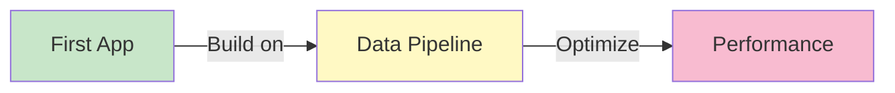

# Tutorials

Step-by-step tutorials to master HHWS Brick Application.

## Overview

These tutorials provide in-depth, hands-on learning experiences. Each tutorial builds on previous knowledge and includes:

- Clear learning objectives
- Step-by-step instructions
- Complete code examples
- Exercises and challenges
- Summary and next steps

---

## Available Tutorials

### :material-rocket-launch: [Building Your First Application](first-app.md)

**Duration**: 30-45 minutes  
**Level**: Beginner

Learn how to create a custom analytics application from scratch.

**What you'll learn**:
- Application structure and requirements
- Implementing qualify and analyze functions
- Testing your application
- Deploying to the package

[Start tutorial →](first-app.md)

---

### :material-pipe: [Data Pipeline Workflow](data-pipeline.md)

**Duration**: 45-60 minutes  
**Level**: Intermediate

Build a complete data processing pipeline.

**What you'll learn**:
- Batch CSV conversion
- Automated validation
- Application qualification
- Batch analytics execution
- Results aggregation

[Start tutorial →](data-pipeline.md)

---

### :material-speedometer: [Performance Optimization](optimization.md)

**Duration**: 30-45 minutes  
**Level**: Advanced

Optimize your workflows for production use.

**What you'll learn**:
- Profiling bottlenecks
- Parallel processing
- Memory management
- Caching strategies
- Best practices

[Start tutorial →](optimization.md)

---

## Tutorial Path



We recommend following the tutorials in order for the best learning experience.

---

## Prerequisites

Before starting the tutorials, make sure you have:

- [x] Installed HHWS Brick Application
- [x] Basic Python knowledge
- [x] Completed the [Quick Start Guide](../getting-started/quick-start.md)
- [x] Familiarity with [Core Concepts](../getting-started/core-concepts.md)

---

## Learning Resources

### Complementary Materials

- **[Examples](../examples/index.md)** - Quick code snippets
- **[User Guide](../user-guide/index.md)** - Feature documentation
- **[Developer Guide](../developer-guide/index.md)** - Advanced topics
- **[API Reference](../api-reference/index.md)** - Detailed API docs

### External Resources

- [Brick Schema Documentation](https://brickschema.org/)
- [RDFLib Tutorial](https://rdflib.readthedocs.io/)
- [Python Packaging Guide](https://packaging.python.org/)

---

## Getting Help

If you get stuck during a tutorial:

1. **Check the code** - All tutorials include complete working examples
2. **Review the FAQ** - Common issues are documented in the [FAQ](../faq.md)
3. **Search issues** - Look for similar problems on [GitHub](https://github.com/yourusername/hhw-brick/issues)
4. **Ask for help** - Open a [discussion](https://github.com/yourusername/hhw-brick/discussions)

---

## Contributing Tutorials

Have an idea for a tutorial? We'd love to hear from you!

See the [Contributing Guide](../developer-guide/contributing/documentation.md) to learn how to contribute tutorials.

---

**Ready to learn?** Start with [Building Your First Application](first-app.md) →
# Examples

Practical examples to help you get started with HHWS Brick Application.

## Overview

This section contains code examples ranging from basic to advanced usage. Each example includes:

- Complete working code
- Explanation of key concepts
- Expected output
- Common variations

---

## Quick Examples

### Simple CSV Conversion

```python
from hhw_brick import CSVToBrickConverter

converter = CSVToBrickConverter()
result = converter.convert_csv_to_brick(
    input_file="building_105.csv",
    output_file="building_105.ttl"
)
```

### Validate a Model

```python
from hhw_brick import BrickModelValidator

validator = BrickModelValidator()
is_valid, report = validator.validate_model("building_105.ttl")
print(f"Valid: {is_valid}")
```

### Run an Application

```python
from hhw_brick import apps

app = apps.load_app("secondary_loop_temp_diff")
qualified, details = app.qualify(brick_model)
if qualified:
    results = app.analyze(brick_model, timeseries_data, config)
```

---

## Example Categories

### :material-school: [Basic Examples](basic/csv-conversion.md)

Simple examples for beginners:

- [CSV to Brick Conversion](basic/csv-conversion.md)
- [Model Validation](basic/validation.md)
- [Running Applications](basic/running-apps.md)

### :material-rocket: [Advanced Examples](advanced/batch-processing.md)

Complex workflows for advanced users:

- [Batch Processing](advanced/batch-processing.md)
- [Custom Applications](advanced/custom-apps.md)
- [System Integration](advanced/integration.md)

---

## Example Data

All examples use sample data available in the `Example_Input_Data/` directory:

```
Example_Input_Data/
├── building_105.csv
├── building_127.csv
├── building_304.csv
└── timeseries/
    ├── building_105_data.csv
    └── building_127_data.csv
```

---

## Running Examples

### Option 1: Python Script

Save the example code to a `.py` file and run:

```bash
python my_example.py
```

### Option 2: Interactive Python

Run in Python interactive mode:

```bash
python
>>> from hhw_brick import CSVToBrickConverter
>>> # ... rest of code
```

### Option 3: Jupyter Notebook

Use examples in Jupyter notebooks for interactive exploration.

---

## Common Patterns

### Pattern 1: Complete Workflow

```python
from hhw_brick import (
    CSVToBrickConverter,
    BrickModelValidator,
    apps
)

# Convert
converter = CSVToBrickConverter()
converter.convert_csv_to_brick("input.csv", "model.ttl")

# Validate
validator = BrickModelValidator()
is_valid, report = validator.validate_model("model.ttl")

if is_valid:
    # Run app
    app = apps.load_app("secondary_loop_temp_diff")
    results = app.analyze(model, data, config)
    print("Analysis complete!")
```

### Pattern 2: Batch Processing

```python
from hhw_brick import BatchConverter

converter = BatchConverter()
results = converter.convert_batch(
    input_dir="csv_files/",
    output_dir="brick_models/"
)
```

### Pattern 3: Error Handling

```python
try:
    converter.convert_csv_to_brick("input.csv", "output.ttl")
except FileNotFoundError:
    print("Input file not found!")
except Exception as e:
    print(f"Conversion failed: {e}")
```

---

## Next Steps

- **Browse** [Basic Examples](basic/csv-conversion.md) to get started
- **Explore** [Advanced Examples](advanced/batch-processing.md) for complex workflows
- **Check** [Tutorials](../tutorials/index.md) for step-by-step guides
- **Read** [User Guide](../user-guide/index.md) for detailed documentation

---

**Ready to try?** Start with [CSV Conversion](basic/csv-conversion.md) →

