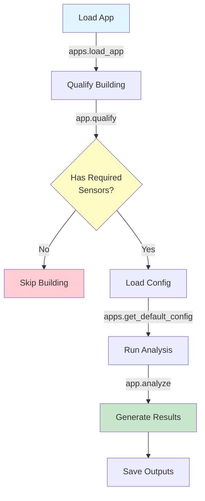

# Analytics Applications

Run analytics on validated Brick models to extract insights from building data.

## Overview

HHWS Brick Application provides a **pluggable application framework** for running analytics on building systems. Applications are self-contained modules that:

- **Qualify** buildings - Check if building has required sensors
- **Analyze** data - Perform calculations and generate insights
- **Generate outputs** - Create reports, plots, and metrics

## Available Applications

### Current Applications

The package includes two built-in applications:

| Application | Purpose | Required Sensors |
|-------------|---------|------------------|
| **secondary_loop_temp_diff** | Analyze secondary loop temperature difference | Secondary supply, return temps |
| **primary_loop_temp_diff** | Analyze primary loop temperature difference | Primary supply, return temps |

More applications can be added by developers. See [Developer Guide](../../developer-guide/creating-apps/index.md).

## Quick Start

### 4-Step Workflow

From `examples/07_run_application.py`:

```python
from hhw_brick import apps

# Step 1: Load application
app = apps.load_app("secondary_loop_temp_diff")

# Step 2: Qualify building (check if it has required sensors)
qualified, details = app.qualify("building_105.ttl")

if qualified:
    # Step 3: Load configuration
    config = apps.get_default_config("secondary_loop_temp_diff")
    
    # Step 4: Run analysis
    results = app.analyze(
        brick_model_path="building_105.ttl",
        timeseries_data_path="building_105_data.csv",
        config=config
    )
    
    print(f"Analysis complete: {results['summary']}")
```

## Apps Manager

### Discover Applications

From `examples/06_application_management.py`:

```python
from hhw_brick import apps

# List all available applications
available_apps = apps.list_apps()

print(f"Found {len(available_apps)} applications:")
for app_info in available_apps:
    print(f"  • {app_info['name']}")
    print(f"    {app_info['description']}")
```

Expected output:
```
Found 2 applications:
  • secondary_loop_temp_diff
    Analyzes temperature difference in secondary hot water loop
  • primary_loop_temp_diff
    Analyzes temperature difference in primary hot water loop
```

### Load Application

```python
# Load by name
app = apps.load_app("secondary_loop_temp_diff")

# Now you can use app.qualify() and app.analyze()
```

### Get Application Info

```python
# Get detailed information
info = apps.get_app_info("secondary_loop_temp_diff")

print(f"Name: {info['name']}")
print(f"Description: {info['description']}")
print(f"Functions: {[f['name'] for f in info['functions']]}")
```

### Get Default Configuration

```python
# Get default config template
config = apps.get_default_config("secondary_loop_temp_diff")

# Customize
config['output']['output_dir'] = './my_results'
config['output']['generate_plots'] = True

# Save for later use
import yaml
with open('my_config.yaml', 'w') as f:
    yaml.dump(config, f)
```

## Application Lifecycle

### Complete Workflow



### Step-by-Step Example

```python
"""
Complete application workflow
Based on examples/07_run_application.py
"""

from pathlib import Path
from hhw_brick import apps
import yaml

def run_application_workflow(building_id, app_name):
    """Complete workflow for running an application."""
    
    # Paths
    model_file = f"brick_models/building_{building_id}.ttl"
    data_file = f"timeseries_data/{building_id}_data.csv"
    
    print(f"Running {app_name} on building {building_id}")
    print("="*60)
    
    # ===== Step 1: Load Application =====
    print("\nStep 1: Load Application")
    app = apps.load_app(app_name)
    print(f"✓ Loaded {app_name}")
    
    # ===== Step 2: Qualify Building =====
    print("\nStep 2: Qualify Building")
    qualified, details = app.qualify(model_file)
    
    if not qualified:
        print(f"✗ Building {building_id} not qualified")
        print(f"  Reason: {details.get('reason', 'Missing required sensors')}")
        return None
    
    print(f"✓ Building {building_id} qualified")
    print(f"  Found sensors:")
    for sensor_type, sensor_uri in details.items():
        if sensor_uri and 'http' in str(sensor_uri):
            sensor_name = str(sensor_uri).split('#')[-1]
            print(f"    - {sensor_type}: {sensor_name}")
    
    # ===== Step 3: Load Configuration =====
    print("\nStep 3: Load Configuration")
    config = apps.get_default_config(app_name)
    
    # Customize config
    config['output']['output_dir'] = f"./results/{app_name}"
    config['output']['generate_plots'] = True
    
    # Save config (optional)
    config_file = f"{app_name}_config.yaml"
    with open(config_file, 'w') as f:
        yaml.dump(config, f)
    print(f"✓ Configuration ready")
    print(f"  Output: {config['output']['output_dir']}")
    
    # ===== Step 4: Run Analysis =====
    print("\nStep 4: Run Analysis")
    print(f"  Model: {model_file}")
    print(f"  Data: {data_file}")
    
    results = app.analyze(
        brick_model_path=model_file,
        timeseries_data_path=data_file,
        config=config
    )
    
    # ===== Display Results =====
    print("\n" + "="*60)
    print("Analysis Results")
    print("="*60)
    
    if 'summary' in results:
        print("\nSummary:")
        for key, value in results['summary'].items():
            print(f"  {key}: {value}")
    
    if 'outputs' in results:
        print("\nGenerated Files:")
        for output in results['outputs']:
            print(f"  ✓ {output}")
    
    return results

# Run it
if __name__ == "__main__":
    results = run_application_workflow(
        building_id="105",
        app_name="secondary_loop_temp_diff"
    )
```

## Batch Application

### Qualify Multiple Buildings

From `examples/06_application_management.py`:

```python
from hhw_brick import apps

# Check all buildings in a directory
batch_results = apps.qualify_buildings("brick_models/")

# Analyze results
for building in batch_results:
    building_name = Path(building['model']).stem
    print(f"\nBuilding: {building_name}")
    
    for result in building['results']:
        app_name = result['app']
        qualified = result['qualified']
        
        status = "✓" if qualified else "✗"
        print(f"  {status} {app_name}")
```

### Build Qualification Matrix

```python
"""
Create a matrix showing which buildings qualify for which apps
"""

from pathlib import Path
from hhw_brick import apps

# Batch qualify
batch_results = apps.qualify_buildings("brick_models/")

# Build matrix
app_matrix = {}  # app -> list of qualified buildings
building_matrix = {}  # building -> list of qualified apps

for building in batch_results:
    building_name = Path(building['model']).stem
    building_matrix[building_name] = []
    
    for r in building['results']:
        app_name = r['app']
        
        if app_name not in app_matrix:
            app_matrix[app_name] = []
        
        if r['qualified']:
            app_matrix[app_name].append(building_name)
            building_matrix[building_name].append(app_name)

# Display by application
print("By Application:")
for app_name, buildings in app_matrix.items():
    print(f"  {app_name}:")
    print(f"    Qualified: {len(buildings)}/{len(batch_results)} buildings")
    for b in buildings[:5]:  # Show first 5
        print(f"      ✓ {b}")

# Display by building
print("\nBy Building:")
for building_name, apps_list in building_matrix.items():
    if apps_list:
        print(f"  {building_name}: {', '.join(apps_list)}")
```

### Batch Run Applications

```python
"""
Run applications on all qualified buildings
"""

from hhw_brick import apps
from pathlib import Path
import yaml

def batch_run_application(app_name, model_dir, data_dir, output_dir):
    """Run application on all qualified buildings."""
    
    # Load app
    app = apps.load_app(app_name)
    config = apps.get_default_config(app_name)
    
    # Find all models
    model_files = list(Path(model_dir).glob("*.ttl"))
    
    results_summary = {
        'total': len(model_files),
        'qualified': 0,
        'analyzed': 0,
        'failed': 0,
        'results': []
    }
    
    for model_file in model_files:
        building_id = model_file.stem.split('_')[1]  # Extract ID
        
        # Qualify
        qualified, details = app.qualify(str(model_file))
        
        if not qualified:
            continue
        
        results_summary['qualified'] += 1
        
        # Find corresponding data file
        data_file = Path(data_dir) / f"{building_id}_data.csv"
        
        if not data_file.exists():
            print(f"⚠ Data file not found for building {building_id}")
            results_summary['failed'] += 1
            continue
        
        try:
            # Run analysis
            result = app.analyze(
                brick_model_path=str(model_file),
                timeseries_data_path=str(data_file),
                config=config
            )
            
            results_summary['analyzed'] += 1
            results_summary['results'].append({
                'building_id': building_id,
                'status': 'success',
                'summary': result.get('summary', {})
            })
            
            print(f"✓ Building {building_id}")
            
        except Exception as e:
            results_summary['failed'] += 1
            results_summary['results'].append({
                'building_id': building_id,
                'status': 'failed',
                'error': str(e)
            })
            
            print(f"✗ Building {building_id}: {e}")
    
    # Summary
    print(f"\n{'='*60}")
    print(f"Batch Analysis Summary - {app_name}")
    print(f"{'='*60}")
    print(f"Total buildings: {results_summary['total']}")
    print(f"Qualified: {results_summary['qualified']}")
    print(f"Analyzed: {results_summary['analyzed']}")
    print(f"Failed: {results_summary['failed']}")
    
    return results_summary

# Use it
results = batch_run_application(
    app_name="secondary_loop_temp_diff",
    model_dir="brick_models/",
    data_dir="timeseries_data/",
    output_dir="analysis_results/"
)
```

## Application Interface

### Standard Interface

All applications follow the same interface:

```python
# All apps have these three functions:

__all__ = ['qualify', 'analyze', 'load_config']

def qualify(brick_model_path: str) -> Tuple[bool, Dict]:
    """
    Check if building has required sensors.
    
    Returns:
        (qualified, details) tuple
        - qualified: True if building can use this app
        - details: Dict with sensor URIs or qualification info
    """
    pass

def analyze(brick_model_path: str, 
           timeseries_data_path: str,
           config: Dict) -> Dict:
    """
    Run analysis on building data.
    
    Returns:
        Dict with analysis results, including:
        - summary: Key metrics
        - outputs: List of generated files
        - data: Detailed results
    """
    pass

def load_config(config_path: str = None) -> Dict:
    """
    Load application configuration.
    
    Returns:
        Configuration dictionary
    """
    pass
```

## Common Patterns

### Pattern 1: Single Building Analysis

```python
# Load app
app = apps.load_app("secondary_loop_temp_diff")

# Qualify
qualified, details = app.qualify("building_105.ttl")

if qualified:
    # Load config
    config = apps.get_default_config("secondary_loop_temp_diff")
    
    # Run
    results = app.analyze(
        "building_105.ttl",
        "building_105_data.csv",
        config
    )
```

### Pattern 2: Try Multiple Apps

```python
# Try all apps on one building
available_apps = apps.list_apps()
model_path = "building_105.ttl"

for app_info in available_apps:
    app = apps.load_app(app_info['name'])
    qualified, details = app.qualify(model_path)
    
    if qualified:
        print(f"✓ Can run: {app_info['name']}")
        # Run it...
    else:
        print(f"✗ Cannot run: {app_info['name']}")
```

### Pattern 3: Conditional Analysis

```python
# Run different apps based on system type
from hhw_brick.validation import SubgraphPatternValidator

pattern_validator = SubgraphPatternValidator()
result = pattern_validator.check_pattern_2_district_system(model_path)

if result['matched']:
    # District system - use district-specific apps
    app = apps.load_app("district_efficiency")
else:
    # Boiler system - use boiler-specific apps  
    app = apps.load_app("boiler_efficiency")

# Then qualify and analyze...
```

## Configuration Management

### Default Configuration

```python
# Get default config
config = apps.get_default_config("secondary_loop_temp_diff")

# Typical structure:
{
    'analysis': {
        'time_window': '1D',
        'aggregation': 'mean'
    },
    'output': {
        'save_results': True,
        'output_dir': './results',
        'generate_plots': True
    }
}
```

### Custom Configuration

```python
import yaml

# Load and customize
config = apps.get_default_config("secondary_loop_temp_diff")
config['output']['output_dir'] = './custom_results'
config['output']['generate_plots'] = False
config['analysis']['time_window'] = '6H'

# Save
with open('custom_config.yaml', 'w') as f:
    yaml.dump(config, f)

# Load later
with open('custom_config.yaml', 'r') as f:
    config = yaml.safe_load(f)

# Use it
results = app.analyze(model_path, data_path, config)
```

## Output Management

### Typical Outputs

Applications generate various outputs:

```python
results = app.analyze(model_path, data_path, config)

# Results structure
{
    'summary': {
        'mean_temp_diff': 5.2,
        'max_temp_diff': 12.1,
        'data_points': 8760
    },
    'outputs': [
        'results/temp_diff_plot.png',
        'results/statistics.csv',
        'results/hourly_data.csv'
    ],
    'data': {
        # Detailed results...
    }
}
```

### Handling Outputs

```python
# Check generated files
if 'outputs' in results:
    print("Generated files:")
    for output_file in results['outputs']:
        if Path(output_file).exists():
            print(f"  ✓ {output_file}")
        else:
            print(f"  ✗ {output_file} (not found)")

# Access summary metrics
if 'summary' in results:
    for metric, value in results['summary'].items():
        print(f"{metric}: {value}")
```

## Troubleshooting

### Issue: "App not found"

**Solution:**
```python
# List available apps
print(apps.list_apps())

# Use exact name
app = apps.load_app("secondary_loop_temp_diff")  # Correct
# app = apps.load_app("secondary_loop")  # Wrong
```

### Issue: Building not qualified

**Investigation:**
```python
qualified, details = app.qualify("building_105.ttl")

if not qualified:
    print("Qualification failed:")
    print(f"  Reason: {details.get('reason', 'Unknown')}")
    print(f"  Missing: {details.get('missing', [])}")
```

### Issue: Analysis fails

**Check:**
1. Data file exists and is readable
2. Data format matches expected format
3. Configuration is valid

```python
# Debug
try:
    results = app.analyze(model_path, data_path, config)
except FileNotFoundError as e:
    print(f"File not found: {e}")
except Exception as e:
    print(f"Analysis failed: {e}")
    import traceback
    traceback.print_exc()
```

## Best Practices

### 1. Always Qualify First

```python
# Good ✓
qualified, details = app.qualify(model_path)
if qualified:
    results = app.analyze(model_path, data_path, config)

# Bad ✗
# Skip qualification - might fail
results = app.analyze(model_path, data_path, config)
```

### 2. Use Configuration Files

```python
# Good ✓ - Reusable configuration
config = yaml.safe_load(open('config.yaml'))
results = app.analyze(model_path, data_path, config)

# Bad ✗ - Hard-coded config
config = {'output': {'output_dir': './results'}}
```

### 3. Handle Failures Gracefully

```python
# Good ✓
try:
    results = app.analyze(model_path, data_path, config)
    save_results(results)
except Exception as e:
    log_error(f"Analysis failed: {e}")
    notify_admin()

# Bad ✗
results = app.analyze(model_path, data_path, config)
# No error handling
```

## Next Steps

Learn about specific applications:

- **[Apps Manager](apps-manager.md)** - Detailed apps manager API
- **[Secondary Loop Temp Diff](secondary-loop.md)** - Temperature difference analysis
- **[Primary Loop Temp Diff](primary-loop.md)** - Primary loop analysis
- **[Running Apps](running-apps.md)** - Complete guide to running applications

Or explore related topics:

- **[Developer Guide](../../developer-guide/creating-apps/index.md)** - Create your own applications
- **[Examples](../../examples/applications/using-apps.md)** - Working code samples

---

**Continue to:** [Apps Manager Details](apps-manager.md) →

