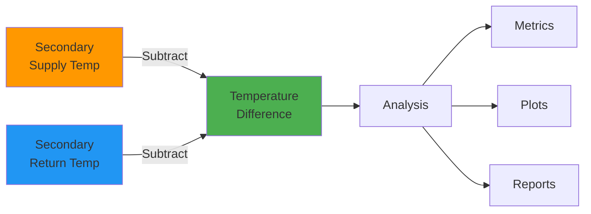
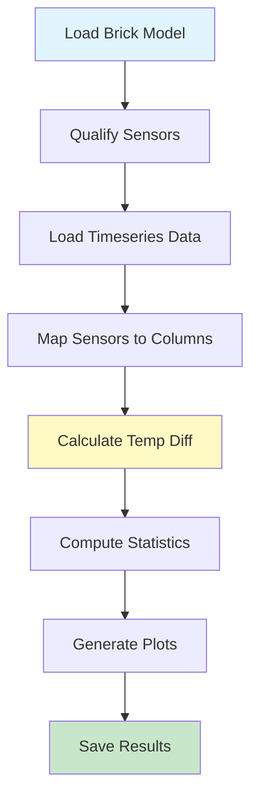

# Secondary Loop Temperature Difference

Analyze temperature difference between supply and return water in secondary hot water loops.

## Overview

The **Secondary Loop Temperature Difference** application analyzes the temperature differential in building secondary loops. This helps:

- **Monitor performance** - Track loop efficiency
- **Identify issues** - Detect circulation problems
- **Optimize operation** - Understand load patterns
- **Save energy** - Find opportunities for improvement

## What It Does

### Analysis



Calculates:
- **Temperature difference**: Supply - Return
- **Statistical metrics**: Mean, max, min, std dev
- **Time-series analysis**: Trends over time
- **Visualizations**: Plots and charts

### Required Sensors

The building must have both sensors on the **same secondary loop**:

| Sensor Type | Brick Class | Purpose |
|-------------|-------------|---------|
| **Supply Temperature** | `Supply_Water_Temperature_Sensor` or<br/>`Leaving_Hot_Water_Temperature_Sensor` or<br/>`Hot_Water_Supply_Temperature_Sensor` | Measures temperature leaving loop |
| **Return Temperature** | `Return_Water_Temperature_Sensor` or<br/>`Entering_Hot_Water_Temperature_Sensor` or<br/>`Hot_Water_Return_Temperature_Sensor` | Measures temperature returning to loop |

!!! note "Secondary Loop Only"
    This app specifically looks for sensors on **secondary loops** (not primary loops). It identifies secondary loops by checking if the equipment URI contains "secondary".

## Quick Start

### Basic Usage

```python
from hhw_brick import apps

# Load app
app = apps.load_app("secondary_loop_temp_diff")

# Qualify building
qualified, details = app.qualify("building_105.ttl")

if qualified:
    # Get config
    config = apps.get_default_config("secondary_loop_temp_diff")
    
    # Run analysis
    results = app.analyze(
        brick_model_path="building_105.ttl",
        timeseries_data_path="building_105_data.csv",
        config=config
    )
    
    # View results
    print(f"Mean Temp Diff: {results['summary']['mean_temp_diff']:.2f}°C")
    print(f"Max Temp Diff: {results['summary']['max_temp_diff']:.2f}°C")
```

## Qualification

### qualify()

Check if building has required sensors.

**Signature:**
```python
def qualify(brick_model_path: str) -> Tuple[bool, Dict]
```

**Returns:**
```python
(True, {
    'loop': 'https://hhws.example.org#Secondary_Loop',
    'supply': 'https://hhws.example.org#Secondary_Supply_Temp',
    'return': 'https://hhws.example.org#Secondary_Return_Temp'
})
```

**Example:**
```python
qualified, details = app.qualify("building_105.ttl")

if qualified:
    print("✓ Building qualified")
    print(f"  Loop: {details['loop'].split('#')[-1]}")
    print(f"  Supply: {details['supply'].split('#')[-1]}")
    print(f"  Return: {details['return'].split('#')[-1]}")
else:
    print("✗ Building not qualified")
    print("  Missing secondary loop sensors")
```

### What Gets Checked

The qualification process:

1. **Loads Brick model** - Parses TTL file
2. **Finds secondary loops** - Looks for `Hot_Water_Loop` entities with "secondary" in URI
3. **Searches for sensors** - Finds supply and return temperature sensors
4. **Validates pairing** - Ensures both sensors are on the same loop

**SPARQL Query Used:**
```sparql
SELECT ?equipment ?supply ?return WHERE {
    # Find secondary hot water loops
    ?equipment rdf:type/rdfs:subClassOf* brick:Hot_Water_Loop .
    FILTER(CONTAINS(LCASE(STR(?equipment)), "secondary"))
    
    # Find supply temperature sensor
    ?supply rdf:type/rdfs:subClassOf* ?supply_type .
    VALUES ?supply_type {
        brick:Supply_Water_Temperature_Sensor
        brick:Leaving_Hot_Water_Temperature_Sensor
        brick:Hot_Water_Supply_Temperature_Sensor
    }
    
    # Find return temperature sensor
    ?return rdf:type/rdfs:subClassOf* ?return_type .
    VALUES ?return_type {
        brick:Return_Water_Temperature_Sensor
        brick:Entering_Hot_Water_Temperature_Sensor
        brick:Hot_Water_Return_Temperature_Sensor
    }
    
    # Both must be associated with the loop
    {
        ?equipment brick:hasPart ?supply .
        ?equipment brick:hasPart ?return .
    } UNION {
        ?supply brick:isPointOf ?equipment .
        ?return brick:isPointOf ?equipment .
    }
}
```

## Analysis

### analyze()

Run temperature difference analysis.

**Signature:**
```python
def analyze(
    brick_model_path: str,
    timeseries_data_path: str,
    config: Dict
) -> Dict
```

**Parameters:**
- `brick_model_path` (str): Path to Brick model TTL file
- `timeseries_data_path` (str): Path to CSV data file
- `config` (dict): Configuration dictionary

**Returns:**
```python
{
    'summary': {
        'mean_temp_diff': 5.2,
        'max_temp_diff': 12.1,
        'min_temp_diff': 0.3,
        'std_temp_diff': 2.1,
        'data_points': 8760
    },
    'outputs': [
        'results/temp_diff_plot.png',
        'results/statistics.csv',
        'results/hourly_data.csv'
    ],
    'data': {
        'timestamps': [...],
        'temp_diff': [...],
        'supply_temp': [...],
        'return_temp': [...]
    }
}
```

### Analysis Workflow



**Steps:**

1. **QUALIFY** - Check for required sensors
2. **FETCH** - Load timeseries data
3. **MAP** - Match sensors to data columns
4. **CALCULATE** - Compute temperature difference
5. **ANALYZE** - Calculate statistics
6. **VISUALIZE** - Generate plots
7. **OUTPUT** - Save results

## Configuration

### Default Configuration

```yaml
analysis:
  threshold_min_delta: 0.5    # Minimum expected temp diff (°C)
  threshold_max_delta: 10.0   # Maximum expected temp diff (°C)

output:
  save_results: true
  output_dir: ./results
  export_format: csv
  generate_plots: true
  plot_format: png

time_range:
  start_time: null  # Optional: "2024-01-01 00:00:00"
  end_time: null    # Optional: "2024-12-31 23:59:59"
```

### Configuration Options

| Parameter | Type | Default | Description |
|-----------|------|---------|-------------|
| `analysis.threshold_min_delta` | float | 0.5 | Minimum expected temperature difference (°C) |
| `analysis.threshold_max_delta` | float | 10.0 | Maximum expected temperature difference (°C) |
| `output.save_results` | bool | true | Save analysis results to files |
| `output.output_dir` | str | "./results" | Directory for output files |
| `output.export_format` | str | "csv" | Format for data export (csv, excel) |
| `output.generate_plots` | bool | true | Generate visualization plots |
| `output.plot_format` | str | "png" | Plot image format (png, pdf, svg) |
| `time_range.start_time` | str | null | Start time for analysis (ISO format) |
| `time_range.end_time` | str | null | End time for analysis (ISO format) |

### Custom Configuration

```python
import yaml

# Load default
config = apps.get_default_config("secondary_loop_temp_diff")

# Customize
config['analysis']['threshold_min_delta'] = 1.0
config['analysis']['threshold_max_delta'] = 15.0
config['output']['output_dir'] = './custom_results'
config['output']['generate_plots'] = True
config['time_range']['start_time'] = "2024-01-01 00:00:00"
config['time_range']['end_time'] = "2024-03-31 23:59:59"

# Save
with open('custom_config.yaml', 'w') as f:
    yaml.dump(config, f)

# Use it
results = app.analyze(model_path, data_path, config)
```

## Data Format

### Timeseries Data CSV

Expected format:

```csv
datetime,secondary_supply_temp,secondary_return_temp
2024-01-01 00:00:00,70.5,65.3
2024-01-01 01:00:00,71.2,66.1
2024-01-01 02:00:00,69.8,64.7
...
```

**Requirements:**
- **datetime column** - Timestamp for each row
- **Temperature columns** - Sensor data (column names will be matched to Brick model)
- **Numeric values** - Temperature in °C or °F
- **Regular intervals** - Hourly, 15-min, etc. (any interval works)

### Column Mapping

The app automatically maps Brick sensors to CSV columns:

```python
# Brick model has:
# :Secondary_Supply_Temp a brick:Supply_Water_Temperature_Sensor

# CSV column might be:
# "secondary_supply_temp" or "sup_temp_sec" or "sec_loop_supply"

# App automatically finds the match!
```

## Results

### Summary Metrics

```python
results['summary'] = {
    'mean_temp_diff': 5.2,      # Average temperature difference
    'max_temp_diff': 12.1,      # Maximum observed
    'min_temp_diff': 0.3,       # Minimum observed
    'std_temp_diff': 2.1,       # Standard deviation
    'data_points': 8760,        # Number of data points analyzed
    'start_time': '2024-01-01', # Analysis period start
    'end_time': '2024-12-31'    # Analysis period end
}
```

### Generated Files

Typical outputs (when `save_results=true`):

```
results/
├── temp_diff_plot.png          # Time-series plot
├── statistics.csv              # Statistical summary
├── hourly_data.csv            # Detailed hourly results
└── distribution_plot.png       # Temperature difference distribution
```

### Visualizations

**Time-Series Plot:**
Shows temperature difference over time with supply and return temperatures.

**Distribution Plot:**
Histogram of temperature differences showing frequency distribution.

## Examples

### Basic Analysis

```python
from hhw_brick import apps

app = apps.load_app("secondary_loop_temp_diff")

# Qualify
qualified, details = app.qualify("building_105.ttl")

if qualified:
    # Run with defaults
    config = apps.get_default_config("secondary_loop_temp_diff")
    results = app.analyze(
        "building_105.ttl",
        "building_105_data.csv",
        config
    )
    
    # Print summary
    print("Analysis Summary:")
    for key, value in results['summary'].items():
        print(f"  {key}: {value}")
```

### Time-Range Analysis

```python
# Analyze specific time period
config = apps.get_default_config("secondary_loop_temp_diff")
config['time_range']['start_time'] = "2024-06-01 00:00:00"
config['time_range']['end_time'] = "2024-08-31 23:59:59"

results = app.analyze(model_path, data_path, config)
print(f"Summer average temp diff: {results['summary']['mean_temp_diff']:.2f}°C")
```

### Custom Output Directory

```python
# Save to specific directory
config = apps.get_default_config("secondary_loop_temp_diff")
config['output']['output_dir'] = f"./results/building_105"
config['output']['generate_plots'] = True

results = app.analyze(model_path, data_path, config)

print("Generated files:")
for file_path in results['outputs']:
    print(f"  - {file_path}")
```

### Batch Analysis

```python
"""
Run secondary loop analysis on multiple buildings
"""
from pathlib import Path
from hhw_brick import apps

app = apps.load_app("secondary_loop_temp_diff")
config = apps.get_default_config("secondary_loop_temp_diff")

model_dir = Path("brick_models")
data_dir = Path("timeseries_data")

for model_file in model_dir.glob("*.ttl"):
    building_id = model_file.stem.split('_')[1]
    
    # Qualify
    qualified, details = app.qualify(str(model_file))
    
    if not qualified:
        continue
    
    # Find data file
    data_file = data_dir / f"{building_id}_data.csv"
    
    if not data_file.exists():
        continue
    
    # Run analysis
    try:
        config['output']['output_dir'] = f"./results/building_{building_id}"
        results = app.analyze(str(model_file), str(data_file), config)
        
        print(f"Building {building_id}:")
        print(f"  Mean temp diff: {results['summary']['mean_temp_diff']:.2f}°C")
    except Exception as e:
        print(f"Building {building_id}: Failed - {e}")
```

## Troubleshooting

### Issue: Building not qualified

**Check:**
1. Building has secondary loop (URI contains "secondary")
2. Loop has both supply and return temperature sensors
3. Sensors use recognized Brick classes

```python
# Debug
from rdflib import Graph

g = Graph()
g.parse("building_105.ttl", format="turtle")

# Check for secondary loops
query = """
SELECT ?loop WHERE {
    ?loop a/rdfs:subClassOf* brick:Hot_Water_Loop .
    FILTER(CONTAINS(LCASE(STR(?loop)), "secondary"))
}
"""

for row in g.query(query):
    print(f"Found loop: {row.loop}")
```

### Issue: Column mapping failed

**Solution:** Check CSV column names match sensors:

```python
import pandas as pd

df = pd.read_csv("building_105_data.csv")
print("Available columns:")
print(df.columns.tolist())
```

### Issue: No data in time range

**Check:** Time range configuration:

```python
config['time_range']['start_time'] = "2024-01-01 00:00:00"
config['time_range']['end_time'] = "2024-12-31 23:59:59"
```

## Best Practices

### 1. Always Qualify First

```python
# Good ✓
qualified, details = app.qualify(model_path)
if qualified:
    results = app.analyze(model_path, data_path, config)
```

### 2. Check Data Quality

```python
# Verify data before analysis
df = pd.read_csv(data_path)
print(f"Data points: {len(df)}")
print(f"Date range: {df['datetime'].min()} to {df['datetime'].max()}")
```

### 3. Save Configuration

```python
# Save config for reproducibility
with open('analysis_config.yaml', 'w') as f:
    yaml.dump(config, f)
```

## Next Steps

- **[Primary Loop App](primary-loop.md)** - Analyze primary loop temperature difference
- **[Running Apps Guide](running-apps.md)** - Complete application workflow
- **[Examples](../../examples/applications/using-apps.md)** - More code samples

---

**Continue to:** [Primary Loop Temperature Difference](primary-loop.md) →

