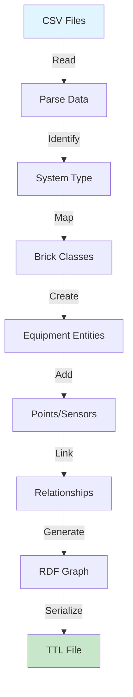

# CSV to Brick Conversion

Complete guide to converting heating hot water system data from CSV format to Brick ontology models.

## Overview

The conversion module transforms your building equipment data into standardized Brick ontology format. This enables:

- **Interoperability** - Use the same data with different tools
- **Portability** - Move analytics between buildings
- **Standardization** - Common vocabulary for all buildings

## Conversion Process



### What Gets Converted

| Source | Destination |
|--------|-------------|
| Building metadata | `rec:Building` entity |
| System type | Equipment classes (Boiler, HX, etc.) |
| Sensor availability | Point entities and `hasPoint` relationships |
| System topology | `feeds` relationships between equipment |

## Conversion Methods

### 1. Single Building Conversion

Convert one building at a time with full control:

```python
from hhw_brick import CSVToBrickConverter

converter = CSVToBrickConverter()
result = converter.convert_to_brick(
    metadata_csv="metadata.csv",
    vars_csv="vars_available_by_building.csv",
    building_tag="105",
    output_path="building_105.ttl"
)
```

**Best for:**
- Testing and development
- Single building focus
- Custom output paths

[Learn more →](single-building.md)

### 2. Batch Conversion

Convert multiple buildings at once:

```python
from hhw_brick import BatchConverter

batch = BatchConverter()
results = batch.convert_all_buildings(
    metadata_csv="metadata.csv",
    vars_csv="vars_available_by_building.csv",
    output_dir="brick_models/",
    show_progress=True
)
```

**Best for:**
- Portfolio-wide conversion
- Production workflows
- Large datasets

[Learn more →](batch-conversion.md)

### 3. System Type Filtering

Convert only specific system types:

```python
# Convert only condensing systems
result = converter.convert_to_brick(
    metadata_csv="metadata.csv",
    vars_csv="vars_available_by_building.csv",
    system_type="Condensing",
    output_path="condensing_systems.ttl"
)
```

[Learn more →](system-types.md)

## Module Components

### CSVToBrickConverter

Main conversion class for single buildings.

**Key Methods:**

```python
converter = CSVToBrickConverter()

# Primary conversion method
result = converter.convert_to_brick(
    metadata_csv: str,
    vars_csv: str,
    system_type: Optional[str] = None,
    building_tag: Optional[str] = None,
    sensor_mapping: Optional[str] = None,
    output_path: str = "output.ttl"
) -> Graph
```

**Parameters:**
- `metadata_csv` - Building information file
- `vars_csv` - Sensor availability file
- `system_type` - Filter by system (optional)
- `building_tag` - Specific building ID (optional)
- `sensor_mapping` - Custom mapping file (optional)
- `output_path` - Where to save the model

**Returns:** RDFLib Graph object

[API Reference →](../../api-reference/conversion/csv-to-brick.md)

### BatchConverter

Batch processing for multiple buildings.

**Key Methods:**

```python
batch = BatchConverter()

# Convert all buildings
results = batch.convert_all_buildings(
    metadata_csv: str,
    vars_csv: str,
    output_dir: str,
    system_type: Optional[str] = None,
    building_tags: Optional[List[str]] = None,
    show_progress: bool = True
) -> Dict[str, Any]
```

**Returns:** Statistics dictionary with:
- `total` - Total buildings processed
- `successful` - Successfully converted
- `failed` - Failed conversions
- `by_system` - Breakdown by system type
- `total_triples` - Total RDF statements created

[API Reference →](../../api-reference/conversion/batch-converter.md)

## Common Workflows

### Workflow 1: Single Building Development

```python
"""
Development workflow for a single building
"""
from hhw_brick import CSVToBrickConverter, BrickModelValidator

# Convert
converter = CSVToBrickConverter()
model = converter.convert_to_brick(
    metadata_csv="metadata.csv",
    vars_csv="vars.csv",
    building_tag="105",
    output_path="building_105.ttl"
)

print(f"Created {len(model)} triples")

# Validate
validator = BrickModelValidator()
is_valid, report = validator.validate_model("building_105.ttl")

if is_valid:
    print("✓ Model is valid")
else:
    print("⚠ Warnings:", report)
```

### Workflow 2: Batch Production

```python
"""
Production workflow for multiple buildings
"""
from hhw_brick import BatchConverter
from pathlib import Path

# Set up output directory
output_dir = Path("brick_models")
output_dir.mkdir(exist_ok=True)

# Batch convert
batch = BatchConverter()
results = batch.convert_all_buildings(
    metadata_csv="metadata.csv",
    vars_csv="vars.csv",
    output_dir=str(output_dir),
    show_progress=True
)

# Report results
print(f"\nConversion Summary:")
print(f"  Total: {results['total']}")
print(f"  Successful: {results['successful']}")
print(f"  Failed: {results['failed']}")
print(f"  Total RDF triples: {results['total_triples']:,}")

# Breakdown by system
print(f"\nBy System Type:")
for system, count in results['by_system'].items():
    print(f"  {system}: {count}")
```

### Workflow 3: Filtered Conversion

```python
"""
Convert only specific buildings or system types
"""

# Option 1: Specific buildings
target_buildings = ["105", "106", "107"]
batch = BatchConverter()
results = batch.convert_all_buildings(
    metadata_csv="metadata.csv",
    vars_csv="vars.csv",
    output_dir="selected_buildings/",
    building_tags=target_buildings
)

# Option 2: Specific system type
results = batch.convert_all_buildings(
    metadata_csv="metadata.csv",
    vars_csv="vars.csv",
    output_dir="condensing_only/",
    system_type="Condensing"
)
```

## Output Files

### File Naming Convention

**Single building:**
```
building_{tag}_{system}_{variant}.ttl
```

Example: `building_105_non-condensing_h.ttl`

**Batch conversion:**
```
building_{tag}_{system_abbrev}_{variant}.ttl
```

All files go to the specified `output_dir`.

### File Contents

Each TTL file contains:

```turtle
# Ontology declaration
@prefix brick: <https://brickschema.org/schema/Brick#> .
@prefix hhws: <https://hhws.example.org#> .
@prefix rec: <https://w3id.org/rec#> .

<ontology_uri> a owl:Ontology ;
    owl:imports <https://brickschema.org/schema/1.3/Brick> .

# Building entity
:Building_105 a rec:Building ;
    brick:hasLocation :Building_105_location .

# Equipment entities
:Boiler_Primary a brick:Boiler ;
    brick:feeds :Heat_Exchanger .

# Points/sensors
:HW_Supply_Temp a brick:Hot_Water_Supply_Temperature_Sensor .

# Relationships
:Boiler_Primary brick:hasPoint :HW_Supply_Temp .
```

## Advanced Features

### Custom Sensor Mapping

Provide your own sensor mapping:

```python
result = converter.convert_to_brick(
    metadata_csv="metadata.csv",
    vars_csv="vars.csv",
    sensor_mapping="my_custom_mapping.yaml",
    output_path="output.ttl"
)
```

[Learn more →](sensor-mapping.md)

### Accessing Warnings

Check conversion warnings:

```python
converter = CSVToBrickConverter()
result = converter.convert_to_brick(...)

# Check for warnings
if converter.validation_warnings:
    print("Conversion warnings:")
    for warning in converter.validation_warnings:
        print(f"  - {warning}")
```

### Working with Graph Objects

Use the returned Graph object directly:

```python
# Get the graph without saving
result_graph = converter.convert_to_brick(
    metadata_csv="metadata.csv",
    vars_csv="vars.csv",
    building_tag="105",
    output_path="temp.ttl"
)

# Query it
query = """
SELECT ?equip WHERE {
    ?equip a brick:Boiler .
}
"""

for row in result_graph.query(query):
    print(f"Found boiler: {row.equip}")

# Serialize in different formats
result_graph.serialize("output.xml", format="xml")
result_graph.serialize("output.json", format="json-ld")
```

## Performance Considerations

### Large Datasets

For hundreds of buildings:

```python
# Use batch converter with progress bar
batch = BatchConverter()
results = batch.convert_all_buildings(
    metadata_csv="large_dataset.csv",
    vars_csv="large_vars.csv",
    output_dir="models/",
    show_progress=True  # Shows progress bar
)
```

### Memory Usage

Each building's graph is created and cleared independently, so memory usage stays constant regardless of dataset size.

## Error Handling

### Common Errors

**FileNotFoundError:**
```python
try:
    result = converter.convert_to_brick(
        metadata_csv="missing.csv",
        vars_csv="vars.csv"
    )
except FileNotFoundError as e:
    print(f"File not found: {e}")
```

**ValueError (no data):**
```python
try:
    result = converter.convert_to_brick(
        metadata_csv="metadata.csv",
        vars_csv="vars.csv",
        building_tag="999"  # Doesn't exist
    )
except ValueError as e:
    print(f"No data for building: {e}")
```

### Robust Conversion Script

```python
"""
Production conversion script with error handling
"""
from hhw_brick import BatchConverter
import logging

# Set up logging
logging.basicConfig(
    level=logging.INFO,
    format='%(asctime)s - %(levelname)s - %(message)s'
)

def convert_with_error_handling():
    batch = BatchConverter()
    
    try:
        results = batch.convert_all_buildings(
            metadata_csv="metadata.csv",
            vars_csv="vars.csv",
            output_dir="brick_models/",
            show_progress=True
        )
        
        # Log results
        logging.info(f"Converted {results['successful']} buildings")
        
        if results['failed'] > 0:
            logging.warning(f"Failed: {results['failed']}")
            for building in results.get('failed_buildings', []):
                logging.error(f"  - Building {building}")
        
        return results
        
    except FileNotFoundError as e:
        logging.error(f"Input file not found: {e}")
        return None
    except Exception as e:
        logging.error(f"Unexpected error: {e}")
        return None

if __name__ == "__main__":
    convert_with_error_handling()
```

## Next Steps

### Deep Dive into Conversion

- **[Single Building](single-building.md)** - Detailed single building guide
- **[Batch Conversion](batch-conversion.md)** - Multi-building workflows
- **[System Types](system-types.md)** - Understanding HVAC systems
- **[Sensor Mapping](sensor-mapping.md)** - Customize sensor mapping

### Related Topics

- **[Validation](../validation/index.md)** - Validate converted models
- **[Examples](../../examples/conversion/single-building.md)** - Working code samples
- **[API Reference](../../api-reference/conversion/csv-to-brick.md)** - Complete API docs

---

**Continue to:** [Single Building Conversion](single-building.md) →

