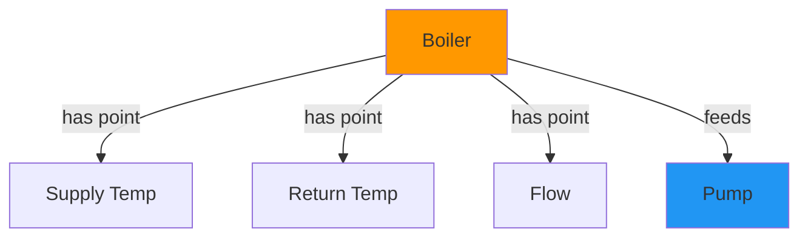
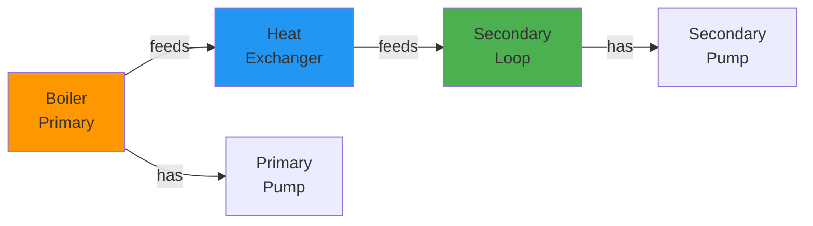
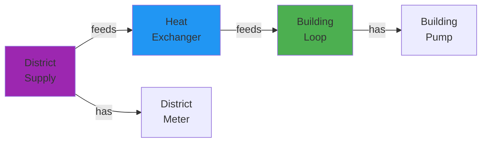
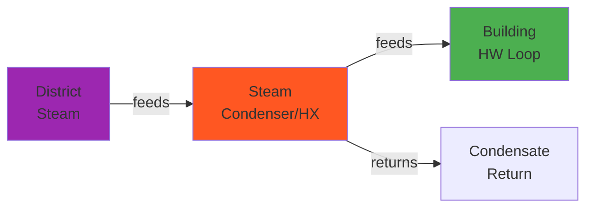

# System Types

Understanding the different HVAC system types supported by HHWS Brick Application.

## Overview

HHWS Brick Application supports **five main system types** for heating hot water systems. Each system type has different equipment configurations and Brick class mappings.

## Supported System Types

| System Type | Description | Common Use | Equipment Created |
|-------------|-------------|------------|-------------------|
| **Boiler** | Generic boiler system | Legacy/generic buildings | Boiler, pumps |
| **Non-condensing** | Non-condensing boiler with heat exchanger | Older buildings | Boiler, HX, primary/secondary loops |
| **Condensing** | High-efficiency condensing boiler | Modern buildings | Condensing boiler, HX, loops |
| **District HW** | District hot water connection | Campus settings | District connection, HX, building loop |
| **District Steam** | District steam connection | Dense urban areas | Steam connection, HX, building loop |

## System Type Details

### 1. Boiler Systems

Generic boiler system without specific efficiency classification.

#### Equipment Hierarchy



#### Created Equipment

- **Boiler** (`brick:Boiler`)
  - Supply temperature sensor
  - Return temperature sensor
  - Flow sensor (if available)

- **Pumps** (`brick:Water_Pump`)
  - Primary pumps
  - Variable frequency drives (if available)

#### CSV Example

```csv
# metadata.csv
tag,system,org
105,Boiler,Organization A

# vars_available_by_building.csv
tag,hw_supply_temp,hw_return_temp,hw_flow
105,1,1,1
```

### 2. Non-condensing Systems

Non-condensing boiler with heat exchanger separating primary and secondary loops.

#### Equipment Hierarchy



#### Created Equipment

**Primary Side:**
- **Boiler** (`brick:Boiler`)
  - HW supply temperature
  - HW return temperature  
  - Flow rate
  - Firing rate (if available)

- **Primary Pumps** (`brick:Water_Pump`)
  - Pump power
  - Pump speed
  - VFD status

**Heat Transfer:**
- **Heat Exchanger** (`brick:Heat_Exchanger`)
  - Primary/secondary interface

**Secondary Side:**
- **Secondary Loop Equipment**
  - Supply/return temperatures
  - Flow rate
  - Pumps with VFDs

#### CSV Example

```csv
# metadata.csv
tag,system,org,b_number
105,Non-condensing,Org A,2

# vars_available_by_building.csv
tag,hw_supply_temp,hw_return_temp,hw_flow,secondary_supply_temp,secondary_return_temp,secondary_flow,sup1,ret1,sup2,ret2
105,1,1,1,1,1,1,1,1,1,1
```

#### Multiple Boilers

The system can model multiple boilers:

```python
# Building with 3 boilers
# metadata.csv: b_number=3
# Creates: Boiler_Primary_1, Boiler_Primary_2, Boiler_Primary_3
```

### 3. Condensing Systems

High-efficiency condensing boiler systems with same topology as non-condensing.

#### Key Differences

| Feature | Non-condensing | Condensing |
|---------|---------------|------------|
| Boiler Type | `brick:Boiler` | `brick:Condensing_Boiler` |
| Efficiency | ~80-85% | ~90-98% |
| Exhaust Temp | High (>140°C) | Low (<60°C) |
| Return Temp | >60°C | Can be <60°C |

#### Equipment Hierarchy

Same as non-condensing, but uses `brick:Condensing_Boiler` class.

#### CSV Example

```csv
# metadata.csv
tag,system,org
106,Condensing,Org A

# vars_available_by_building.csv (same format as non-condensing)
tag,hw_supply_temp,hw_return_temp,hw_flow
106,1,1,1
```

### 4. District Hot Water (District HW)

Building connected to a campus-wide hot water distribution system.

#### Equipment Hierarchy



#### Created Equipment

**District Side:**
- **District Connection** (`brick:District_Hot_Water_System`)
  - Supply temperature
  - Return temperature
  - Flow meter
  - Energy meter

**Building Side:**
- **Heat Exchanger** (`brick:Heat_Exchanger`)
- **Building Loop**
  - Secondary supply/return temperatures
  - Building circulation pumps
  - Control valves

#### CSV Example

```csv
# metadata.csv
tag,system,org
108,District HW,Org B

# vars_available_by_building.csv
tag,hw_supply_temp,hw_return_temp,hw_flow,secondary_supply_temp,secondary_return_temp
108,1,1,1,1,1
```

#### No Boilers

District systems do **not** create boiler entities, even if boiler-related data exists:

```python
# If b_number > 0 in District HW system:
# ⚠ Warning logged: "District system but found boiler data"
# ✓ No boilers created (correct behavior)
```

### 5. District Steam

Building connected to campus steam distribution.

#### Equipment Hierarchy



#### Created Equipment

**Steam Side:**
- **District Steam Connection** (`brick:District_Steam_System`)
  - Steam pressure
  - Steam temperature
  - Condensate return temperature

**Conversion:**
- **Steam-to-Water Heat Exchanger**
  - Steam condensing
  - Hot water generation

**Building Side:**
- **Hot Water Loop**
  - Supply/return temperatures
  - Pumps and controls

#### CSV Example

```csv
# metadata.csv
tag,system,org
109,District Steam,Org B

# vars_available_by_building.csv
tag,steam_pressure,condensate_temp,hw_supply_temp,hw_return_temp
109,1,1,1,1
```

## System Type Selection

### Auto-Detection

If you don't specify `system_type`, it's auto-detected from metadata:

```python
converter = CSVToBrickConverter()
result = converter.convert_to_brick(
    metadata_csv="metadata.csv",
    vars_csv="vars.csv",
    building_tag="105"
    # system_type not specified - auto-detected
)
```

### Manual Specification

You can override the metadata:

```python
result = converter.convert_to_brick(
    metadata_csv="metadata.csv",
    vars_csv="vars.csv",
    building_tag="105",
    system_type="Condensing"  # Force this type
)
```

### Filtering

Convert only specific system types:

```python
# Convert only condensing systems
result = converter.convert_to_brick(
    metadata_csv="metadata.csv",
    vars_csv="vars.csv",
    system_type="Condensing"  # Filter
)
```

## Equipment Numbering

### Boiler Numbering

Boilers are numbered based on `b_number` in metadata and sensor patterns:

```python
# metadata.csv: b_number=3
# Creates:
#   Boiler_Primary_1
#   Boiler_Primary_2
#   Boiler_Primary_3
```

### Sensor-Based Detection

If `b_number` is missing, the converter infers from sensors:

```csv
# vars_available_by_building.csv
tag,sup1,ret1,fire1,sup2,ret2,fire2,sup3,ret3,fire3
105,1,1,1,1,1,1,1,1,1
# Detects 3 boilers from sup1-3, ret1-3, fire1-3
```

### Pump Numbering

Similar logic for pumps:

```csv
# vars_available_by_building.csv
tag,pmp1_pwr,pmp1_spd,pmp2_pwr,pmp2_spd
105,1,1,1,1
# Detects 2 pumps
```

## Point Mappings by System

### Common Points (All Systems)

| CSV Column | Brick Class |
|------------|-------------|
| `hw_supply_temp` | `Hot_Water_Supply_Temperature_Sensor` |
| `hw_return_temp` | `Hot_Water_Return_Temperature_Sensor` |
| `hw_flow` | `Water_Flow_Sensor` |
| `outdoor_temp` | `Outside_Air_Temperature_Sensor` |

### Boiler-Specific Points

| CSV Column | Brick Class | Systems |
|------------|-------------|---------|
| `fire1`, `fire2`, ... | `Firing_Rate_Sensor` | Boiler, Non-condensing, Condensing |
| `sup1`, `sup2`, ... | `Hot_Water_Supply_Temperature_Sensor` | Boiler, Non-condensing, Condensing |
| `ret1`, `ret2`, ... | `Hot_Water_Return_Temperature_Sensor` | Boiler, Non-condensing, Condensing |

### Secondary Loop Points

| CSV Column | Brick Class | Systems |
|------------|-------------|---------|
| `secondary_supply_temp` | `Hot_Water_Supply_Temperature_Sensor` | Non-condensing, Condensing, District |
| `secondary_return_temp` | `Hot_Water_Return_Temperature_Sensor` | Non-condensing, Condensing, District |
| `secondary_flow` | `Water_Flow_Sensor` | Non-condensing, Condensing, District |

### District-Specific Points

| CSV Column | Brick Class | Systems |
|------------|-------------|---------|
| `steam_pressure` | `Steam_Pressure_Sensor` | District Steam |
| `condensate_temp` | `Condensate_Temperature_Sensor` | District Steam |

## Validation and Warnings

### System Type Mismatch

```python
# Building marked as "District HW" but has boiler data
# ⚠ Warning: "District system but found boiler data"
# ✓ Boilers not created (correct)
```

### Missing Equipment Count

```python
# Boiler system but b_number=0
# ⚠ Warning: "Boiler system but b_number=0"
# ✓ Falls back to sensor detection
```

### Inconsistent Data

```python
# b_number=2 but sensors show 3 boilers
# ⚠ Warning: "b_number=2 but sensors show 3, using max"
# ✓ Creates 3 boilers
```

## Choosing the Right System Type

### When to Use Each Type

**Boiler:**
- Generic/legacy systems
- Simple heating setups
- When specific efficiency unknown

**Non-condensing:**
- Older buildings (pre-2000)
- Systems with return temp >60°C
- Standard efficiency boilers

**Condensing:**
- Modern buildings (post-2000)
- High-efficiency systems
- Return temp can be <60°C

**District HW:**
- Campus settings
- Centralized hot water
- No on-site boilers

**District Steam:**
- Dense urban areas
- Legacy campus systems
- Steam-to-hot-water conversion

## Examples by System Type

### Convert All Non-condensing

```python
from hhw_brick import BatchConverter

batch = BatchConverter()
results = batch.convert_all_buildings(
    metadata_csv="metadata.csv",
    vars_csv="vars.csv",
    output_dir="non_condensing_models/",
    system_type="Non-condensing"
)
```

### Convert District Systems

```python
# District HW
results_hw = batch.convert_all_buildings(
    metadata_csv="metadata.csv",
    vars_csv="vars.csv",
    output_dir="district_hw/",
    system_type="District HW"
)

# District Steam
results_steam = batch.convert_all_buildings(
    metadata_csv="metadata.csv",
    vars_csv="vars.csv",
    output_dir="district_steam/",
    system_type="District Steam"
)
```

### Separate by Type

```python
system_types = [
    "Non-condensing",
    "Condensing",
    "District HW"
]

for system in system_types:
    results = batch.convert_all_buildings(
        metadata_csv="metadata.csv",
        vars_csv="vars.csv",
        output_dir=f"models/{system.lower().replace(' ', '_')}/",
        system_type=system,
        show_progress=True
    )
    
    print(f"{system}: {results['successful']} buildings")
```

## Next Steps

- **[Sensor Mapping](sensor-mapping.md)** - Customize sensor mappings
- **[Validation](../validation/index.md)** - Validate system models
- **[Examples](../../examples/conversion/single-building.md)** - Working examples

---

**Continue to:** [Sensor Mapping](sensor-mapping.md) →

