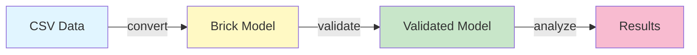
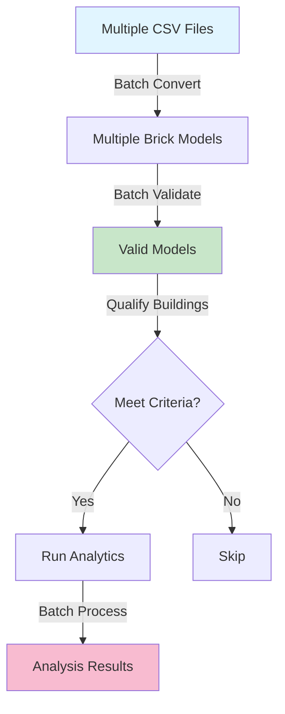

# User Guide

Welcome to the HHW Brick Application User Guide! This comprehensive guide covers all features and functionalities of the package.

## Overview

The User Guide is organized into the following sections:

### :material-swap-horizontal: [CSV to Brick Conversion](conversion/index.md)

Learn how to convert your building equipment data from CSV format to Brick ontology models.

- [Basic Usage](conversion/basic-usage.md) - Simple conversion examples
- [Batch Processing](conversion/batch-processing.md) - Convert multiple files
- [Configuration](conversion/configuration.md) - Customize conversion settings

---

### :material-check-decagram: [Model Validation](validation/index.md)

Ensure your Brick models meet quality standards and specifications.

- [Ontology Validation](validation/ontology.md) - Validate against Brick schema
- [Subgraph Matching](validation/subgraph.md) - Pattern-based validation
- [Point Count Validation](validation/point-count.md) - Verify data completeness

---

### :material-application: [Analytics Applications](applications/index.md)

Use pre-built or custom analytics applications to analyze building systems.

- [Available Apps](applications/available-apps.md) - Browse built-in applications
- [Running Applications](applications/running-apps.md) - Execute analysis workflows
- [Batch Analysis](applications/batch-analysis.md) - Process multiple buildings

---

### :material-console: [Command Line Interface](cli/index.md)

Use the powerful CLI for quick operations and automation.

- [Commands Reference](cli/commands.md) - Complete command documentation
- [Examples](cli/examples.md) - Practical CLI usage examples

---

## Common Workflows

### Basic Workflow

1. **Convert** CSV data to Brick model
2. **Validate** the generated model
3. **Analyze** using applications
4. **Export** results

### Advanced Workflow

1. **Batch convert** multiple CSV files
2. **Batch validate** all models
3. **Qualify** buildings for analysis
4. **Run analytics** on qualified buildings
5. **Aggregate** results

---

## Quick Navigation

- :material-file-document: **[Conversion](conversion/index.md)**

    Transform CSV to Brick models

- :material-shield-check: **[Validation](validation/index.md)**

    Verify model quality

- :material-chart-line: **[Applications](applications/index.md)**

    Analyze building systems

- :material-terminal: **[CLI](cli/index.md)**

    Use command-line tools

---

## Need More Help?

- **New to Brick?** Check out [Core Concepts](../getting-started/core-concepts.md)
- **Looking for code examples?** Browse [Examples](../examples/index.md)
- **Want to build your own apps?** See [Developer Guide](../developer-guide/index.md)
- **Have questions?** Visit the [FAQ](../faq.md)

---

**Ready to start?** Pick a topic above or continue to [CSV to Brick Conversion](conversion/index.md) →
