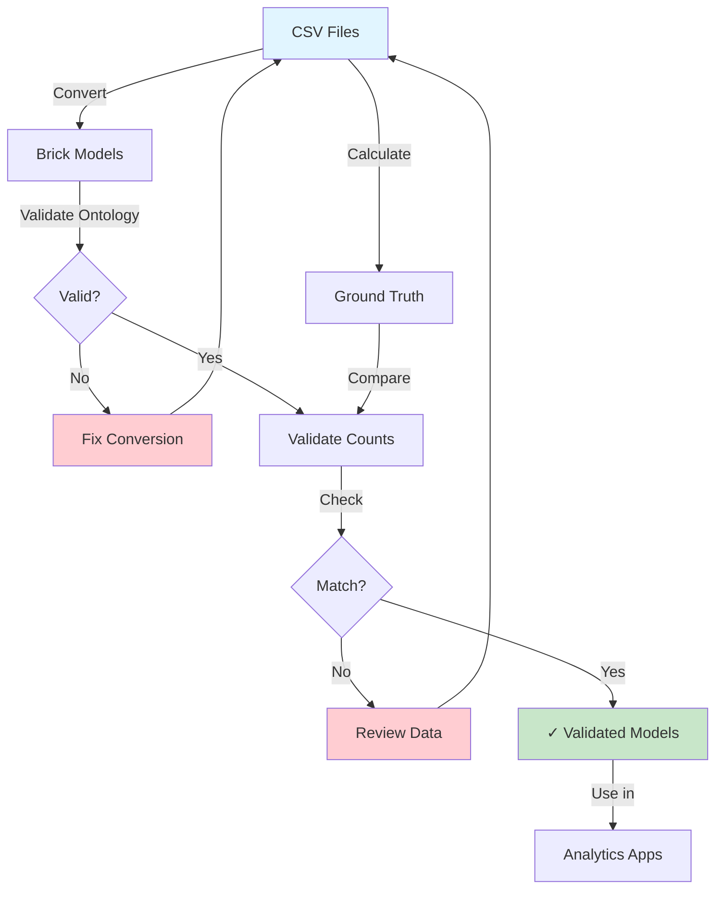

# Model Validation

Ensure your Brick models are correct, complete, and follow schema rules.

## Overview

After converting CSV data to Brick models, validation ensures:

- **Ontology correctness** - Models follow Brick schema rules
- **Data completeness** - All expected points and equipment exist
- **Count accuracy** - Point and equipment counts match expectations

## Why Validate?

### Quality Assurance

Catch errors early:
```python
# Convert
converter.convert_to_brick(...)

# Validate immediately
validator = BrickModelValidator()
is_valid, report = validator.validate_model("building_105.ttl")

if not is_valid:
    print("Fix these issues:", report)
```

### Production Readiness

Ensure models are ready for analytics:
```python
# Only use validated models
if is_valid:
    app = apps.load_app("secondary_loop_temp_diff")
    results = app.analyze(model, data, config)
```

## Validation Types

HHW Brick Application provides three types of validation:

### 1. Ontology Validation

Check if model follows Brick schema rules.

```python
from hhw_brick import BrickModelValidator

validator = BrickModelValidator(use_local_brick=True)
result = validator.validate_ontology("building_105.ttl")

if result['valid']:
    print("✓ Model follows Brick schema")
else:
    print(f"✗ Found {len(result['violations'])} violations")
```

**Checks:**
- ✓ Valid Brick classes used
- ✓ Correct relationship types
- ✓ Proper namespaces
- ✓ RDF/OWL syntax

[Learn more →](ontology.md)

### 2. Ground Truth Validation

Compare model against expected values.

```python
from hhw_brick import GroundTruthCalculator, BrickModelValidator

# Generate ground truth from CSV
calculator = GroundTruthCalculator()
calculator.calculate(
    metadata_csv="metadata.csv",
    vars_csv="vars.csv",
    output_csv="ground_truth.csv"
)

# Validate against ground truth
validator = BrickModelValidator(
    ground_truth_csv_path="ground_truth.csv"
)

result = validator.validate_point_count("building_105.ttl")
print(f"Point accuracy: {result['accuracy_percentage']:.1f}%")
```

**Checks:**
- ✓ Point count matches
- ✓ Boiler count correct
- ✓ Pump count correct
- ✓ Weather station present

[Learn more →](ground-truth.md)

### 3. Subgraph Pattern Validation

Verify system topology patterns.

```python
from hhw_brick.validation import SubgraphPatternValidator

validator = SubgraphPatternValidator()
result = validator.validate("building_105.ttl")

if result['all_patterns_found']:
    print("✓ All expected patterns found")
else:
    print(f"✗ Missing: {result['missing_patterns']}")
```

**Checks:**
- ✓ Boiler → Heat Exchanger connection
- ✓ Equipment → Points relationships
- ✓ Primary → Secondary loop flow

[Learn more →](subgraph-patterns.md)

## Quick Start

### Validate a Single Model

Complete validation workflow:

```python
from hhw_brick import BrickModelValidator, GroundTruthCalculator

# Step 1: Generate ground truth
calculator = GroundTruthCalculator()
calculator.calculate(
    metadata_csv="metadata.csv",
    vars_csv="vars.csv",
    output_csv="ground_truth.csv"
)

# Step 2: Create validator
validator = BrickModelValidator(
    ground_truth_csv_path="ground_truth.csv",
    use_local_brick=True
)

# Step 3: Validate ontology
ontology_result = validator.validate_ontology("building_105.ttl")
print(f"Ontology valid: {ontology_result['valid']}")

# Step 4: Validate point counts
point_result = validator.validate_point_count("building_105.ttl")
print(f"Point accuracy: {point_result['accuracy_percentage']:.1f}%")

# Step 5: Validate equipment counts
equipment_result = validator.validate_equipment_count("building_105.ttl")
print(f"Equipment match: {equipment_result['overall_success']}")
```

### Batch Validate Multiple Models

Validate all models in a directory:

```python
from hhw_brick import BrickModelValidator

validator = BrickModelValidator(
    ground_truth_csv_path="ground_truth.csv",
    use_local_brick=True
)

# Batch ontology validation (parallel processing)
results = validator.batch_validate_ontology(
    test_data_dir="brick_models/",
    max_workers=8  # Parallel workers
)

print(f"Validated {results['total_files']} models")
print(f"Valid: {results['passed_files']}")
print(f"Invalid: {results['failed_files']}")
print(f"Accuracy: {results['overall_accuracy']:.1f}%")

# Batch point count validation
point_results = validator.batch_validate_point_count(
    test_data_dir="brick_models/"
)

print(f"Point count accuracy: {point_results['overall_accuracy']:.1f}%")
```

## Validation Workflow

### Complete Production Workflow



### Step-by-Step Example

Based on `examples/02_ontology_validation.py` and `examples/03_point_count_validation.py`:

```python
"""
Complete validation workflow
Based on HHW Brick Application examples
"""

from pathlib import Path
from hhw_brick import (
    CSVToBrickConverter,
    BatchConverter,
    BrickModelValidator,
    GroundTruthCalculator
)

def complete_workflow():
    # Paths
    metadata_csv = "metadata.csv"
    vars_csv = "vars_available_by_building.csv"
    output_dir = Path("brick_models")
    ground_truth_csv = "ground_truth.csv"

    # ===== Step 1: Convert CSV to Brick =====
    print("Step 1: Converting CSV to Brick...")
    batch = BatchConverter()
    conversion_results = batch.convert_all_buildings(
        metadata_csv=metadata_csv,
        vars_csv=vars_csv,
        output_dir=str(output_dir),
        show_progress=True
    )
    print(f"✓ Converted {conversion_results['successful']} buildings")

    # ===== Step 2: Generate Ground Truth =====
    print("\nStep 2: Generating ground truth...")
    calculator = GroundTruthCalculator()
    ground_truth_df = calculator.calculate(
        metadata_csv=metadata_csv,
        vars_csv=vars_csv,
        output_csv=ground_truth_csv
    )
    print(f"✓ Ground truth generated for {len(ground_truth_df)} buildings")

    # ===== Step 3: Validate Ontology (Batch) =====
    print("\nStep 3: Validating ontology...")
    validator = BrickModelValidator(
        ground_truth_csv_path=ground_truth_csv,
        use_local_brick=True
    )

    ontology_results = validator.batch_validate_ontology(
        test_data_dir=str(output_dir),
        max_workers=8
    )

    print(f"✓ Ontology validation:")
    print(f"  - Valid: {ontology_results['passed_files']}/{ontology_results['total_files']}")
    print(f"  - Accuracy: {ontology_results['overall_accuracy']:.1f}%")

    # ===== Step 4: Validate Point Counts (Batch) =====
    print("\nStep 4: Validating point counts...")
    point_results = validator.batch_validate_point_count(
        test_data_dir=str(output_dir)
    )

    print(f"✓ Point count validation:")
    print(f"  - Matched: {point_results['passed_files']}/{point_results['total_files']}")
    print(f"  - Accuracy: {point_results['overall_accuracy']:.1f}%")

    # ===== Step 5: Validate Equipment Counts (Batch) =====
    print("\nStep 5: Validating equipment counts...")
    equipment_results = validator.batch_validate_equipment_count(
        test_data_dir=str(output_dir)
    )

    print(f"✓ Equipment count validation:")
    print(f"  - Matched: {equipment_results['passed_files']}/{equipment_results['total_files']}")
    print(f"  - Accuracy: {equipment_results['overall_accuracy']:.1f}%")

    # ===== Summary =====
    print("\n" + "="*60)
    print("Validation Summary")
    print("="*60)
    print(f"Total models: {conversion_results['successful']}")
    print(f"Ontology valid: {ontology_results['passed_files']}")
    print(f"Point counts match: {point_results['passed_files']}")
    print(f"Equipment counts match: {equipment_results['passed_files']}")

    # Overall success
    all_valid = (
        ontology_results['passed_files'] == conversion_results['successful'] and
        point_results['passed_files'] == conversion_results['successful'] and
        equipment_results['passed_files'] == conversion_results['successful']
    )

    if all_valid:
        print("\n✓ All models validated successfully!")
        print("  Models are ready for analytics applications.")
    else:
        print("\n⚠ Some models have validation issues")
        print("  Review failed models before using in production.")

    return {
        'conversion': conversion_results,
        'ontology': ontology_results,
        'points': point_results,
        'equipment': equipment_results
    }

if __name__ == "__main__":
    results = complete_workflow()
```

## Common Validation Patterns

### Pattern 1: Validate After Conversion

Always validate after converting:

```python
# Convert
result = converter.convert_to_brick(
    metadata_csv="metadata.csv",
    vars_csv="vars.csv",
    building_tag="105",
    output_path="building_105.ttl"
)

# Validate immediately
validator = BrickModelValidator(use_local_brick=True)
validation = validator.validate_ontology("building_105.ttl")

if validation['valid']:
    print("✓ Conversion successful and valid")
else:
    print("✗ Model has errors - review conversion")
```

### Pattern 2: Pre-Production Check

Before deploying to analytics:

```python
def is_model_ready(model_path, ground_truth_path):
    """Check if model is ready for production use."""

    validator = BrickModelValidator(
        ground_truth_csv_path=ground_truth_path,
        use_local_brick=True
    )

    # Check ontology
    ont_result = validator.validate_ontology(model_path)
    if not ont_result['valid']:
        return False, "Ontology validation failed"

    # Check point counts
    point_result = validator.validate_point_count(model_path)
    if not point_result['success']:
        return False, "Point count mismatch"

    # Check equipment counts
    equip_result = validator.validate_equipment_count(model_path)
    if not equip_result['overall_success']:
        return False, "Equipment count mismatch"

    return True, "Model ready"

# Use it
ready, message = is_model_ready("building_105.ttl", "ground_truth.csv")
if ready:
    # Run analytics
    app.analyze(model, data, config)
```

### Pattern 3: Continuous Validation

Validate on data updates:

```python
import os
from datetime import datetime

def validate_if_changed(model_path, ground_truth_path, cache_file=".validation_cache"):
    """Only validate if model changed since last check."""

    # Get model modification time
    mod_time = os.path.getmtime(model_path)

    # Check cache
    if os.path.exists(cache_file):
        with open(cache_file, 'r') as f:
            last_validated = float(f.read().strip())

        if mod_time <= last_validated:
            print("Model unchanged, using cached validation result")
            return True

    # Validate
    validator = BrickModelValidator(
        ground_truth_csv_path=ground_truth_path
    )

    result = validator.validate_ontology(model_path)

    # Update cache
    if result['valid']:
        with open(cache_file, 'w') as f:
            f.write(str(datetime.now().timestamp()))

    return result['valid']
```

## Validation Results

### Understanding Results

All validation methods return dictionaries with results:

```python
# Ontology validation
{
    'valid': True,
    'violations': [],
    'ttl_file_path': 'building_105.ttl'
}

# Point count validation
{
    'success': True,
    'match': True,
    'expected_point_count': 23,
    'actual_point_count': 23,
    'accuracy_percentage': 100.0
}

# Equipment count validation
{
    'overall_success': True,
    'boiler': {'expected': 2, 'actual': 2, 'match': True},
    'pump': {'expected': 3, 'actual': 3, 'match': True},
    'weather_station': {'expected': 1, 'actual': 1, 'match': True}
}
```

## Troubleshooting

### Issue: "brickschema not available"

**Solution:**
```bash
pip install brickschema
```

### Issue: "Ground truth file not found"

**Solution:** Generate it first:
```python
calculator = GroundTruthCalculator()
calculator.calculate(
    metadata_csv="metadata.csv",
    vars_csv="vars.csv",
    output_csv="ground_truth.csv"
)
```

### Issue: Point count mismatch

**Possible causes:**
1. Sensor mapping incorrect
2. Missing sensors in vars.csv
3. Conversion issues

**Solution:** Review conversion warnings:
```python
converter = CSVToBrickConverter()
result = converter.convert_to_brick(...)

if converter.validation_warnings:
    for warning in converter.validation_warnings:
        print(warning)
```

## Performance

### Batch Validation Speed

Parallel processing significantly improves performance:

```python
# Serial (slow for many files)
for file in ttl_files:
    validator.validate_ontology(file)

# Parallel (much faster)
results = validator.batch_validate_ontology(
    test_data_dir="brick_models/",
    max_workers=8  # Use 8 parallel workers
)
```

**Typical performance:**
- 10 models: ~5 seconds (parallel) vs ~30 seconds (serial)
- 100 models: ~45 seconds (parallel) vs ~5 minutes (serial)

## Next Steps

Learn about each validation type in detail:

- **[Ontology Validation](ontology.md)** - Check Brick schema compliance
- **[Ground Truth Validation](ground-truth.md)** - Verify counts and completeness
- **[Subgraph Patterns](subgraph-patterns.md)** - Validate system topology

Or explore related topics:

- **[Conversion Guide](../conversion/index.md)** - How to generate models
- **[Applications Guide](../applications/index.md)** - Use validated models
- **[Examples](../../examples/validation/basic.md)** - Working code samples

---

**Continue to:** [Ontology Validation](ontology.md) →
