# Model Validation

Ensure your Brick models are correct, complete, and follow schema rules.

## Overview

After converting CSV data to Brick models, validation ensures:

- **Ontology correctness** - Models follow Brick Schema 1.4 rules (SHACL validation)
- **Data completeness** - All expected sensors and equipment exist
- **Structural integrity** - System topology matches expected patterns

## Why Validate?

### Quality Assurance
Catch errors early before running analytics:

```python
# Convert
converter = CSVToBrickConverter()
graph = converter.convert_to_brick(...)

# Validate immediately
validator = BrickModelValidator()
result = validator.validate_ontology("building_105.ttl")

if not result['valid']:
    print("Fix these issues before proceeding:")
    for violation in result['violations']:
        print(f"  - {violation}")
```

### Production Readiness
Ensure models are ready for analytics applications:

```python
# Only use validated models in production
if result['valid']:
    app = apps.load_app("secondary_loop_temp_diff")
    results = app.analyze(
        brick_model="building_105.ttl",
        timeseries_data="data.csv"
    )
```

### Build Confidence
Validation provides confidence that your semantic models accurately represent your buildings.

---

## Four Validation Levels

HHW Brick provides comprehensive multi-level validation:

### 1. 🔍 Ontology Validation (SHACL)

**What it checks**: Compliance with Brick Schema 1.4 rules

```python
from hhw_brick import BrickModelValidator

validator = BrickModelValidator(use_local_brick=True)
result = validator.validate_ontology("building_105.ttl")

if result['valid']:
    print("✓ Model follows Brick Schema")
else:
    print(f"✗ Found {len(result['violations'])} violations")
    for v in result['violations']:
        print(f"  - {v}")
```

**Validates**:
- ✓ Valid Brick classes used (e.g., `brick:Boiler`, `brick:Temperature_Sensor`)
- ✓ Correct relationship types (e.g., `brick:hasPart`, `brick:feeds`)
- ✓ Proper namespaces and URIs
- ✓ RDF/OWL syntax correctness

[Learn more about ontology validation →](ontology.md)

---

### 2. 📊 Point Count Validation

**What it checks**: All sensors from CSV were converted correctly

```python
from hhw_brick import GroundTruthCalculator, BrickModelValidator

# Step 1: Generate ground truth from CSV
calculator = GroundTruthCalculator()
ground_truth = calculator.calculate(
    metadata_csv="metadata.csv",
    vars_csv="vars_available_by_building.csv",
    output_csv="ground_truth.csv"
)

# Step 2: Validate point counts
validator = BrickModelValidator(ground_truth_csv_path="ground_truth.csv")
result = validator.validate_point_count("building_105.ttl")

print(f"Expected: {result['expected_points']} points")
print(f"Actual: {result['actual_points']} points")
print(f"Match: {result['match']} ({'✓' if result['match'] else '✗'})")
print(f"Accuracy: {result['accuracy_percentage']:.1f}%")
```

**Validates**:
- ✓ Sensor count matches expected (from CSV)
- ✓ Handles `owl:sameAs` deduplication (shared sensors)
- ✓ Independent ground truth (calculated from source CSV, not Brick model)

[Learn more about point count validation →](ground-truth.md#point-count-validation)

---

### 3. ⚙️ Equipment Count Validation

**What it checks**: Boilers, pumps, and weather stations

```python
result = validator.validate_equipment_count("building_105.ttl")

print("Equipment Counts:")
print(f"  Boilers: {result['boilers']['actual']}/{result['boilers']['expected']}")
print(f"  Pumps: {result['pumps']['actual']}/{result['pumps']['expected']}")
print(f"  Weather: {result['weather_stations']['actual']}/{result['weather_stations']['expected']}")

if result['all_match']:
    print("✓ All equipment counts correct")
```

**Validates**:
- ✓ Boiler count (with subclass support for condensing/non-condensing)
- ✓ Pump count (per loop)
- ✓ Weather station presence
- ✓ Supports equipment inheritance (e.g., `Condensing_Boiler` → `Boiler`)

[Learn more about equipment validation →](ground-truth.md#equipment-count-validation)

---

### 4. 🏗️ Structural Pattern Validation

**What it checks**: System topology and component relationships

```python
from hhw_brick import SubgraphPatternValidator

validator = SubgraphPatternValidator()
result = validator.validate_building_pattern("building_105.ttl")

if result['pattern_1']:
    print("✓ Pattern 1: Boiler System")
    print(f"  Boilers: {result['pattern_1']['boiler_count']}")
    print(f"  Primary pumps: {result['pattern_1']['primary_pump_count']}")
    print(f"  Secondary pumps: {result['pattern_1']['secondary_pump_count']}")
elif result['pattern_2']:
    print("✓ Pattern 2: District System")
    print(f"  Secondary pumps: {result['pattern_2']['secondary_pump_count']}")
```

**Validates**:
- ✓ **Pattern 1**: Boiler system (primary loop + secondary loop + boilers)
- ✓ **Pattern 2**: District system (secondary loop only, no boilers)
- ✓ Correct loop structure using SPARQL queries
- ✓ Equipment placement in appropriate loops

[Learn more about pattern validation →](subgraph-patterns.md)

---

## Validation Workflow



```mermaid
graph TD
    A[CSV Files] --> B[Convert to Brick]
    B --> C[Brick Model .ttl]
    C --> D[1. Ontology Validation]
    D --> E{Valid?}
    E -->|No| F[Fix Conversion Logic]
    E -->|Yes| G[2. Point Count Validation]
    G --> H{Match?}
    H -->|No| I[Check CSV & Converter]
    H -->|Yes| J[3. Equipment Count Validation]
    J --> K{Match?}
    K -->|No| L[Check Equipment Logic]
    K -->|Yes| M[4. Pattern Validation]
    M --> N{Pattern Found?}
    N -->|No| O[Check System Structure]
    N -->|Yes| P[✓ Validated Model]
    P --> Q[Ready for Analytics]
    F --> B
    I --> B
    L --> B
    O --> B
```

### Recommended Validation Order

1. **Ontology First** - Catch schema violations early
2. **Point Counts** - Verify completeness
3. **Equipment Counts** - Check specific components
4. **Patterns Last** - Validate overall structure

---

## Batch Validation (Parallel Processing)

Validate multiple buildings efficiently using parallel workers:

### Batch Ontology Validation
```python
validator = BrickModelValidator(use_local_brick=True)

results = validator.batch_validate_ontology(
    test_data_dir="output/",
    max_workers=4  # Parallel processing
)

print(f"Total: {results['total_files']}")
print(f"Passed: {results['passed_files']}")
print(f"Failed: {results['failed_files']}")
print(f"Accuracy: {results['overall_accuracy']:.1f}%")
```

### Batch Point Count Validation
```python
results = validator.batch_validate_point_count(
    test_data_dir="output/",
    max_workers=4
)

for detail in results['details']:
    building = detail['filename']
    match = detail['match']
    print(f"{building}: {'✓' if match else '✗'}")
```

### Batch Pattern Validation
```python
validator = SubgraphPatternValidator()

results = validator.batch_validate_patterns(
    test_data_dir="output/",
    max_workers=4
)

print(f"Boiler Systems (Pattern 1): {results['pattern_1_count']}")
print(f"District Systems (Pattern 2): {results['pattern_2_count']}")
print(f"Success Rate: {results['success_rate']:.1f}%")
```

**Benefits of Batch Validation**:
- ⚡ Faster (parallel processing)
- 📊 Summary statistics
- 🎯 Identify problematic buildings
- 📈 Track overall quality

---

## Ground Truth: The Key Concept

!!! important "What is Ground Truth?"
    Ground truth values (expected counts) are calculated **independently from the input CSV data**,
    not from the generated Brick model. This ensures unbiased validation.

### Why Independent Ground Truth?

**Without Independent Ground Truth** (circular validation):
```
CSV → Converter → Brick Model
                      ↓
                  Count Points ← Compare with itself ✗
```

**With Independent Ground Truth** (proper validation):
```
CSV → Converter → Brick Model
  ↓                   ↓
Count Expected → Compare with Actual ✓
  (Ground Truth)
```

### How Ground Truth is Calculated

```python
calculator = GroundTruthCalculator()

# Reads metadata.csv and vars_available_by_building.csv
# Counts sensors and equipment directly from source data
ground_truth = calculator.calculate(
    metadata_csv="metadata.csv",
    vars_csv="vars_available_by_building.csv",
    output_csv="ground_truth.csv"
)

# ground_truth.csv contains expected counts for each building
# Independent of the conversion process
```

---

## Quick Start Example

Complete validation workflow:

```python
from hhw_brick import (
    CSVToBrickConverter,
    BrickModelValidator,
    GroundTruthCalculator,
    SubgraphPatternValidator
)

# 1. Convert
converter = CSVToBrickConverter()
graph = converter.convert_to_brick(
    metadata_csv="metadata.csv",
    vars_csv="vars_available_by_building.csv",
    building_tag="105",
    output_path="building_105.ttl"
)
print(f"Converted: {len(graph)} triples")

# 2. Generate ground truth
calculator = GroundTruthCalculator()
calculator.calculate(
    metadata_csv="metadata.csv",
    vars_csv="vars_available_by_building.csv",
    output_csv="ground_truth.csv"
)

# 3. Validate ontology
validator = BrickModelValidator(
    use_local_brick=True,
    ground_truth_csv_path="ground_truth.csv"
)

ontology_result = validator.validate_ontology("building_105.ttl")
print(f"Ontology valid: {ontology_result['valid']}")

# 4. Validate point counts
point_result = validator.validate_point_count("building_105.ttl")
print(f"Point count match: {point_result['match']}")

# 5. Validate equipment
equip_result = validator.validate_equipment_count("building_105.ttl")
print(f"Equipment match: {equip_result['all_match']}")

# 6. Validate pattern
pattern_validator = SubgraphPatternValidator()
pattern_result = pattern_validator.validate_building_pattern("building_105.ttl")
print(f"Pattern found: {pattern_result['pattern_1'] is not None or pattern_result['pattern_2'] is not None}")
```

---

## Troubleshooting Validation Issues

### Ontology Validation Failures

**Issue**: SHACL violations

**Solutions**:
- Check class names (e.g., use `brick:Boiler`, not `Boiler`)
- Verify relationships (e.g., `brick:hasPart`, not `hasPart`)
- Ensure URIs are properly formatted
- Use `use_local_brick=True` for stable validation

### Point Count Mismatches

**Issue**: Expected ≠ Actual point counts

**Solutions**:
- Check CSV data for missing/extra sensors
- Verify `owl:sameAs` is used for shared sensors
- Review converter sensor mapping logic
- Inspect ground_truth.csv for accuracy

### Equipment Count Mismatches

**Issue**: Boiler/pump counts don't match

**Solutions**:
- Use `include_subclasses=True` for equipment inheritance
- Check metadata.csv for correct `b_number` and `p_number`
- Verify equipment placement in correct loops

### Pattern Validation Failures

**Issue**: No pattern matched

**Solutions**:
- Verify loop labels contain "primary" or "secondary"
- Check `brick:feeds` relationship between loops
- Ensure boilers are in primary loop (Pattern 1)
- Validate equipment placement

---

## Best Practices

!!! tip "Validation Best Practices"
    1. **Validate immediately after conversion** - Catch errors early
    2. **Use batch validation** - Faster with `max_workers`
    3. **Save validation reports** - Track quality over time
    4. **Fix root causes** - Don't just fix individual models
    5. **Automate validation** - Include in CI/CD pipeline

### Automation Example

```python
def validate_pipeline(metadata_csv, vars_csv, output_dir):
    """Complete conversion and validation pipeline"""

    # Convert
    batch = BatchConverter()
    conv_results = batch.convert_all_buildings(
        metadata_csv=metadata_csv,
        vars_csv=vars_csv,
        output_dir=output_dir
    )

    # Generate ground truth
    calculator = GroundTruthCalculator()
    calculator.calculate(
        metadata_csv=metadata_csv,
        vars_csv=vars_csv,
        output_csv=f"{output_dir}/ground_truth.csv"
    )

    # Validate all
    validator = BrickModelValidator(
        use_local_brick=True,
        ground_truth_csv_path=f"{output_dir}/ground_truth.csv"
    )

    val_results = {
        'ontology': validator.batch_validate_ontology(output_dir),
        'points': validator.batch_validate_point_count(output_dir),
        'equipment': validator.batch_validate_equipment_count(output_dir)
    }

    # Report
    print(f"\n{'='*60}")
    print("Validation Report")
    print(f"{'='*60}")
    print(f"Converted: {conv_results['successful']}/{conv_results['total']} buildings")
    print(f"Ontology: {val_results['ontology']['passed_files']}/{val_results['ontology']['total_files']} passed")
    print(f"Points: {val_results['points']['passed_files']}/{val_results['points']['total_files']} matched")
    print(f"Equipment: {val_results['equipment']['passed_files']}/{val_results['equipment']['total_files']} matched")

    return val_results
```

---

## Next Steps

- [Ontology Validation Guide](ontology.md) - SHACL validation details
- [Ground Truth Validation](ground-truth.md) - Point and equipment count validation
- [Subgraph Pattern Validation](subgraph-patterns.md) - Structural pattern validation
- [Examples](../../examples/) - Complete working examples

---

## Need Help?

- Check the [FAQ](../../faq.md) for common issues
- Review [examples](../../examples/) for working code
- [Report issues](https://github.com/CenterForTheBuiltEnvironment/HHW_brick/issues) on GitHub

Verify system topology patterns.

```python
from hhw_brick.validation import SubgraphPatternValidator

validator = SubgraphPatternValidator()
result = validator.validate("building_105.ttl")

if result['all_patterns_found']:
    print("✓ All expected patterns found")
else:
    print(f"✗ Missing: {result['missing_patterns']}")
```

**Checks:**
- ✓ Boiler → Heat Exchanger connection
- ✓ Equipment → Points relationships
- ✓ Primary → Secondary loop flow

[Learn more →](subgraph-patterns.md)

## Quick Start

### Validate a Single Model

Complete validation workflow:

```python
from hhw_brick import BrickModelValidator, GroundTruthCalculator

# Step 1: Generate ground truth
calculator = GroundTruthCalculator()
calculator.calculate(
    metadata_csv="metadata.csv",
    vars_csv="vars.csv",
    output_csv="ground_truth.csv"
)

# Step 2: Create validator
validator = BrickModelValidator(
    ground_truth_csv_path="ground_truth.csv",
    use_local_brick=True
)

# Step 3: Validate ontology
ontology_result = validator.validate_ontology("building_105.ttl")
print(f"Ontology valid: {ontology_result['valid']}")

# Step 4: Validate point counts
point_result = validator.validate_point_count("building_105.ttl")
print(f"Point accuracy: {point_result['accuracy_percentage']:.1f}%")

# Step 5: Validate equipment counts
equipment_result = validator.validate_equipment_count("building_105.ttl")
print(f"Equipment match: {equipment_result['overall_success']}")
```

### Batch Validate Multiple Models

Validate all models in a directory:

```python
from hhw_brick import BrickModelValidator

validator = BrickModelValidator(
    ground_truth_csv_path="ground_truth.csv",
    use_local_brick=True
)

# Batch ontology validation (parallel processing)
results = validator.batch_validate_ontology(
    test_data_dir="brick_models/",
    max_workers=8  # Parallel workers
)

print(f"Validated {results['total_files']} models")
print(f"Valid: {results['passed_files']}")
print(f"Invalid: {results['failed_files']}")
print(f"Accuracy: {results['overall_accuracy']:.1f}%")

# Batch point count validation
point_results = validator.batch_validate_point_count(
    test_data_dir="brick_models/"
)

print(f"Point count accuracy: {point_results['overall_accuracy']:.1f}%")
```

## Validation Workflow

### Complete Production Workflow

```mermaid
graph TD
    A[CSV Files] -->|Convert| B[Brick Models]
    A -->|Calculate| C[Ground Truth]
    B -->|Validate Ontology| D{Valid?}
    D -->|No| E[Fix Conversion]
    E --> A
    D -->|Yes| F[Validate Counts]
    C -->|Compare| F
    F -->|Check| G{Match?}
    G -->|No| H[Review Data]
    H --> A
    G -->|Yes| I[✓ Validated Models]
    I -->|Use in| J[Analytics Apps]

    style A fill:#e1f5ff
    style I fill:#c8e6c9
    style E fill:#ffcdd2
    style H fill:#ffcdd2
```



### Step-by-Step Example

Based on `examples/02_ontology_validation.py` and `examples/03_point_count_validation.py`:

```python
"""
Complete validation workflow
Based on HHW Brick Application examples
"""

from pathlib import Path
from hhw_brick import (
    CSVToBrickConverter,
    BatchConverter,
    BrickModelValidator,
    GroundTruthCalculator
)

def complete_workflow():
    # Paths
    metadata_csv = "metadata.csv"
    vars_csv = "vars_available_by_building.csv"
    output_dir = Path("brick_models")
    ground_truth_csv = "ground_truth.csv"

    # ===== Step 1: Convert CSV to Brick =====
    print("Step 1: Converting CSV to Brick...")
    batch = BatchConverter()
    conversion_results = batch.convert_all_buildings(
        metadata_csv=metadata_csv,
        vars_csv=vars_csv,
        output_dir=str(output_dir),
        show_progress=True
    )
    print(f"✓ Converted {conversion_results['successful']} buildings")

    # ===== Step 2: Generate Ground Truth =====
    print("\nStep 2: Generating ground truth...")
    calculator = GroundTruthCalculator()
    ground_truth_df = calculator.calculate(
        metadata_csv=metadata_csv,
        vars_csv=vars_csv,
        output_csv=ground_truth_csv
    )
    print(f"✓ Ground truth generated for {len(ground_truth_df)} buildings")

    # ===== Step 3: Validate Ontology (Batch) =====
    print("\nStep 3: Validating ontology...")
    validator = BrickModelValidator(
        ground_truth_csv_path=ground_truth_csv,
        use_local_brick=True
    )

    ontology_results = validator.batch_validate_ontology(
        test_data_dir=str(output_dir),
        max_workers=8
    )

    print(f"✓ Ontology validation:")
    print(f"  - Valid: {ontology_results['passed_files']}/{ontology_results['total_files']}")
    print(f"  - Accuracy: {ontology_results['overall_accuracy']:.1f}%")

    # ===== Step 4: Validate Point Counts (Batch) =====
    print("\nStep 4: Validating point counts...")
    point_results = validator.batch_validate_point_count(
        test_data_dir=str(output_dir)
    )

    print(f"✓ Point count validation:")
    print(f"  - Matched: {point_results['passed_files']}/{point_results['total_files']}")
    print(f"  - Accuracy: {point_results['overall_accuracy']:.1f}%")

    # ===== Step 5: Validate Equipment Counts (Batch) =====
    print("\nStep 5: Validating equipment counts...")
    equipment_results = validator.batch_validate_equipment_count(
        test_data_dir=str(output_dir)
    )

    print(f"✓ Equipment count validation:")
    print(f"  - Matched: {equipment_results['passed_files']}/{equipment_results['total_files']}")
    print(f"  - Accuracy: {equipment_results['overall_accuracy']:.1f}%")

    # ===== Summary =====
    print("\n" + "="*60)
    print("Validation Summary")
    print("="*60)
    print(f"Total models: {conversion_results['successful']}")
    print(f"Ontology valid: {ontology_results['passed_files']}")
    print(f"Point counts match: {point_results['passed_files']}")
    print(f"Equipment counts match: {equipment_results['passed_files']}")

    # Overall success
    all_valid = (
        ontology_results['passed_files'] == conversion_results['successful'] and
        point_results['passed_files'] == conversion_results['successful'] and
        equipment_results['passed_files'] == conversion_results['successful']
    )

    if all_valid:
        print("\n✓ All models validated successfully!")
        print("  Models are ready for analytics applications.")
    else:
        print("\n⚠ Some models have validation issues")
        print("  Review failed models before using in production.")

    return {
        'conversion': conversion_results,
        'ontology': ontology_results,
        'points': point_results,
        'equipment': equipment_results
    }

if __name__ == "__main__":
    results = complete_workflow()
```

## Common Validation Patterns

### Pattern 1: Validate After Conversion

Always validate after converting:

```python
# Convert
result = converter.convert_to_brick(
    metadata_csv="metadata.csv",
    vars_csv="vars.csv",
    building_tag="105",
    output_path="building_105.ttl"
)

# Validate immediately
validator = BrickModelValidator(use_local_brick=True)
validation = validator.validate_ontology("building_105.ttl")

if validation['valid']:
    print("✓ Conversion successful and valid")
else:
    print("✗ Model has errors - review conversion")
```

### Pattern 2: Pre-Production Check

Before deploying to analytics:

```python
def is_model_ready(model_path, ground_truth_path):
    """Check if model is ready for production use."""

    validator = BrickModelValidator(
        ground_truth_csv_path=ground_truth_path,
        use_local_brick=True
    )

    # Check ontology
    ont_result = validator.validate_ontology(model_path)
    if not ont_result['valid']:
        return False, "Ontology validation failed"

    # Check point counts
    point_result = validator.validate_point_count(model_path)
    if not point_result['success']:
        return False, "Point count mismatch"

    # Check equipment counts
    equip_result = validator.validate_equipment_count(model_path)
    if not equip_result['overall_success']:
        return False, "Equipment count mismatch"

    return True, "Model ready"

# Use it
ready, message = is_model_ready("building_105.ttl", "ground_truth.csv")
if ready:
    # Run analytics
    app.analyze(model, data, config)
```

### Pattern 3: Continuous Validation

Validate on data updates:

```python
import os
from datetime import datetime

def validate_if_changed(model_path, ground_truth_path, cache_file=".validation_cache"):
    """Only validate if model changed since last check."""

    # Get model modification time
    mod_time = os.path.getmtime(model_path)

    # Check cache
    if os.path.exists(cache_file):
        with open(cache_file, 'r') as f:
            last_validated = float(f.read().strip())

        if mod_time <= last_validated:
            print("Model unchanged, using cached validation result")
            return True

    # Validate
    validator = BrickModelValidator(
        ground_truth_csv_path=ground_truth_path
    )

    result = validator.validate_ontology(model_path)

    # Update cache
    if result['valid']:
        with open(cache_file, 'w') as f:
            f.write(str(datetime.now().timestamp()))

    return result['valid']
```

## Validation Results

### Understanding Results

All validation methods return dictionaries with results:

```python
# Ontology validation
{
    'valid': True,
    'violations': [],
    'ttl_file_path': 'building_105.ttl'
}

# Point count validation
{
    'success': True,
    'match': True,
    'expected_point_count': 23,
    'actual_point_count': 23,
    'accuracy_percentage': 100.0
}

# Equipment count validation
{
    'overall_success': True,
    'boiler': {'expected': 2, 'actual': 2, 'match': True},
    'pump': {'expected': 3, 'actual': 3, 'match': True},
    'weather_station': {'expected': 1, 'actual': 1, 'match': True}
}
```

## Troubleshooting

### Issue: "brickschema not available"

**Solution:**
```bash
pip install brickschema
```

### Issue: "Ground truth file not found"

**Solution:** Generate it first:
```python
calculator = GroundTruthCalculator()
calculator.calculate(
    metadata_csv="metadata.csv",
    vars_csv="vars.csv",
    output_csv="ground_truth.csv"
)
```

### Issue: Point count mismatch

**Possible causes:**
1. Sensor mapping incorrect
2. Missing sensors in vars.csv
3. Conversion issues

**Solution:** Review conversion warnings:
```python
converter = CSVToBrickConverter()
result = converter.convert_to_brick(...)

if converter.validation_warnings:
    for warning in converter.validation_warnings:
        print(warning)
```

## Performance

### Batch Validation Speed

Parallel processing significantly improves performance:

```python
# Serial (slow for many files)
for file in ttl_files:
    validator.validate_ontology(file)

# Parallel (much faster)
results = validator.batch_validate_ontology(
    test_data_dir="brick_models/",
    max_workers=8  # Use 8 parallel workers
)
```

**Typical performance:**
- 10 models: ~5 seconds (parallel) vs ~30 seconds (serial)
- 100 models: ~45 seconds (parallel) vs ~5 minutes (serial)

## Next Steps

Learn about each validation type in detail:

- **[Ontology Validation](ontology.md)** - Check Brick schema compliance
- **[Ground Truth Validation](ground-truth.md)** - Verify counts and completeness
- **[Subgraph Patterns](subgraph-patterns.md)** - Validate system topology

Or explore related topics:

- **[Conversion Guide](../conversion/index.md)** - How to generate models
- **[Applications Guide](../applications/index.md)** - Use validated models
- **[Examples](../../examples/validation/basic.md)** - Working code samples

---

**Continue to:** [Ontology Validation](ontology.md) →
