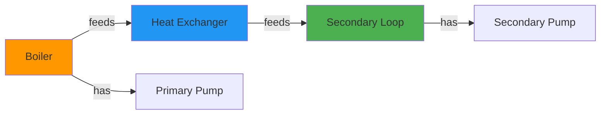
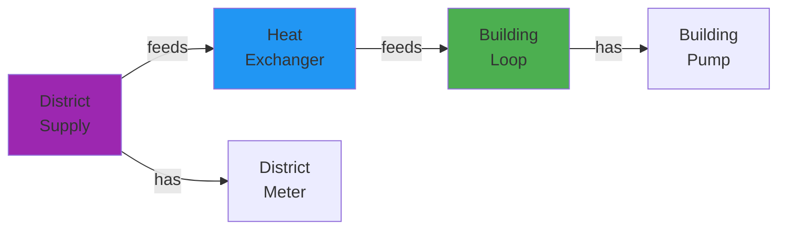

# Subgraph Pattern Validation

Validate system topology and architectural patterns in Brick models.

## Overview

Subgraph pattern validation checks if your Brick model follows expected **system architecture patterns**:

- **Pattern 1 (Boiler System)**: Has boilers, primary loop, heat exchanger, secondary loop
- **Pattern 2 (District System)**: Has district connection, secondary loop, no boilers

This ensures system **topology is correct**.

## Why Validate Patterns?

### Verify System Architecture

Ensure model represents the actual system:

```python
# Pattern 2: District System
# Expected: District connection → HX → Secondary loop
# Should NOT have: Boilers, primary loop

result = validator.check_pattern_2_district_system("building_108.ttl")
if result['matched']:
    print("✓ District system architecture correct")
```

### Catch Modeling Errors

Find structural issues:

```python
# District system but has boilers? Error!
if result['has_boiler']:
    print("✗ District system should not have boilers")
```

### Prepare for Analytics

Some analytics require specific patterns:

```python
# This app requires boiler system (Pattern 1)
if not has_boilers(model):
    print("Skip: Model doesn't match required pattern")
```

## SubgraphPatternValidator

### Basic Usage

From `examples/05_subgraph_pattern_matching.py`:

```python
from hhw_brick.validation import SubgraphPatternValidator

# Create validator
validator = SubgraphPatternValidator()

# Check if model matches Pattern 2 (District System)
result = validator.check_pattern_2_district_system("building_108.ttl")

if result['matched']:
    print("✓ This is a District System")
    print(f"  - Has building: {result['details']['has_building']}")
    print(f"  - Has HW system: {result['details']['has_hot_water_system']}")
    print(f"  - Has secondary loop: {result['details']['has_secondary_loop']}")
    print(f"  - No boilers: {not result['details']['has_boiler']}")
else:
    print("✗ Not a District System")
```

## Pattern Definitions

### Pattern 1: Boiler System

**Architecture:**


**Components:**
- ✓ One or more boilers
- ✓ Primary loop
- ✓ Heat exchanger
- ✓ Secondary loop
- ✓ Primary and secondary pumps

**System Types:** Non-condensing, Condensing, Boiler

### Pattern 2: District System

**Architecture:**


**Components:**
- ✓ District hot water/steam connection
- ✓ Heat exchanger
- ✓ Secondary loop (building side)
- ✓ Building pumps
- ✗ NO boilers
- ✗ NO primary loop

**System Types:** District HW, District Steam

## Validation Methods

### check_pattern_2_district_system()

Check if model matches District System pattern.

**Signature:**
```python
def check_pattern_2_district_system(ttl_file_path: str) -> Dict
```

**Returns:**
```python
{
    'matched': bool,                    # True if matches Pattern 2
    'details': {
        'has_building': bool,           # Building entity exists
        'has_hot_water_system': bool,   # HW system exists
        'has_secondary_loop': bool,     # Secondary loop exists
        'has_pump': bool,               # Pumps exist
        'has_weather_station': bool,    # Weather station exists
        'has_boiler': bool,             # Should be False for Pattern 2
        'has_primary_loop': bool,       # Should be False for Pattern 2
        'pump_count': int               # Number of pumps
    },
    'ttl_file_path': str,
    'error': str or None                # Error message if failed
}
```

**Example:**
```python
result = validator.check_pattern_2_district_system("building_108.ttl")

print(f"Matched Pattern 2: {result['matched']}")

details = result['details']
print(f"\nComponents:")
print(f"  Building: {details['has_building']}")
print(f"  HW System: {details['has_hot_water_system']}")
print(f"  Secondary Loop: {details['has_secondary_loop']}")
print(f"  Pump Count: {details['pump_count']}")

# Verify no boiler components
print(f"\nNo Boiler Components (should be False):")
print(f"  Has Boiler: {details['has_boiler']}")
print(f"  Has Primary Loop: {details['has_primary_loop']}")
```

### Batch Pattern Validation

From `examples/05_subgraph_pattern_matching.py`:

```python
from hhw_brick.validation import SubgraphPatternValidator

validator = SubgraphPatternValidator()

# Batch validate all buildings
batch_results = validator.batch_validate_all_buildings(
    ttl_directory="brick_models/",
    max_workers=4  # Parallel workers
)

# Summary
total = len(batch_results)
pattern_2 = sum(1 for r in batch_results if r.get('matched'))
pattern_1 = total - pattern_2

print(f"Total buildings: {total}")
print(f"Pattern 1 (Boiler Systems): {pattern_1}")
print(f"Pattern 2 (District Systems): {pattern_2}")
```

### batch_validate_all_buildings()

**Signature:**
```python
def batch_validate_all_buildings(
    ttl_directory: str,
    max_workers: int = None
) -> List[Dict]
```

**Parameters:**
- `ttl_directory` (str): Directory containing TTL files
- `max_workers` (int, optional): Number of parallel workers

**Returns:**
```python
[
    {
        'matched': bool,
        'details': {...},
        'ttl_file_path': str,
        'error': str or None
    },
    # ... one dict per file
]
```

**Example:**
```python
results = validator.batch_validate_all_buildings(
    ttl_directory="brick_models/",
    max_workers=8
)

# Group by pattern
pattern_1_models = []
pattern_2_models = []

for result in results:
    file_name = Path(result['ttl_file_path']).name
    
    if result['matched']:
        pattern_2_models.append(file_name)
    else:
        pattern_1_models.append(file_name)

print(f"Pattern 1 (Boiler): {len(pattern_1_models)} models")
print(f"Pattern 2 (District): {len(pattern_2_models)} models")
```

## Complete Validation Example

Based on `examples/05_subgraph_pattern_matching.py`:

```python
"""
Complete subgraph pattern validation
"""

from pathlib import Path
from hhw_brick.validation import SubgraphPatternValidator

def validate_system_patterns():
    # Create validator
    validator = SubgraphPatternValidator()
    
    # ===== Single Building Validation =====
    print("Single Building Pattern Validation")
    print("="*60)
    
    building_file = "building_108_district_hw_aa.ttl"
    
    # Check Pattern 2
    result = validator.check_pattern_2_district_system(building_file)
    
    if result['matched']:
        print(f"✓ {building_file} matches Pattern 2 (District System)")
        
        details = result['details']
        print("\nSystem Components:")
        print(f"  ✓ Building: {details['has_building']}")
        print(f"  ✓ HW System: {details['has_hot_water_system']}")
        print(f"  ✓ Secondary Loop: {details['has_secondary_loop']}")
        print(f"  ✓ Pumps: {details['pump_count']}")
        print(f"  ✓ Weather Station: {details['has_weather_station']}")
        
        print("\nNo Boiler Components (correct for District):")
        print(f"  ✓ No Boiler: {not details['has_boiler']}")
        print(f"  ✓ No Primary Loop: {not details['has_primary_loop']}")
    else:
        print(f"✗ {building_file} does NOT match Pattern 2")
        print(f"  This is likely a Pattern 1 (Boiler System)")
    
    # ===== Batch Validation =====
    print("\n" + "="*60)
    print("Batch Pattern Validation")
    print("="*60)
    
    batch_results = validator.batch_validate_all_buildings(
        ttl_directory="brick_models/",
        max_workers=8
    )
    
    # Analyze results
    total = len(batch_results)
    pattern_2_count = 0
    pattern_1_count = 0
    errors = 0
    
    pattern_2_files = []
    pattern_1_files = []
    
    for result in batch_results:
        file_name = Path(result['ttl_file_path']).name
        
        if result.get('error'):
            errors += 1
        elif result['matched']:
            pattern_2_count += 1
            pattern_2_files.append(file_name)
        else:
            pattern_1_count += 1
            pattern_1_files.append(file_name)
    
    # Summary
    print(f"\nPattern Validation Summary:")
    print(f"  Total files: {total}")
    print(f"  Pattern 1 (Boiler Systems): {pattern_1_count}")
    print(f"  Pattern 2 (District Systems): {pattern_2_count}")
    print(f"  Errors: {errors}")
    
    # Show samples
    if pattern_1_files:
        print(f"\nPattern 1 (Boiler) sample:")
        for file in pattern_1_files[:3]:
            print(f"  - {file}")
    
    if pattern_2_files:
        print(f"\nPattern 2 (District) sample:")
        for file in pattern_2_files[:3]:
            print(f"  - {file}")
    
    return batch_results

if __name__ == "__main__":
    results = validate_system_patterns()
```

## Common Use Cases

### Use Case 1: Separate by Pattern

Group models by their pattern:

```python
def separate_by_pattern(model_dir):
    """Separate models into Pattern 1 and Pattern 2 directories."""
    
    from pathlib import Path
    import shutil
    
    validator = SubgraphPatternValidator()
    
    # Create output directories
    pattern_1_dir = Path("pattern_1_boiler")
    pattern_2_dir = Path("pattern_2_district")
    pattern_1_dir.mkdir(exist_ok=True)
    pattern_2_dir.mkdir(exist_ok=True)
    
    # Validate all
    results = validator.batch_validate_all_buildings(
        ttl_directory=model_dir,
        max_workers=8
    )
    
    # Copy to appropriate directories
    for result in results:
        src = Path(result['ttl_file_path'])
        
        if result['matched']:
            dst = pattern_2_dir / src.name
        else:
            dst = pattern_1_dir / src.name
        
        shutil.copy(src, dst)
    
    print(f"Pattern 1 (Boiler): {len(list(pattern_1_dir.glob('*.ttl')))} files")
    print(f"Pattern 2 (District): {len(list(pattern_2_dir.glob('*.ttl')))} files")

# Use it
separate_by_pattern("brick_models/")
```

### Use Case 2: Validate Before Analytics

Only run certain analytics on matching patterns:

```python
def run_pattern_specific_analytics(model_path, data, config):
    """Run analytics based on system pattern."""
    
    validator = SubgraphPatternValidator()
    result = validator.check_pattern_2_district_system(model_path)
    
    if result['matched']:
        # Pattern 2: District System
        print("Running district system analytics...")
        app = apps.load_app("district_efficiency")
    else:
        # Pattern 1: Boiler System
        print("Running boiler system analytics...")
        app = apps.load_app("boiler_efficiency")
    
    # Run appropriate analytics
    qualified, details = app.qualify(model_path)
    if qualified:
        results = app.analyze(model_path, data, config)
        return results
    else:
        print("Building doesn't qualify for this analysis")
        return None
```

### Use Case 3: Validation Report

Generate detailed pattern validation report:

```python
def generate_pattern_report(model_dir, output_file="pattern_report.csv"):
    """Generate CSV report of pattern validation."""
    
    import pandas as pd
    
    validator = SubgraphPatternValidator()
    results = validator.batch_validate_all_buildings(
        ttl_directory=model_dir,
        max_workers=8
    )
    
    # Create report data
    report_data = []
    for result in results:
        file_name = Path(result['ttl_file_path']).name
        building_id = file_name.split('_')[1]  # Extract from filename
        
        details = result.get('details', {})
        
        report_data.append({
            'building_id': building_id,
            'file_name': file_name,
            'pattern': 'Pattern 2 (District)' if result['matched'] else 'Pattern 1 (Boiler)',
            'has_building': details.get('has_building', False),
            'has_hw_system': details.get('has_hot_water_system', False),
            'has_secondary_loop': details.get('has_secondary_loop', False),
            'has_boiler': details.get('has_boiler', False),
            'pump_count': details.get('pump_count', 0),
            'has_weather_station': details.get('has_weather_station', False)
        })
    
    # Create DataFrame and save
    df = pd.DataFrame(report_data)
    df.to_csv(output_file, index=False)
    
    print(f"Pattern report saved to: {output_file}")
    print(f"Total buildings: {len(df)}")
    print(df['pattern'].value_counts())
    
    return df

# Use it
report = generate_pattern_report("brick_models/")
```

## Understanding Results

### Pattern 2 Match (District System)

```python
{
    'matched': True,
    'details': {
        'has_building': True,
        'has_hot_water_system': True,
        'has_secondary_loop': True,
        'has_pump': True,
        'has_weather_station': True,
        'has_boiler': False,          # Correct: No boiler
        'has_primary_loop': False,    # Correct: No primary loop
        'pump_count': 2
    },
    'ttl_file_path': 'building_108.ttl',
    'error': None
}
```

### Pattern 1 (Not Pattern 2)

```python
{
    'matched': False,  # Not Pattern 2
    'details': {
        'has_building': True,
        'has_hot_water_system': True,
        'has_secondary_loop': True,
        'has_pump': True,
        'has_weather_station': True,
        'has_boiler': True,           # Has boiler -> Pattern 1
        'has_primary_loop': True,     # Has primary loop -> Pattern 1
        'pump_count': 4
    },
    'ttl_file_path': 'building_105.ttl',
    'error': None
}
```

## Troubleshooting

### Issue: All models show matched=False

**Cause:** Models are Pattern 1 (Boiler systems)

**Solution:** This is correct if you have boiler systems. Pattern 2 is specifically for district systems.

### Issue: Pattern validation fails

**Cause:** Model parsing error

**Solution:**
```python
result = validator.check_pattern_2_district_system("model.ttl")

if result.get('error'):
    print(f"Validation error: {result['error']}")
    # Check if file is valid
    from rdflib import Graph
    g = Graph()
    g.parse("model.ttl", format="turtle")
```

### Issue: District system not matching Pattern 2

**Possible causes:**
1. Model has boiler entities (shouldn't)
2. Missing secondary loop components
3. Conversion issue

**Investigation:**
```python
result = validator.check_pattern_2_district_system("district_model.ttl")

details = result['details']
print(f"Has boiler (should be False): {details['has_boiler']}")
print(f"Has primary loop (should be False): {details['has_primary_loop']}")
print(f"Has secondary loop (should be True): {details['has_secondary_loop']}")
```

## Best Practices

### 1. Use Pattern Validation for Filtering

```python
# Separate district systems for specific analytics
validator = SubgraphPatternValidator()
results = validator.batch_validate_all_buildings("brick_models/")

district_models = [
    r['ttl_file_path'] for r in results if r['matched']
]

for model in district_models:
    # Run district-specific analytics
    run_district_analysis(model)
```

### 2. Combine with Other Validation

```python
# Complete validation pipeline
ontology_valid = validator.validate_ontology(model)['valid']
pattern_matched = pattern_validator.check_pattern_2_district_system(model)['matched']
counts_match = validator.validate_point_count(model)['match']

if ontology_valid and counts_match:
    # Model is valid, check pattern for analytics selection
    if pattern_matched:
        run_district_analytics(model)
    else:
        run_boiler_analytics(model)
```

### 3. Document Pattern in Metadata

```python
# Add pattern info to model metadata
results = validator.batch_validate_all_buildings("brick_models/")

for result in results:
    pattern = "District" if result['matched'] else "Boiler"
    file_path = result['ttl_file_path']
    
    # Store in database or metadata file
    save_metadata(file_path, pattern=pattern)
```

## Next Steps

- **[Applications](../applications/index.md)** - Use validated models in analytics
- **[Examples](../../examples/validation/subgraph.md)** - More pattern examples
- **[API Reference](../../api-reference/validation/subgraph.md)** - Complete API

---

**Validation documentation complete!** 🎉

Continue to [Applications Guide](../applications/index.md) →

